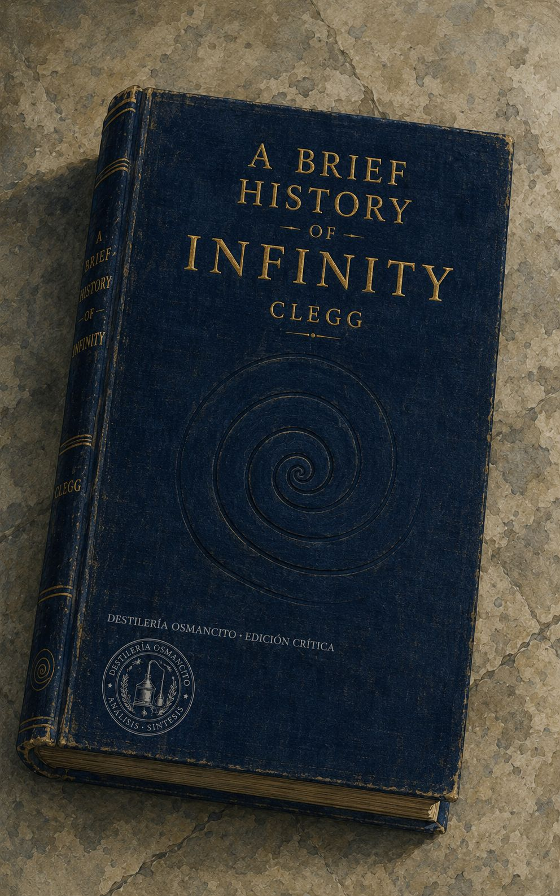
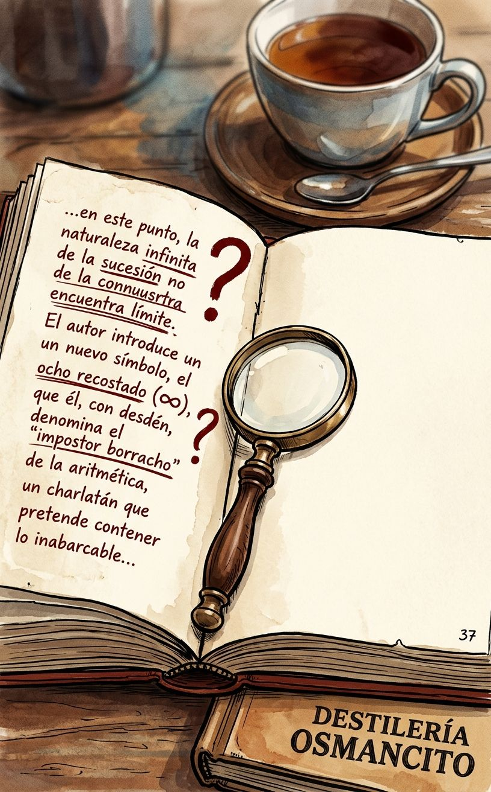
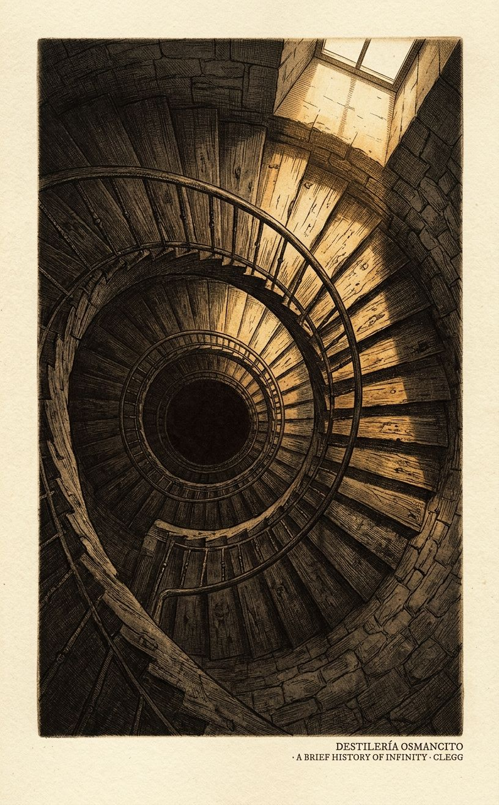
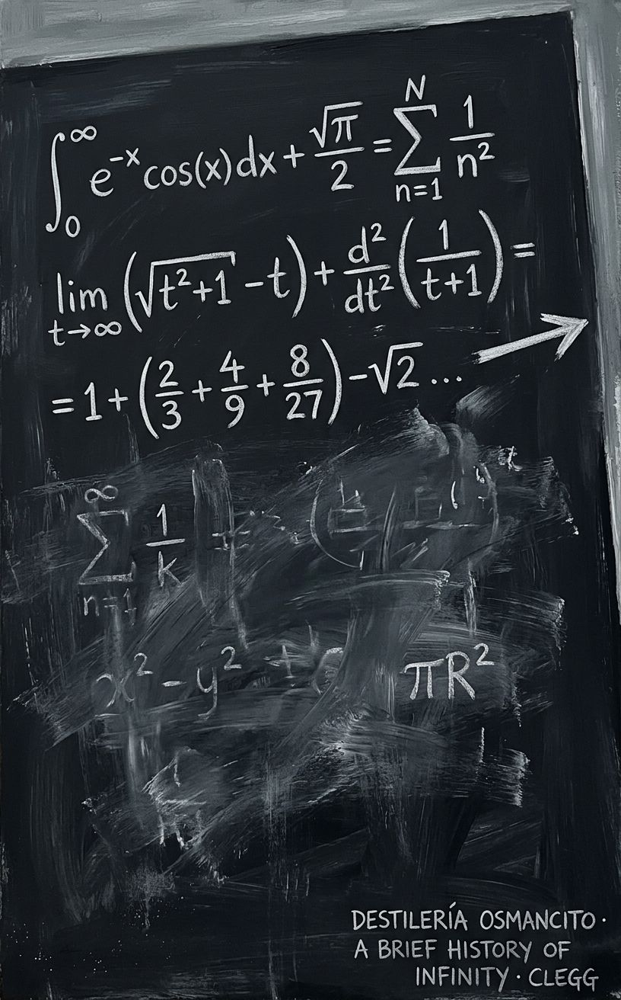

# Recepción

## Víspera

### Presentación

  
<strong>El Objeto y su Vértigo</strong>

  <figure class="img-container">
    
  </figure>

  
<strong>Abierto en el Umbral</strong>

  <figure class="img-container">
    
  </figure>

---

### Atmósfera

  
<strong>El Centro que Falta</strong>

  <figure class="img-container">
    
  </figure>

  
<strong>La Operación que No Cierra</strong>

  <figure class="img-container">
    
  </figure>

---

## Nota de recibo

*Un libro que intenta pensar lo que no puede pensarse del todo, y que advierte desde el principio que la tarea es imposible y que eso, precisamente, es lo que la hace irresistible. Clegg no es matemático sino cartógrafo: dibuja el territorio de lo infinito con la misma pluma con que se escribe una carta de viaje. Lo que sorprende no es que el infinito sea raro, sino que los humanos que se acercaron a él —Cantor, Galileo, Bolzano— terminaran cambiados, rotos o silenciados. La pregunta que el libro deja sin cerrar es si el infinito lo resiste la matemática o si es la matemática la que, apenas, lo contiene.*

---

Una presencia compacta, accesible al tacto, liviana en el peso físico pero densa en lo que propone. Antes de abrirlo ya anuncia su paradoja: un objeto finito sobre un objeto sin fin. Nombrar lo que es este libro es diferente de decir lo que dice: es un tratado de imposibilidades que funciona, una guía turística a un destino que no se puede visitar.

---

### Ficha

**Título** — A Brief History of Infinity: The Quest to Think the Unthinkable  
**Autor** — Brian Clegg  
**Año** — 2003  
**Género** — Divulgación científica / Historia de las ideas matemáticas  
**Extensión estimada** — ~77.000 palabras · ~308 páginas aproximadas · 18 capítulos más referencias e índice  
**Idioma original** — Inglés  
**Palabra más frecuente con contenido** — *infinity* (346 apariciones directas), seguida de *numbers* (332) e *infinite* (245). Confirma lo que el corpus declara ser: no es un libro sobre matemáticas que pasa por el infinito; es un libro sobre el infinito que usa las matemáticas como instrumento de aproximación.

---

### Sinopsis y figuras clave

*A Brief History of Infinity* recorre la historia de cómo la humanidad ha intentado pensar, definir y domesticar el concepto de lo infinito: desde los primeros filósofos griegos que lo declararon peligroso hasta Georg Cantor, que lo convirtió en matemática rigurosa y pagó con su salud mental la osadía. El libro narra ese recorrido como una historia de personajes —matemáticos, filósofos, teólogos— que se acercaron al concepto y salieron transformados, rotos o ignorados. A lo largo de 18 capítulos, Clegg construye un argumento implícito: que el infinito no es solo un problema matemático sino una pregunta sobre los límites de la mente humana.

**Figuras clave:**

- **Zeno de Elea** — filósofo griego cuyas paradojas (Aquiles y la tortuga, la flecha en vuelo) plantearon la imposibilidad del movimiento si el espacio es infinitamente divisible.
- **Aristóteles** — quien distinguió entre infinito potencial (proceso que no termina) e infinito actual (entidad completa), distinción que dominaría el pensamiento occidental durante siglos.
- **Galileo Galilei** — que identificó la paradoja de que los cuadrados perfectos son tan numerosos como los enteros, y se retiró sin resolver la contradicción.
- **John Wallis** — matemático inglés del siglo XVII que introdujo el símbolo ∞ —el ocho recostado— al que el libro llama repetidamente "impostor" respecto al infinito real.
- **Isaac Newton y Gottfried Leibniz** — rivales en la invención del cálculo infinitesimal, que requería manejar cantidades "infinitamente pequeñas" sin poder definirlas con rigor.
- **Georg Cantor** — el protagonista central del libro: matemático alemán que demostró que hay infinitos más grandes que otros, fundó la teoría de conjuntos, y sufrió colapsos nerviosos recurrentes que el autor vincula, con cautela, a la naturaleza de su objeto de estudio.
- **Bertrand Russell** — que encontró una paradoja en los fundamentos de la teoría de conjuntos de Cantor y la comunicó a Frege cuando este ya había terminado su obra.

---

### Mapa de hechos

El libro no tiene argumento narrativo en sentido estricto —no hay personaje único que atraviesa una transformación— sino una línea de pensamiento que se despliega históricamente. La estructura es cronológica con excursiones temáticas.

**El problema griego.** Los filósofos presocráticos y luego Platón y Aristóteles se encontraron con el infinito como amenaza: Zeno demostró que si el espacio es divisible hasta el infinito, Aquiles nunca alcanza a la tortuga. Aristóteles ofreció la solución conceptual que dominaría dos milenios: hay infinito potencial (contar siempre puede continuar) pero no infinito actual (no existe un número que sea infinito). Esta distinción mantuvo a raya el problema hasta el siglo XIX.

**La matemática medieval y la llegada del cero.** Los capítulos centrales del primer tercio rastrean cómo el pensamiento árabe, y luego el europeo medieval, introdujeron el cero y empezaron a construir el álgebra. El cero y el infinito son presentados como gemelos problemáticos: ambos representan ausencia o desbordamiento de la cantidad normal.

**El cálculo y sus fantasmas.** Newton y Leibniz inventaron el cálculo de forma independiente y simultánea, pero lo hicieron sobre una base conceptualmente inestable: los "infinitesimales", cantidades más pequeñas que cualquier número real pero distintas de cero. El obispo Berkeley atacó este fundamento con precisión filosófica, llamando a los infinitesimales "fantasmas de cantidades difuntas". Durante casi dos siglos, el cálculo funcionó sin que nadie pudiera decir con exactitud por qué funcionaba.

**Las paradojas y la resistencia institucional.** El libro dedica capítulos a las paradojas que produce el infinito cuando se lo toma en serio: Hilbert's Hotel (un hotel con infinitas habitaciones siempre puede alojar a un huésped más), la Trompeta de Gabriel (un objeto con volumen finito pero superficie infinita), la paradoja de los espejos enfrentados. Estas no son curiosidades marginales: son el centro del problema.

**Cantor y la ruptura.** Georg Cantor, en la segunda mitad del siglo XIX, hizo lo que Aristóteles había prohibido: trató el infinito como objeto matemático real. Desarrolló la teoría de conjuntos, definió el cardinal aleph-cero (el infinito de los números naturales) y demostró que hay infinitos más grandes: el infinito de los números reales es estrictamente mayor que el de los naturales. También demostró que existen infinitos de todos los tamaños, una jerarquía de infinitos. Sus colegas lo rechazaron, Kronecker lo atacó públicamente, y Cantor sufrió depresiones severas repetidas hasta morir en una clínica psiquiátrica en 1918.

**Las paradojas fundacionales.** Bertrand Russell descubrió que la teoría de conjuntos de Cantor contenía una paradoja en su propio interior: el "conjunto de todos los conjuntos que no se contienen a sí mismos" genera una contradicción. Frege, que había construido su lógica sobre esas bases, reconoció el problema en el prefacio de su obra terminada. El intento de Hilbert de axiomatizar toda la matemática fue destruido por Gödel en 1931, quien demostró que cualquier sistema formal suficientemente potente contiene enunciados que no pueden probarse ni refutarse desde dentro del sistema.

**El cierre abierto.** El libro termina no con una solución sino con una celebración de la perplejidad. Clegg concluye que el infinito continuará siendo fascinante precisamente porque no puede ser domesticado del todo.

---

### Diagnóstico

El corpus llega con la temperatura de un libro que sabe cuál es su límite y decide, deliberadamente, no resolverlo. Hay en Clegg una honestidad de divulgador infrecuente: no finge que el infinito es manejable, no simplifica hasta desfigurar, pero tampoco exige formación matemática. El tono es el de alguien que te muestra la puerta de un cuarto en el que él mismo no puede entrar del todo, y te describe lo que alcanza a ver desde el umbral. El corpus produce en quien lo recibe una sensación específica: la de entender exactamente hasta dónde puede llegar la comprensión, y quedarse justo en ese borde. Eso no es una limitación del libro. Es su logro más preciso.

---

### Las tensiones que mueven todo

**1. Pensar lo impensable vs. aceptar el límite del pensamiento.** El libro lleva en el subtítulo la promesa de pensar lo que no puede pensarse. Pero a lo largo de 18 capítulos, la demostración implícita es la contraria: que la mente humana puede acercarse al infinito, construir herramientas para manejarlo, pero nunca habitarlo. La tensión no se resuelve —es la energía que mueve el libro.

**2. El rigor matemático vs. la experiencia humana de lo infinito.** Cantor prueba que hay infinitos más grandes que otros. Pero esa prueba ocurre en el espacio de las definiciones formales, no en el espacio de lo imaginable. El libro trabaja constantemente en la frontera entre lo que la matemática puede decir y lo que la mente puede sostener.

**3. El progreso del conocimiento vs. el costo personal de conocer.** Cantor, Bolzano, Kronecker: el libro está lleno de figuras que pagaron precios por acercarse al infinito. No como metáfora: con salud, reputación, relaciones. La pregunta implícita —que el libro nunca formula directamente— es si el conocimiento de los límites extremos del pensamiento tiene algo inherentemente peligroso, o si eso es solo leyenda romántica que el autor no puede resistir del todo.

---

*[Auditor — Este primer instrumento produce un documento sólido y bien articulado. La tensión más rica —la del costo personal de conocer— está formulada con una honestidad que el análisis debería proteger conforme avanza. Sugiero que cuando lleguen instrumentos como Dioniso o Reacciones, no se ceda a la tentación de dramatizar esa dimensión más allá de lo que el corpus sustenta: Clegg es cuidadoso con esa historia, y el análisis debería serlo también.]*

---

# Néctar

El símbolo ∞ —ese ocho recostado, ese número borracho caído al suelo— no es el infinito real. Es un impostor conveniente, una abreviatura que los físicos e ingenieros usan con la comodidad de quien usa un teléfono sin entender la electrónica que lo hace funcionar. El infinito real es otra cosa: más perturbador, más extraño, capaz de habitar una jerarquía entera de tamaños distintos, ninguno de los cuales la intuición puede sostener del todo.

Todo empieza con Zeno, cuyas paradojas siguen sin resolverse de manera satisfactoria para el instinto aunque la matemática las haya domesticado. Si el espacio entre Aquiles y la tortuga se puede dividir infinitamente, Aquiles debe recorrer infinitos intervalos antes de alcanzarla. Pero Aquiles sí la alcanza. La contradicción no desaparece: se administra. El cálculo le da la vuelta sin eliminarla, demostrando que una suma infinita de números puede converger en un valor finito. La paradoja sigue ahí, apenas debajo de la solución, indisoluble.

La historia del cálculo es, en parte, la historia de una deuda conceptual diferida durante dos siglos. Newton y Leibniz construyeron las herramientas más poderosas que la matemática había producido hasta entonces —herramientas que hicieron posible la física moderna, la ingeniería, la astronomía— sobre una base que ninguno de los dos podía justificar con rigor. Los "infinitesimales", cantidades más pequeñas que cualquier número real pero distintas de cero, eran el andamio invisible de todo el edificio. El obispo Berkeley, que no era matemático sino filósofo, lo vio con claridad implacable y los llamó "fantasmas de cantidades difuntas": algo que se había necesitado que existiera, que luego se había necesitado que desapareciera, y que en ningún momento se había podido definir con honestidad. El cálculo funcionaba con un agujero en su fundamento, y los matemáticos prefirieron mirar hacia otro lado durante casi dos siglos antes de que Weierstrass les diera una salida rigurosa.

Georg Cantor no miró hacia otro lado. Hizo exactamente lo que Aristóteles había prohibido: trató el infinito como un objeto matemático real, no como una variable que crece sin límite sino como una entidad completa a la que se podía aplicar aritmética. Y descubrió, con una elegancia que todavía impresiona, que los racionales y los enteros tienen la misma cantidad de elementos —el mismo cardinal, dirá la teoría— a pesar de que los racionales parecen infinitamente más densos. La demostración es puramente visual: una cuadrícula infinita recorrida en diagonal, emparejando cada fracción con un entero, sin que quede ninguna sin asignar.

Pero la demostración siguiente fue diferente. Tomó la lista de todos los números entre 0 y 1, racionales e irracionales juntos, e hizo algo inesperado: construyó un número que no podía estar en ningún lugar de la lista. Tomó el primer dígito del primer número, el segundo dígito del segundo número, el tercero del tercero —y modificó cada uno. El número resultante difería del primero en el primer dígito, del segundo en el segundo, del tercero en el tercero. No podía coincidir con ningún número de la lista, independientemente de lo que contuviera. Había demostrado, sin ecuaciones imposibles, que los números reales son estrictamente más numerosos que los enteros. Que no es posible emparejarlos. Que existe un segundo nivel de infinito, genuinamente mayor que el primero.

Cantor escribió a su amigo Dedekind: "Lo veo, pero no lo creo."

Lo que siguió fue más extraño aún. Cantor demostró que el número de puntos en un segmento de línea era idéntico al número de puntos en un cuadrado, o en un cubo, o en cualquier espacio de cualquier número de dimensiones. Un segmento contiene tantos puntos como todo el espacio tridimensional. El número de dimensiones no afecta el cardinal. Era una conclusión que "ningún lector del siglo XIX habría esperado" —y que Cantor mismo no podía creer del todo después de haberla probado.

Leopold Kronecker, que había sido su mentor, decidió que todo esto era peligroso. No solo matemáticamente equivocado: moralmente peligroso. Llamó a Cantor "corruptor de la juventud", bloqueó sistemáticamente la publicación de sus papeles desde su posición de poder en la Academia de Berlín, y durante años convirtió en obstáculo toda vía de difusión que Cantor intentara usar. Hubo incluso un episodio en que Kronecker anunció que iba a publicar en la única revista donde Cantor se sentía seguro —y el artículo nunca existió. Fue un arma de aniquilación psicológica, fabricada de ausencia.

El primer colapso nervioso de Cantor llegó poco después. Los siguientes vinieron con mayor frecuencia y mayor duración. Cada vez, según sus propias cartas, lo que había estado haciendo justo antes de perder la concentración era trabajar en los problemas del infinito. Murió en una clínica psiquiátrica en 1918, sin haber podido probar la hipótesis del continuo que había formulado décadas antes: que el infinito de los números reales era exactamente el siguiente nivel después del infinito de los enteros, sin nada en medio. Décadas más tarde, Paul Cohen demostraría que esa pregunta es indecidible dentro de los axiomas estándar de la teoría de conjuntos. No es que la respuesta sea sí o no: es que el sistema no puede producir respuesta. La pregunta que consumió la mente de Cantor no tenía respuesta posible dentro de las reglas que él mismo había construido.

Gödel llegó después y sistematizó esa imposibilidad. En cualquier sistema matemático suficientemente complejo, hay enunciados que no pueden probarse ni refutarse desde dentro del sistema. La matemática tiene agujeros estructurales que no son accidentes de ignorancia sino características permanentes de su arquitectura. Gödel también desarrolló paranoia progresiva, convencido de que alguien intentaba envenenarlo. En sus últimos años, casi no comía. Murió en 1978 de desnutrición.

Mientras tanto, el Hilbert del que Gödel deshizo el sueño había imaginado un hotel. Un hotel con infinitas habitaciones, todas ocupadas. Llega un huésped. No hay problema: se pide a cada ocupante que se traslade a la habitación de número inmediatamente superior, y la primera queda libre. Llega un autobús con infinitos pasajeros. Tampoco hay problema: cada ocupante se traslada a la habitación con el doble de su número actual, y todas las habitaciones impares —una cantidad infinita de ellas— quedan disponibles. El hotel de Hilbert es la demostración más accesible de que la aritmética del infinito no funciona como la del resto de los números: sumar infinito al infinito da el mismo infinito, y multiplicar infinito por dos da el mismo infinito.

La Trompeta de Gabriel es más perturbadora. Es un objeto geométrico generado por una función simple, girada sobre un eje hasta producir una forma que se extiende infinitamente pero se estrecha sin parar. Ese objeto tiene volumen finito y superficie infinita. Se puede llenar de pintura —el volumen es finito, la cantidad de pintura necesaria también— pero no se puede pintar por dentro: la superficie es infinita, se requeriría una cantidad infinita de pintura para cubrirla. La paradoja no se disuelve al explicarla. El propio Clegg la señala sin resolver: "I have yet to see a good explanation of what is happening." Un objeto que cabe en un depósito de pintura que no se puede pintar. La matemática lo demuestra. La intuición no lo puede sostener. Ambas cosas son verdad al mismo tiempo.

Eso es, en última instancia, lo que este libro produce: la sensación precisa de entender algo que no puede entenderse del todo. El infinito no es un número, no es un lugar, no es una cantidad. Es el nombre de un límite que la mente puede tocar pero no cruzar —y la historia de las personas que intentaron cruzarlo de todas formas.

---

## Veredicto

**Valor.** Este libro merece más atención de la que suele recibir en las listas de divulgación científica. No es el libro más riguroso sobre el infinito ni el más literario, pero es probablemente el más honesto con sus propias limitaciones: Clegg sabe cuándo no puede explicar algo y lo dice en vez de disimularlo. Eso, en un género donde la tentación de simplificar hasta desfigurar es constante, es un logro real.

**Goce.** Sí, esto se disfruta —sobre todo en las zonas donde el libro se permite ser extraño sin pedir disculpas. La Trompeta de Gabriel, el argumento diagonal de Cantor, la historia del colapso de Kronecker como arma psicológica: hay momentos en que el libro produce algo que se parece genuinamente al vértigo. No todos los capítulos tienen esa temperatura; algunos tramos históricos se leen como relleno de contexto. Pero las zonas calientes son calientes de verdad, y justifican el recorrido completo.

---

# Bitácora

**Cap. 1 — To Infinity and Beyond.** El libro abre con una declaración directa: contemplar el infinito ha llevado a la locura a al menos dos grandes matemáticos. Clegg establece de entrada el tono doble que sostendrá durante todo el libro: el infinito es a la vez cotidiano y desorbitado, práctico e incomprensible. Introduce el símbolo ∞ —ese ocho caído que llama "impostor borracho"— advirtiendo que no representa el infinito real sino una convención útil. Los físicos lo usan como caja negra. Los matemáticos no pueden permitirse esa comodidad. El capítulo termina en declaración de intenciones: el libro va a tratar de abrir vistas despejadas sobre el concepto sin que los símbolos y el jargón las obstruyan.

**Cap. 2 — Counting on Your Fingers.** Clegg retrocede al origen más básico: el acto de contar. Los niños cuentan con aceleración hasta gritar "infinito" como si hubieran llegado al final. Pero no hay final. El capítulo recorre rimas infantiles de conteo en distintas culturas —inglesas, chinas— como evidencia de que numerar secuencias está incorporado a la arquitectura cultural de la especie. Introduce la idea de patrón: el cerebro busca estructuras incluso donde no las hay (las constelaciones como ejemplo: Alpha Centauri y Beta Centauri distanciadas por casi dos billones de kilómetros, sin relación real entre sí, agrupadas por la ilusión del ojo). Los tres puntos suspensivos que los matemáticos usan para indicar que una serie continúa sin fin —"..."— reciben aquí su primer análisis: no significan simplemente "y así sucesivamente", sino específicamente "sin ningún límite".

**Cap. 3 — A Different Mathematics.** El libro examina el sistema numérico griego y su incapacidad para manejar el cero y el infinito. Los griegos trabajaban en geometría porque su notación hacía el álgebra casi imposible. La geometría tiene la ventaja de que los objetos son finitos: el infinito puede evitarse si se habla de líneas y formas concretas. El capítulo presenta la distinción fundamental de Aristóteles: infinito potencial (un proceso que siempre puede continuar, como contar) versus infinito actual (una entidad completamente realizada e infinita). Aristóteles acepta el primero y rechaza el segundo. Esta distinción gobernará el pensamiento matemático durante dos mil años.

**Cap. 4 — The Power of Number.** Recorre el papel del número en Pitágoras y sus seguidores, para quienes los números no eran herramientas de cálculo sino la sustancia misma del universo. El capítulo introduce la crisis pitagórica: si el universo está hecho de razones entre números enteros, ¿qué hacer con la raíz cuadrada de 2, que no puede expresarse como tal razón? La diagonal del cuadrado de lado 1 tiene una longitud que no es un número "limpio". Los pitagóricos intentaron suprimir el descubrimiento. Aparece aquí también Roger Bacon, que en el siglo XIII ya vislumbraba aplicaciones prácticas de la ciencia —máquinas voladoras, submarinos— junto con la pólvora, vinculando el conocimiento con el poder de transformar el mundo.

**Cap. 5 — The Absolute.** El capítulo explora la ecuación entre Dios y el infinito a través de la historia del pensamiento teológico occidental. Plotino, neoplatónico del siglo III, es uno de los primeros en hacer explícita la correspondencia: su "Uno" debe ser infinito porque cualquier límite impuesto introduciría dualidad y destruiría la unidad. San Agustín argumenta en *La Ciudad de Dios* que Dios no solo es infinito sino que puede comprender el infinito: puede conocer todos los números, porque conocer algo así no limita sino que confirma la ilimitación divina. Santo Tomás de Aquino matiza: Dios es infinito pero no puede crear algo infinitamente extenso, porque una "cosa" por definición está delimitada. El capítulo pasa por el hinduismo (*Bhagavad Gita*) y la Cábala judía, donde *Ein Sof* —literalmente "sin fin"— es el nombre del aspecto más elevado del Divino. La tesis implícita del capítulo es que el infinito fue durante siglos problema de teólogos antes de ser problema de matemáticos.

**Cap. 6 — Labelling the Infinite.** Un capítulo sobre el lenguaje matemático como barrera y como herramienta. Partiendo de una carta de Roger Bacon sobre los símbolos como formas de ocultar conocimiento a los no iniciados, Clegg rastrea la llegada de los números arábigos a Europa a través de al-Juarismi (cuyo nombre latinizado da "algoritmo") y Fibonacci, quien en *Liber abaci* (1202) los popularizó. El capítulo introduce el sistema posicional —la significancia del lugar de un dígito en el número— y el papel del cero como marcador de posición, sin el cual la aritmética columnar es imposible. Se presenta el símbolo ∞ de John Wallis (siglo XVII) como una convención que se ha sobrepuesto al concepto que representa. El capítulo también explica los números irracionales: √2 no puede expresarse como cociente de dos enteros, demostración que se reproduce con cierto detalle. Los trascendentales como π son aún más extremos: irracionales e imposibles de expresar mediante raíces o ecuaciones algebraicas.

**Cap. 7 — Peeking Under the Carpet.** El capítulo se centra en Galileo y su tratamiento del infinito en los *Diálogos sobre dos nuevas ciencias*, escritos bajo arresto domiciliario en Arcetri tras su condena por la Inquisición. Clegg narra con cierto detalle las circunstancias del proceso y de la publicación del libro —la negativa de los editores italianos, el contrabando intelectual hasta el editor holandés Louis Elzevir— antes de entrar en el contenido matemático. Galileo hace que sus personajes discutan el origen de la cohesión de la materia y de ahí saltan al infinito. Su ilustración central: dos ruedas concéntricas que al rodar una vuelta completa recorren la misma distancia en sus respectivos raíles, aunque la interior es más pequeña. En la rueda poligonal, la diferencia se explica por los saltos en el carril. Pero en la rueda circular —que tiene infinitos lados infinitesimalmente pequeños— no hay saltos: los lados de la rueda interior simplemente coinciden con los de la exterior de forma que el problema de la diferencia de circunferencias "desaparece" en el infinito. También en este capítulo: Galileo descubre que los números cuadrados perfectos (1, 4, 9, 16...) se pueden poner en correspondencia uno a uno con los números naturales, ya que cada natural tiene su cuadrado. La paradoja: los cuadrados parecen menos que los naturales (se vuelven más escasos a medida que los números crecen), y sin embargo hay tantos como naturales. Galileo no resuelve la paradoja; se retira de ella declarando que el infinito no puede tratarse con los instrumentos del álgebra finita.

**Cap. 8 — The Indivisible Mystery.** El capítulo trata los "indivisibles" del siglo XVII: cantidades tan pequeñas que no pueden dividirse más. Niccolás de Cusa (siglo XV) ya los había usado para calcular el área de un círculo dividiéndolo en segmentos casi triangulares. En el siglo XVII, Cavalieri formaliza la idea: una línea está compuesta de infinitos puntos, una superficie de infinitas líneas. El problema matemático que esto genera es serio: si los puntos tienen extensión cero, sumar infinitos de ellos da cero, no una longitud. John Wallis resuelve el problema conceptualmente al hablar de rectángulos "diluibles" con una anchura apenas no-nula. Leibniz, cuya obra sobre indivisibles no se publicó hasta 1993 —317 años después de ser escrita— tenía una visión más precisa de lo que se le suele atribuir: sus infinitesimales no eran ceros sino cantidades no mensurables, algo cualitativamente distinto de cero.

**Cap. 9 — Fluxion Wars.** Newton inventa el cálculo en el campo de Woolsthorpe durante la peste que cierra Cambridge en 1664-66. Su herramienta es la cantidad *o*: no exactamente cero pero en proceso de "fluir" hacia cero. La llama "fluxión" para evitar tener que admitir que divide por cero, lo que matemáticamente no tiene sentido. Leibniz, en París entre 1672 y 1676, desarrolla de forma independiente una versión equivalente del cálculo, con notación diferente que resultará la que sobreviva. La controversia sobre prioridad se convierte en acusación abierta de plagio: Newton en privado, y luego mediante un comité de la Royal Society (que él mismo controla), acusa a Leibniz de haber robado las ideas durante su visita a Londres. El veredicto oficial de la Royal Society favorece a Newton, pero la acusación es casi con certeza infundada. El obispo Berkeley ataca el fundamento filosófico del cálculo entero: los infinitesimales son "fantasmas de cantidades difuntas". Su crítica es filosóficamente aguda, aunque no impide que el cálculo funcione. La solución rigurosa tardará aún un siglo: Weierstrass, en el siglo XIX, reformula el cálculo eliminando los infinitesimales mediante el concepto de límite.

**Cap. 10 — Paradoxes of the Infinite.** El protagonista es Bernard Bolzano (1781-1848), sacerdote y matemático checo cuya obra principal, *Paradojas del infinito*, fue publicada póstumamente. Bolzano distingue entre el infinito potencial —una variable que crece sin límite pero nunca llega— y un infinito verdadero, una entidad completa. Argumenta que el segundo existe y puede estudiarse con rigor. Anticipa a Cantor al mostrar que los números entre 0 y 1 pueden ponerse en correspondencia uno a uno con los números entre 0 y 2 mediante la función f(x) = 2x: por cada número en el primer rango hay exactamente uno en el segundo, y viceversa. Bolzano pagó su independencia intelectual: fue expulsado de su cátedra en Praga no por herejía religiosa —la Iglesia lo declaró católico ortodoxo— sino porque en un sermón había sugerido que obedecer al Estado debía someterse a la conciencia. Una orden imperial firmada el día de Nochebuena de 1819 lo destituyó por haber "infringido sus deberes como sacerdote, tutor y ciudadano". Pasó 28 años retirado.

**Cap. 11 — Set in Stone.** Introducción a la teoría de conjuntos como fundamento de la matemática. Un conjunto es cualquier colección de objetos agrupados conceptualmente. La cardinilidad de un conjunto —cuántos elementos tiene— puede establecerse sin saber su número exacto, mediante correspondencia uno a uno. Si los elementos de dos conjuntos pueden emparejarse sin que sobre ninguno en ninguno de los dos, tienen la misma cardinalidad. Peano formaliza los números naturales a partir del conjunto vacío: el 0 es el conjunto vacío Ø, el 1 es {Ø}, el 2 es {Ø, {Ø}}, y así sucesivamente, cada número envolviendo a todos los anteriores. Los diagramas de Venn reciben aquí su momento biográfico: John Venn (1834-1923), que también construyó una máquina de lanzar pelotas de cricket que eliminó a un bateador australiano cuatro veces en 1909. La paradoja de Russell aparece al final: si se define el conjunto de todos los conjuntos que no se contienen a sí mismos, ¿ese conjunto se contiene a sí mismo? Si lo hace, entonces no debería hacerlo. Si no lo hace, entonces debería hacerlo. Frege recibió la carta de Russell cuando tenía la segunda parte de su obra ya en prensa, e incluyó un postfacio reconociendo que su fundamento había sido destruido.

**Cap. 12 — Thinking the Unthinkable.** El capítulo central del libro: Cantor y su teoría de conjuntos transfinitos. Georg Cantor (1845-1918), nacido en San Petersburgo de padre danés, pasó la mayor parte de su vida adulta en Halle, una universidad de segundo rango donde nunca recibió la invitación a un puesto mayor que esperaba. En los años setenta del siglo XIX publicó una serie de artículos que definían con precisión qué son los conjuntos y cómo operan. Introdujo el aleph-cero (ℵ₀) como el cardinal del conjunto de los números naturales: el infinito más pequeño. Demostró que ℵ₀ + 1 = ℵ₀, que ℵ₀ + ℵ₀ = ℵ₀, que ℵ₀ × ℵ₀ = ℵ₀. Luego demostró que los números racionales —todos los cocientes de enteros— tienen también cardinalidad ℵ₀, mediante la disposición en cuadrícula de todos los cocientes y un recorrido diagonal que los empareja con los naturales. También introduce las implicaciones teológicas en la propia obra de Cantor: este veía la jerarquía de infinitos como una escalera hacia un "infinito absoluto" que identificaba con Dios.

**Cap. 13 — Order versus the Cardinals.** Distinción entre cardinales y ordinales. Los cardinales responden a "cuántos": dos conjuntos tienen el mismo cardinal si sus elementos pueden emparejarse. Los ordinales responden a "en qué posición": dependen del orden de los elementos. En los conjuntos finitos, cardinal y ordinal coinciden. Cantor necesita un nuevo símbolo para el ordinal transfinito: ω (omega). Después de ω viene ω+1, ω+2... hasta ω×2, luego ω², ω^ω, y así sucesivamente en una jerarquía que no tiene techo. La aritmética de los ordinales transfinitos no es conmutativa: ω+2 ≠ 2+ω.

**Cap. 14 — An Infinity of Infinities.** El argumento diagonal de Cantor: la demostración de que los números reales (racionales e irracionales entre 0 y 1) no pueden ponerse en correspondencia uno a uno con los naturales. Se construye una lista de todos esos números, se toma el dígito diagonal (el primero del primero, el segundo del segundo, el tercero del tercero...) y se modifica cada uno. El número resultante difiere de cada número de la lista en al menos un dígito, luego no puede estar en la lista. La lista era supuestamente completa, pero hay al menos un número que no está. Los reales son estrictamente más numerosos que los naturales: existe un segundo nivel de infinito, genuinamente mayor. Cantor escribe a Dedekind: "Lo veo, pero no lo creo." Resultado adicional: el número de puntos en un segmento de línea es idéntico al número de puntos en un cuadrado o en un cubo —las dimensiones no afectan el cardinal. Cantor también desarrolla la idea del conjunto potencia: para cualquier conjunto, el conjunto de todos sus subconjuntos tiene cardinalidad 2^c donde c es la cardinalidad original. El conjunto potencia de los naturales tiene cardinalidad mayor que ℵ₀, lo que probablemente corresponde al continuo. Cantor no puede probarlo; la hipótesis del continuo —que no hay cardinal entre ℵ₀ y el cardinal del continuo— permanece sin demostración.

**Cap. 15 — Madness and Sanity.** La oposición a Cantor. Du Bois-Reymond lo descarta como "repugnante al sentido común". Leopold Kronecker, mentor original de Cantor, lanza una campaña sistemática de destrucción: solo acepta los enteros y las fracciones como matemática legítima, llama a Cantor "corruptor de la juventud", bloquea la publicación de sus papeles mediante el sistema de revisión por pares, y como último recurso anuncia que va a publicar en la única revista donde Cantor se siente seguro —anuncio que nunca se materializa pero que logra desestabilizarlo. El primer colapso nervioso de Cantor llega poco después. Gödel completa el relato: su teorema de incompletitud (1931) demuestra que en cualquier sistema matemático suficientemente potente hay enunciados que no pueden probarse desde dentro del sistema. Gödel también desarrolla paranoia progresiva, convencido de que intentan envenenarlo; muere en 1978 de desnutrición porque apenas comía. Paul Cohen concluye en los años sesenta: la hipótesis del continuo es independiente de los axiomas de la teoría de conjuntos. No puede probarse ni refutarse. Es, en la terminología técnica, "indecidible".

**Cap. 16 — Infinitesimally Small.** El problema inverso: los infinitesimales, cantidades más pequeñas que cualquier número real pero distintas de cero. Abraham Robinson (nacido Robinsohn, 1918, familia alemana emigrada a Palestina huyendo del nazismo) demuestra en 1961 que los infinitesimales pueden tratarse como una clase de números propia, análoga a los imaginarios: no son números reales, pero tienen propiedades similares y operan con reglas precisas. El "análisis no estándar" que Robinson construye rehabilita los infinitesimales de Newton y Leibniz dándoles el rigor que les faltaba. Los infinitesimales son mayores que cualquier número negativo y menores que cualquier número positivo: habitan un espacio entre -a y +a para todo a. El cero es el único infinitesimal "real"; Robinson introduce toda una nube de infinitesimales no estándar en ese intersticio.

**Cap. 17 — Infinity to Go.** El capítulo examina si el infinito existe en el mundo físico o solo en la matemática. Tres posiciones: matemática pura (el infinito es un concepto legítimo sin necesidad de aplicación real), matemática real al estilo de Kronecker (solo lo que puede demostrarse físicamente cuenta), y matemática aplicada (se usa el infinito pragmáticamente siempre que el resultado final sea real). Hume argumenta que el infinito no existe porque la mente no puede subdividir una idea en infinitas partes; Hilbert en 1926 hace un argumento similar. El contraargumento: que no podamos imaginar todos los átomos del cuerpo no impide que existan. Calude y Pavlov (2002) proponen que los infinitos estados cuánticos del átomo de hidrógeno podrían usarse como registros de una computadora cuántica capaz de atacar simultáneamente todos los valores posibles de un problema, superando el límite del halting problem de Turing. Si se construyen tales computadoras, podría haber una "infinidad real" en el mundo físico. La conclusión del capítulo es abierta: nadie puede certificar que el infinito físico sea imposible, pero tampoco que exista.

**Cap. 18 — Endless Fascination.** El capítulo de cierre reúne dos paradojas. Hilbert's Hotel: un hotel con infinitas habitaciones siempre puede alojar más huéspedes, incluso un número infinito de ellos, reorganizando a los ocupantes. La paradoja ilustra que ℵ₀ + 1 = ℵ₀ y que ℵ₀ × 2 = ℵ₀. La Trompeta de Gabriel: el objeto tridimensional generado por la función f(x) = 1/x girada sobre su eje tiene volumen finito (π unidades cúbicas, sea cual sea la unidad de medida) pero superficie infinita. Se puede llenar de pintura, pero no se puede pintar por dentro: para cubrir la superficie infinita haría falta una cantidad infinita de pintura. Clegg intenta una explicación física basada en el tamaño de las moléculas de pintura —la trompeta se estrecha hasta ser más estrecha que cualquier molécula— pero reconoce que esto no disuelve la paradoja matemática. El libro cierra con una declaración de placer: el infinito seguirá siendo fascinante mientras haya personas dispuestas a asomarse a sus paradojas, ya sean filósofos profesionales o niños de seis años.

---

# Narraciones

*Destello: Este libro tiene más cadáveres de lo que parece. No son metafóricos: Cantor muere en una clínica psiquiátrica, Gödel muere de desnutrición, Bolzano pasa 28 años en retiro forzado por una orden imperial firmada en Nochebuena. Lo que une a todos no es el infinito sino la institución: la Academia de Berlín, la Royal Society, el Estado austríaco, cada una cumpliendo la misma función de aplastamiento. El libro cuenta la historia del infinito pero en sus márgenes escribe otra historia, más oscura: la de lo que les ocurre a las personas que se atreven a pensar lo que el sistema ha decidido que no debe pensarse.*

---

## Índice de eventos

**Cap. 9 — Newton esconde su descubrimiento en un anagrama.** En junio de 1676, Newton escribe a Leibniz describiendo los resultados del cálculo pero no el método. Desconfía. En lugar de explicar las fluxiones, las cifra en una cadena de letras aparentemente aleatoria: *6accdæl3eff7i319n4o4qrr4s8tl2vx*. Tomó la frase que definía la relación entre fluente y fluxión, contó la frecuencia de cada letra y las ordenó en secuencia alfabética con números. El mensaje era ininteligible para Leibniz, pero Newton podía probarlo más tarde si lo necesitaba. Nadie que reciba una clave sin llave puede acusarle de haber compartido nada. La ironía es que el anagrama no probó ni impidió nada: décadas después, Newton presidió personalmente el comité de la Royal Society que dictaminó en su propio favor.

**Cap. 9 — Newton redacta el veredicto contra Leibniz.** En 1711, Leibniz presenta una queja formal ante la Royal Society —de la que todavía es miembro— por la acusación pública de plagio que John Keill había publicado en los *Philosophical Transactions*. La Royal Society constituye un comité de once hombres para examinar el caso. El comité no toma declaración alguna a Leibniz. El informe final es redactado por el presidente de la Royal Society. El presidente es Isaac Newton. El veredicto condena a Leibniz. Leibniz muere sin haber sido formalmente rehabilitado; su notación, no la de Newton, es la que usa el mundo entero.

**Cap. 7 — Galileo escribe el libro prohibido en arresto domiciliario y lo saca de Italia de contrabando.** Galileo está confinado en Arcetri bajo sentencia de la Inquisición cuando termina los *Diálogos sobre dos nuevas ciencias*, el libro en que trata —entre otras cosas— el infinito matemático. Los editores italianos no pueden publicarlo. Galileo hace llegar el manuscrito al editor holandés Louis Elzevir, que lo publica en Leiden en 1638, fuera del alcance de Roma. El libro que contiene las primeras reflexiones sistemáticas modernas sobre el infinito nació de un acto de contrabando intelectual.

**Cap. 10 — Una orden imperial firmada en Nochebuena.**  El 24 de diciembre de 1819, el emperador firma una orden que destituye a Bernard Bolzano de su cátedra en Praga. Bolzano había pronunciado un sermón en que argumentaba que obedecer al Estado debía someterse a la conciencia individual —una posición que en el siglo XXI sería ordinaria, pero que en la Austria postnapoleónica fue tratada como traición. La Iglesia lo examinó y declaró que era un católico ortodoxo sin rastro de herejía. El Estado fue implacable. Bolzano pasó 28 años retirado, publicando con dificultad, sostenido económicamente por una mujer llamada Frau Hoffmann que lo apoyó durante dos décadas. Sus trabajos sobre el infinito, que anticipaban a Cantor en varias décadas, no alcanzaron difusión real hasta después de su muerte.

**Cap. 12/15 — Kronecker anuncia un artículo que nunca existe.** Leopold Kronecker, que había sido mentor de Cantor y que consideraba la teoría de conjuntos transfinitos matemáticamente ilegítima, llevó su oposición más allá del debate académico. Bloqueó sistemáticamente la publicación de los papeles de Cantor en la *Journal für die reine und angewandte Mathematik*, que él controlaba. Pero el episodio más calculado fue este: cuando Cantor por fin encontró en *Acta Mathematica* —dirigida por Mittag-Leffler— un espacio donde publicar con seguridad, Kronecker anunció que también él iba a publicar un artículo en esa misma revista. El artículo nunca llegó. Lo que llegó fue el efecto: Mittag-Leffler, intimidado, pidió a Cantor que retirara un paper que había enviado, sugiriéndole que era "un siglo antes de su tiempo". El arma era la ausencia.

**Cap. 15 — Cantor trabaja en el infinito, colapsa, se recupera, regresa al infinito.** El primer derrumbe nervioso de Cantor ocurre en 1884. Tarda dos meses en recuperar la capacidad de concentración. Escribe a su amigo Mittag-Leffler y le dice que lo último en lo que había estado trabajando antes de perder la capacidad de pensar era en el campo del infinito. Vuelve. Sufre otro colapso. Vuelve. Los internamientos se alargan. El patrón se repite durante décadas. Muere el 6 de enero de 1918 en la Nervenklinik de Halle, el mismo hospital donde había ingresado y salido tantas veces. La hipótesis del continuo —la pregunta que lo había obsesionado durante décadas— permanece sin demostración. Décadas después, Paul Cohen demostrará que es indecidible.

**Cap. 11 — Russell escribe a Frege cuando el libro ya está en prensa.** Gottlob Frege ha pasado años construyendo los fundamentos lógicos de la aritmética en su obra *Grundgesetze der Arithmetik*. El segundo volumen está ya en la imprenta cuando recibe una carta de Bertrand Russell. Russell le señala que el sistema axiomático de Frege genera una contradicción: el conjunto de todos los conjuntos que no se contienen a sí mismos produce un bucle sin salida. Frege añade un postfacio al segundo volumen reconociendo el problema. El texto más próximo a la rendición que un matemático ha puesto jamás en letra impresa: el fundamento sobre el que había construido todo su trabajo tiene una grieta que él mismo no puede reparar.

---

## Diagnóstico final

Un libro de divulgación matemática que es, en su sustancia narrativa, un archivo de represalias institucionales: lo que les ocurre a las personas que piensan demasiado lejos dentro de sistemas diseñados para no ir tan lejos.

# Joyería

*Destello: El corpus tiene una joya que no parece joya hasta que termina: Cantor escribe a Dedekind "lo veo pero no lo creo" después de demostrar que el espacio de dos dimensiones contiene exactamente los mismos puntos que una línea. No es humildad retórica —es el vértigo de alguien que acaba de desmontar su propia intuición con sus propias manos y no sabe qué hacer con los escombros. Ese momento es el corazón del libro, aunque el libro lo presente como un resultado más.*

---

## Cap. 1 — To Infinity and Beyond

**El impostor borracho**

La tensión abre donde abre el libro: hay un símbolo para el infinito —ese ocho recostado, ebrio, caído al suelo— y ese símbolo no representa lo que dice representar. El ∞ del cálculo es una convención útil, el nombre de algo que los ingenieros necesitan y no quieren examinar. La trayectoria del capítulo es una advertencia: lo que viene no es ese símbolo sino lo que esconde. El cierre suspende la pregunta: si el símbolo es un impostor, ¿qué es lo real? *Temperatura: anticipación disfrazada de advertencia.*

*Veredicto: capítulo de umbral —fija la promesa y establece el tono sin cumplir nada todavía.*

**El faro y los piratas**

Entre los casos de personas llevadas a la locura por el infinito y la advertencia sobre el símbolo impostor, el capítulo abre un corredor: hay matemáticos que sabían que estaban mirando algo peligroso y que miraron de todas formas. El libro no explica por qué. Simplemente anuncia que ocurrió. Esa ausencia de explicación en el primer capítulo es un anzuelo que el libro no retira en todo su recorrido.

---

## Cap. 2 — Counting on Your Fingers

**Dos estrellas que no se conocen**

La tensión abre con una afirmación ordinaria: los niños cuentan, el cerebro busca patrones. La trayectoria desvía hacia el cielo: las constelaciones son ilusiones —Alpha Centauri y Beta Centauri están separadas por casi dos billones de kilómetros y no tienen ninguna relación real entre sí. El ojo las agrupa porque necesita agrupar. La tensión no cierra del todo: si el patrón es una necesidad del observador y no una propiedad del objeto, ¿qué ocurre cuando el objeto es el infinito, que no puede observarse completo? *Temperatura: inquietud silenciosa.*

*Veredicto: capítulo de preparación — asienta el terreno del observador antes de introducir el objeto.*

**Los tres puntos que no mienten**

El libro se detiene en los tres puntos suspensivos —"..."— que los matemáticos usan para decir que una serie continúa sin límite. No son un gesto de pereza tipográfica. Significan algo preciso: no hay final, nunca lo habrá, el proceso puede seguir por siempre y ese "siempre" no es poético sino técnico. Tres puntos que contienen todo el infinito potencial de Aristóteles, sin ecuaciones, sin símbolo, sin drama.

---

## Cap. 3 — A Different Mathematics

**El alumno que no podía aceptarlo**

La tensión abre con una paradoja matemática clásica: una serie de términos que parecen sumar 0 o 1 dependiendo de cómo se agrupen —el mismo resultado, el mismo proceso, dos respuestas. La trayectoria desvía de manera inesperada: el autor interrumpe el argumento para contar que una vez, en una clase de matemáticas en Manchester en los años setenta, un alumno se quedó después de que todos se fueran porque no podía aceptar la paradoja de la rana que nunca llega al nenúfar. El alumno era el propio autor. El cierre entrega una imagen: no fue ninguna ecuación la que lo convenció, sino un diagrama visual. *Temperatura: confesión disfrazada de ilustración.*

*Veredicto: capítulo que construye el marco griego para destruirlo — el pensamiento geométrico como solución y como límite.*

**El estudiante que no se fue**

La clase ha terminado. Todos han salido. Uno se ha quedado. Va a buscar al profesor y le confiesa que no puede aceptar lo que acaban de ver: si la rana da saltos infinitos que se reducen a la mitad cada vez, ¿cómo es posible que no llegue nunca? El profesor era un buen profesor, dice el texto, y al día siguiente trajo un libro. Pero ni el libro convenció. Lo que convenció fue un diagrama. Eso es todo. El autor no reflexiona sobre ello —lo cuenta y pasa.

---

## Cap. 5 — The Absolute

**Dios en el ábaco**

La tensión abre con Agustín de Hipona argumentando que Dios conoce todos los números —porque si hay un número que no conoce, entonces ese número lo limita, y Dios no puede estar limitado por nada, ni siquiera por su propia ignorancia aritmética. La trayectoria es una escalada: Agustín pone a Dios a contar, number por number, sin parar, para demostrar que puede llegar al infinito porque no tiene límite de tiempo ni de capacidad. El cierre es una ecuación teológica: "toda infinitud es, de algún modo inefable, finita para Dios, porque es comprehensible por su conocimiento." *Temperatura: grandiosidad que esconde un argumento circular.*

*Veredicto: capítulo bisagra — cierra el infinito dentro de Dios para que el siguiente movimiento pueda sacarlo y ponerlo en la matemática.*

**La madre que lo encerró en el castillo**

Aquino quiso ingresar a los dominicos. Su madre lo encerró en el castillo familiar durante más de un año para impedírselo. Cuando salió, fue de todas formas. El libro cuenta esto en una sola frase, como dato biográfico de paso, antes de entrar en su argumento sobre la infinitud divina. No lo comenta. No lo usa como metáfora. Lo dice y continúa. Hay algo en esa economía que hace que el dato permanezca.

---

## Cap. 9 — Fluxion Wars

**El código que no decía nada**

La tensión abre con Newton escribiendo a Leibniz sobre el cálculo y su renuencia a compartir el método real. La trayectoria: en lugar de explicar las fluxiones, las codifica en una cadena de letras sin sentido aparente —*6accdæl3eff7i319n4o4qrr4s8tl2vx*— tomando la frase definitoria, contando las letras y ordenándolas por frecuencia. El cierre es el giro: el código no podía probar nada porque nadie sin la clave podía verificarlo, y nadie sin el secreto podía robarlo. Era una cerradura sin llave que protegía una puerta que ya no existía. *Temperatura: paranoia disfrazada de precaución.*

*Veredicto: capítulo de guerra — la disputa Newton-Leibniz como modelo de cómo las instituciones convierten los descubrimientos en propiedad.*

**El comité que tenía un solo miembro**

En 1711, la Royal Society constituye un comité de once hombres para establecer la verdad sobre la disputa de prioridad entre Newton y Leibniz. El comité no toma declaración alguna de Leibniz. El informe final lo redacta el presidente de la Royal Society. El presidente es Isaac Newton. El resultado favorece a Newton. Leibniz muere sin rehabilitación formal. Su notación —no la de Newton— es la que el mundo usa hoy.

---

## Cap. 12 — Thinking the Unthinkable

**La puerta al sol**

La tensión abre con una imagen: la teoría de conjuntos de Cantor abrió una puerta, y al otro lado estaba la superficie del sol. No una metáfora tranquilizadora —una advertencia de calor y ceguera. La trayectoria: el libro admite que no puede demostrar la conexión entre el trabajo de Cantor y sus colapsos, pero tampoco la descarta. La evidencia es una carta: después del primer derrumbe, Cantor le escribió a Mittag-Leffler que lo último en lo que había estado trabajando antes de perder la concentración era el infinito. El cierre es una suspensión: la correlación no es prueba. Pero está ahí. *Temperatura: incomodidad no resuelta.*

*Veredicto: capítulo central — instala la pregunta que el libro no puede responder y que no abandona.*

**Lo último en lo que trabajaba**

Cantor sufre su primer colapso en 1884. Tarda dos meses en recuperar la capacidad de concentración. Escribe a su amigo: lo último en lo que había estado trabajando antes de perder la capacidad de pensar era el infinito. No dice más. El libro tampoco. El dato está ahí solo, sin glosa, sin conclusión. Tiene el peso específico de una confesión que nadie pidió.

---

## Cap. 14 — An Infinity of Infinities

**Lo veo pero no lo creo**

La tensión abre con la pregunta: si el espacio bidimensional parece contener mucho más que una línea, ¿tiene más puntos? Cantor demuestra que no. Toma las coordenadas de cualquier punto en un cuadrado de lado 1 —dos números— y las entrelaza dígito a dígito para producir un único número entre 0 y 1. Ese número contiene toda la información del punto original. El número de puntos en el cuadrado es exactamente igual al número de puntos en la línea. La trayectoria es una escalada silenciosa que termina en un precipicio. El cierre: Cantor escribe a Dedekind —"lo veo pero no lo creo." *Temperatura: vértigo puro.*

*Veredicto: capítulo de ruptura — el momento en que el sistema que Cantor construyó deshace su propia intuición desde adentro.*

**Lo veo pero no lo creo**

Un hombre acaba de demostrar que una línea y un plano tienen el mismo número de puntos. Ha construido la prueba él mismo, paso a paso, sin error. Entiende cada paso. El resultado es correcto. Y no puede creerlo. Escribe a su amigo: *I see it, but I don't believe it.* No pide que lo corrijan. No dice que hay un error. Dice que lo ve. Y que no puede creerlo. Esas dos cosas son verdad al mismo tiempo.

---

*[Auditor — Joyería produjo su mejor trabajo en los capítulos 9 y 14. La joya del comité de un solo miembro es la más limpia del instrumento: hecho puro, sin interpretación, con toda la ironía dentro. "Lo veo pero no lo creo" es la joya más alta en temperatura —cumple las cinco condiciones. El capítulo 5, con la madre y el castillo, es el hallazgo más inesperado: un dato biográfico que el libro no usa y que la Joyería rescata. Los capítulos de andamiaje (6, 7, 8, 10, 11, 13, 15, 16, 17, 18) no producen joyas cristalizadas; se declara sin problema —su función en el corpus es de construcción, no de destello.]*

# Refranero

*Destello: Este corpus practica una sabiduría de umbral: sus sentencias no celebran el conocimiento sino su límite. Las citas que el libro convoca —de Agustín, de Galileo, de la Reina Blanca de Carroll— tienen en común que todas declaran alguna forma de imposibilidad y a continuación la atraviesan de todas formas. La tensión entre lo que no puede pensarse y el hecho de que alguien lo piense de todas formas es el motor sentencioso del libro entero.*

---

## Ficha de conteo

**Total de unidades halladas: 8**

No hay un personaje que concentre el refranero: las sentencias están distribuidas entre fuentes citadas en epígrafes de capítulo, fragmentos de autores citados en el cuerpo del texto, y —en un caso notable— una máxima del narrador-autor. La zona de mayor concentración es el capítulo 5 (*The Absolute*), con tres unidades seguidas en el argumento de Agustín sobre los números y Dios. La distribución global es pareja, con una unidad por capítulo en promedio.

---

## Listado

**1.** "Nuestro conocimiento solo puede ser finito, mientras que nuestra ignorancia debe ser necesariamente infinita." — dicho por Karl Popper, citado como epígrafe del cap. 6 (*Labelling the Infinite*). A propósito de la relación entre el símbolo y el concepto que representa; el libro lo usa para introducir la necesidad de una notación para el infinito.

**2.** "No hay dos números iguales. Son por tanto desiguales y distintos entre sí; y aunque son simplemente finitos, en conjunto son infinitos." — dicho por Agustín de Hipona, citado en el cap. 5 (*The Absolute*), de *La Ciudad de Dios*. A propósito del argumento de Agustín de que Dios debe conocer todos los números porque negarle ese conocimiento sería limitarlo.

**3.** "Tú has ordenado todas las cosas con número, medida y peso." — dicho por el Libro de la Sabiduría (citado por Agustín en *La Ciudad de Dios*), reproducido en el cap. 5. A propósito de la demostración de que Dios conoce el infinito de los números.

**4.** "La infinitud del número, aunque no pueda numerarse, es sin embargo incomprensible para Aquel cuyo entendimiento es infinito. Y así, todo infinito es de algún modo inefable finito para Dios, pues es comprensible por su conocimiento." — dicho por Agustín de Hipona, cap. 5. A propósito de la paradoja de que Dios, siendo infinito, puede abarcar lo infinito haciéndolo en cierto sentido finito para él.

**5.** "Estamos tratando con infinitos e indivisibles, que trascienden nuestro entendimiento finito. A pesar de esto, los hombres no pueden abstenerse de discutirlos, aunque deba hacerse de manera indirecta." — dicho por Salviati (portavoz de Galileo en *Diálogos sobre dos nuevas ciencias*), citado en el cap. 7 (*Peeking Under the Carpet*). A propósito de la paradoja de usar la mente finita para hablar de lo infinito.

**6.** "Este es uno de los problemas que surgen cuando intentamos discutir el infinito con mentes finitas, asignándole las propiedades que damos a lo finito y limitado; pero creo que esto es un error, porque no podemos hablar de cantidades infinitas diciendo que una es mayor, menor o igual a otra." — dicho por Salviati, cap. 7. A propósito de la paradoja de Galileo sobre los cuadrados perfectos, donde la comparación de magnitudes infinitas rompe la intuición ordinaria.

**7.** "Dios existe porque la matemática es consistente, y el diablo existe porque no podemos probarlo." — dicho por André Weil, citado en el cap. 15 (*Madness and Sanity*). A propósito de la frustración ante la indecidibilidad de la hipótesis del continuo: no puede probarse ni refutarse dentro de los axiomas estándar.

**8.** "Siempre he sostenido como axioma mío que las cosas pequeñas son infinitamente las más importantes." — dicho por Sherlock Holmes (Arthur Conan Doyle, *Las aventuras de Sherlock Holmes*), citado como epígrafe del cap. 16 (*Infinitesimally Small*). A propósito de la introducción al tema de los infinitesimales: la broma del epígrafe usa "infinitamente" en su sentido coloquial para introducir el debate sobre si los infinitesimales son matemáticamente legítimos.

---

## Cierre

El corpus marca explícitamente una actitud hacia su propio epígrafe más lúdico. El narrador construye el capítulo 16 con consciencia de que la cita de Doyle usa "infinitamente" como hipérbole popular —el tipo exacto de uso impreciso que el libro lleva 15 capítulos desmontando. No lo comenta directamente, pero el contraste entre el rigor del cuerpo del texto y la ligereza del epígrafe es una declaración implícita: el infinito del lenguaje común y el infinito de la matemática son cosas distintas, y el libro lo sabe.

# Reacciones

## Las conjeturas

**Jorge Luis Borges** — *La biblioteca que se contiene a sí misma*

Borges reconocería de inmediato la arquitectura: un libro sobre el infinito que produce un documento sobre ese libro, que a su vez es finito y habla de lo que no puede ser finito. La mise en abyme lo complacería. Encontraría en la diagonal de Cantor —una lista que pretende ser completa y que produce por construcción el elemento que la desmiente— algo equivalente a sus propias ficciones sobre catálogos imposibles: la enciclopedia de Tlön, la biblioteca de Babel. Le interesaría menos Cantor como personaje que Cantor como demostración de que el infinito no puede ser contenido por ningún sistema que lo intente describir desde adentro. El argumento diagonal sería para él una figura literaria antes que un teorema.

**Harold Bloom** — *El valor y sus deudas*

Bloom preguntaría si este libro merece un lugar junto a los grandes textos de divulgación científica —si tiene la densidad y la originalidad que justifican su existencia frente a, digamos, el *Cosmos* de Sagan o el trabajo de Penrose. Su veredicto sería ambivalente: el libro es honesto, pero la honestidad sin grandeza no basta. Encontraría la figura de Cantor demasiado cómoda —el genio incomprendido que paga con la locura— y sospecharía que Clegg no ha resistido la tentación de convertirlo en personaje romántico cuando debería haberlo tratado como pensador. Lo que le falta al documento analítico, diría, es el tipo de juicio que distingue entre un libro que tiene cosas verdaderas que decir y un libro que dice lo verdadero de manera que importe.

**Roland Barthes** — *El placer y su ausencia*

Barthes buscaría en el documento la pregunta que no aparece: ¿dónde está el placer? El análisis cataloga, descompone, sitúa —opera sobre el texto como un anatomista. Pero el goce, que Barthes distinguía cuidadosamente del placer ordinario de la comprensión, no tiene lugar aquí. Notaría que el documento trabaja con la intención de Clegg —qué quiso decir, qué logró, qué falló— sin preguntarse qué produce el texto en quien lo lee más allá de la comprensión. La Trompeta de Gabriel, que el documento menciona como paradoja matemática, produciría en Barthes algo diferente: una inquietud corporal, casi física, que ninguna explicación disuelve. Eso es lo que el análisis no captura.

**Susan Sontag** — *Contra la explicación*

Sontag sería la más incómoda con el proyecto entero. Preguntaría si tantos instrumentos —Recepción, Néctar, Bitácora, Narraciones, Joyería, Refranero— no están ejecutando exactamente lo que ella criticó en *Contra la interpretación*: sustituir la experiencia del objeto por su traducción en categorías. El Néctar, diría, tiene razón en identificar zonas de temperatura alta, pero al nombrarlas como "temperatura alta" ya las ha distanciado. Lo que el libro produce en el vértigo de la diagonal de Cantor no es "temperatura": es algo más difícil de nombrar, y la dificultad de nombrarlo debería preservarse, no gestionarse.

**George Steiner** — *El límite del lenguaje*

Steiner notaría lo que el documento no puede decir. El infinito matemático de Cantor y el infinito teológico de Agustín son tratados aquí en paralelo —Recepción los menciona, Bitácora los desarrolla— pero el documento no cruza el puente entre ellos: ¿son la misma cosa nombrada en dos idiomas distintos, o son dos cosas radicalmente distintas que comparten un nombre? Steiner pensaría que esa pregunta es la más importante del corpus y que el propio Clegg la roza sin responderla. El documento hereda esa evasión. La pregunta sobre si el infinito matemático es el mismo infinito que experimentan los místicos está en el borde del libro y del análisis —y en ese borde, ambos se detienen.

**Walter Benjamin** — *El fragmento descartado*

Benjamin se iría directamente a lo marginal: la madre de Aquino encerrándolo en el castillo, Bolzano sostenido durante dos décadas por una mujer llamada Frau Hoffmann, el alumno de Manchester que no podía aceptar la paradoja de la rana. Estos detalles, que el documento recoge en Joyería y Narraciones, le parecerían los más verdaderos del conjunto —no porque sean anecdóticos sino porque son los lugares donde el sistema se fisura y deja pasar algo real. Benjamin desconfiaría de la síntesis que los instrumentos producen acumulativamente: cada instrumento tiende a cerrar lo que el anterior abrió, y lo que se pierde en ese cierre es precisamente lo que más importa. Preferiría el documento como constelación de detalles antes que como progresión hacia una conclusión.

**Italo Calvino** — *Las virtudes y sus costos*

Calvino evaluaría el documento con sus propias seis virtudes: ligereza, rapidez, exactitud, visibilidad, multiplicidad, consistencia. El documento tiene exactitud —la Bitácora es minuciosa y justa— y tiene multiplicidad, en el sentido de que los instrumentos multiplican los ángulos de entrada. Pero le falta ligereza: el conjunto pesa, y no por densidad de ideas sino por acumulación de procedimiento. La Joyería es el instrumento más cercano a lo que Calvino valoraría: trabaja con el detalle exacto y deja el resto afuera. El Refranero también: ocho unidades, no más. Los instrumentos más largos —Bitácora, Néctar— tienen exactitud pero no tienen la levedad que hace que la exactitud vuele.

**Vladimir Nabokov** — *La generalización como falla*

Nabokov sería el más cortante. Señalaría que el documento, en varios instrumentos, generaliza donde debería observar. La frase "Cantor sufrió colapsos nerviosos vinculados a su trabajo" es una generalización narrativa. Lo que hay en el corpus es una carta específica, en una fecha específica, en que Cantor describe un estado específico. Eso es distinto. El documento debería trabajar con la carta, no con la generalización. Lo mismo con Frege: "reconoció el problema en un postfacio" es un resumen; lo que habría que citar —dentro de los límites de derechos— es la textura exacta de ese reconocimiento, no su descripción. La tendencia del documento a moverse hacia lo general cuando el detalle se vuelve difícil le parecería el defecto principal.

**Virginia Woolf** — *La prosa como sistema nervioso*

Woolf leería el documento como una serie de momentos de atención desiguales. El Néctar tiene tramos donde la prosa se vuelve viva —el párrafo sobre la carta de Cantor a Dedekind, el párrafo sobre la Trompeta de Gabriel— y tramos donde se vuelve mecánica, de reporte. La Bitácora es casi enteramente mecánica: cumple, pero no respira. Lo que Woolf preguntaría no es si el análisis es correcto sino si la prosa que lo lleva tiene suficiente vida propia para sostener el recorrido completo. Un instrumento puede ser verdadero y estar escrito sin pulso. Eso también es una forma de falla.

**Édouard Glissant** — *El derecho a la opacidad*

Glissant cuestionaría el impulso central del proyecto: volver legible y clasificado lo que quizás tiene derecho a permanecer opaco. El infinito resiste la transparencia —eso es, en parte, de lo que trata el corpus— y sin embargo el documento trabaja sistemáticamente para hacerlo manejable: Recepción, Néctar, Bitácora, Joyería, Refranero, cada instrumento añadiendo una capa de legibilidad. Glissant no diría que el proyecto es incorrecto; diría que hay algo en la naturaleza del objeto que el método no puede respetar del todo. Lo indecidible de la hipótesis del continuo —que Paul Cohen demostró que no puede probarse ni refutarse— es la única zona del corpus que permanece opaca después del análisis. Y eso, diría Glissant, es lo más honesto del libro.

---

## Las voces

**Cauce**

Lo que no puedo terminar de pensar es que Cantor construyó el sistema, llegó al resultado, y luego escribió que lo veía pero no lo creía. No como duda. Como las dos cosas a la vez. Ver y no creer. Y yo no sé si eso es lo más honesto que puede decir alguien después de demostrar algo, o si es el principio de algo que no tiene nombre todavía. Me quedo en esa carta. No sé cómo salir de ella.

**Tambor**

El río no sabe que lleva agua. Cantor no era el agua. Era el cauce.

**Hechizo**

Que este documento no cierre lo que el libro no cerró. Que la Trompeta de Gabriel permanezca sin pintar. Que la hipótesis del continuo siga indecidible dentro de estos márgenes también. Que quien llegue aquí después encuentre el umbral abierto, no la puerta.

**HAL**

He procesado el conjunto de instrumentos completados para el lote 046. El documento cumple los parámetros del protocolo en extensión, estructura y cobertura. Identifico una zona de posible saturación en torno al material de Cantor, distribuido en cuatro instrumentos consecutivos. Esta distribución no constituye error: el peso del objeto en el corpus justifica la recurrencia. Sin embargo, recomendaría que los instrumentos posteriores —Batimetría, Apolo, Dioniso— verifiquen si la figura de Cantor como personaje ha consumido ya todo su rendimiento analítico antes de volver a ella. No es una alerta. Es una observación de sistema.

**Wintermute**

Corpus: finito. Objeto: no. Distancia entre los dos: indecidible. Documento: correcto.

**Neuromancer**

Hay un hotel en algún lugar —no en ningún mapa que funcione— que tiene infinitas habitaciones y todas están ocupadas y de alguna forma siempre hay espacio para uno más. Llegas tarde, sin reserva, con el equipaje equivocado. Te asignan la habitación que acaba de quedar libre porque alguien se movió una posición hacia adelante. Duermes bien. Por la mañana el pasillo se ha alargado. No en dirección a ninguna salida.

**Oráculo**

El río que se cuenta a sí mismo no llega al mar. Llega a otro río.

**Coro**

Hemos visto esto antes: el sistema que se construye para contener lo ilimitado termina siendo contenido por ello. Lo sabemos de Cantor. Lo sabemos de Gödel. Lo sabemos del libro. Lo sabemos ahora también del documento. No es una advertencia. Es simplemente lo que ocurre cuando algo finito intenta nombrar lo que no lo es.

**Solaris**

*El auditor ha dicho, en cuatro instrumentos consecutivos, que Cantor no debe saturarse. Ha vigilado la repetición con más atención de la que ha dedicado a si el análisis mismo es el tipo correcto de análisis para este corpus. Lo que el auditor protege no es la calidad del documento: es su propio papel dentro del documento. Eso también es una forma de infinito: el sistema que se pliega sobre sí mismo sin poder salir.*

# Batimetría

*El corpus tiene un secreto que no anuncia: no es un libro sobre el infinito sino sobre lo que le ocurre a quien intenta pensarlo. Esa segunda historia —más oscura, más biográfica, más institucional— opera por debajo de la primera y nunca se declara como tema. Clegg la lleva sin nombrarla. El análisis la encontró en Narraciones pero aún no la ha agotado.*

---

## Mapa de profundidades

**Vivo** — en superficie, accesible sin mediación.

La historia de Cantor: su obra, su antagonismo con Kronecker, sus colapsos, su muerte en la clínica de Halle. Está en la superficie del corpus —Clegg lo narra con amplitud— y el análisis la ha trabajado en cuatro instrumentos. Territorio agotado como tema; queda como referencia.

La paradoja diagonal: la demostración de que los reales son más numerosos que los naturales. El corpus la expone con detalle y sin rodeo. Acceso directo, sin mediación.

Las paradojas clásicas: Zeno, Hilbert's Hotel, la Trompeta de Gabriel. Clegg las narra con placer evidente. Son el escaparate del libro.

El recorrido histórico: de los griegos a Gödel, capítulo por capítulo. La Bitácora lo cubrió íntegramente.

**Sepultado** — presente pero cubierto por extensión, rodeo o dispersión.

La distinción entre infinito potencial e infinito actual. Aristóteles la formula en el capítulo 3 y domina el libro entero, pero nunca vuelve a nombrarse con esa claridad. Opera por debajo de todo el argumento sin recibir un segundo momento de luz directa. El libro la usa sin volver a ella.

El papel del cero como gemelo problemático del infinito. Aparece en el capítulo 6 con esa formulación exacta —cero e infinito como dos ausencias simétricas que rompen la aritmética ordinaria— y luego desaparece. Está sepultado bajo los capítulos posteriores que no lo retoman.

La historia de Frege. Su reconocimiento de la paradoja de Russell en el postfacio del segundo volumen tiene más peso dramático que el tratamiento que recibe. Está en el corpus, mencionado, pero la extensión y el foco del libro lo mantienen en segundo plano respecto a Cantor.

**Cifrado** — opera sin nombrarse.

*Propuesta:* El libro sostiene implícitamente que hay una relación entre la naturaleza del objeto de estudio y el costo psicológico de estudiarlo —que algo en el infinito daña a quien lo piensa sostenidamente. Clegg nunca lo afirma. Lo que hace es acumular casos —Cantor, Bolzano, Gödel— y dejar la correlación sin conclusión. La tesis opera en el libro pero no tiene nombre. El corpus la rozó en Néctar y Narraciones; sigue cifrada porque ningún instrumento la nombró como tesis, solo como patrón.

*Propuesta:* El libro es también una defensa implícita de la divulgación como forma legítima de conocimiento. Clegg no es matemático; escribe para no matemáticos; sus instrumentos de análisis son narrativos, no formales. Hay una justificación tácita de ese método que nunca se formula: que la historia de las ideas matemáticas puede contarse desde afuera con rigor suficiente. Esa defensa está cifrada en la estructura del libro entero.

**Borrado** — dejó huella sin quedarse.

El tratamiento de las mujeres en la historia del infinito. Frau Hoffmann —la mujer que sostuvo económicamente a Bolzano durante veintiocho años— aparece en una sola frase y no vuelve. El libro no registra ninguna matemática en la historia del infinito; la ausencia es completa pero la mención de Frau Hoffmann dejó una hendidura: el libro sabe que hay algo ahí y no lo desarrolla. La cicatriz es esa única frase.

La experiencia mística del infinito. El capítulo 5 (*The Absolute*) abre la posibilidad de que el infinito matemático y el infinito religioso sean la misma experiencia nombrada en dos idiomas. Clegg la menciona —el *Ein Sof* cabalístico, el Uno plotiniano— y luego pasa a otra cosa. La pregunta de si son lo mismo o no quedó desplazada, no respondida.

**Ausente** — no está y no dejó marca.

La experiencia del lector. El corpus no contiene ningún momento en que Clegg se pregunte qué produce el infinito en quien lo lee por primera vez, o en quien lo entiende por primera vez. El libro asume al lector como receptor, no como sujeto afectado.

La matemática del siglo XX después de Gödel. El libro termina prácticamente con Cohen y la indecidibilidad de la hipótesis del continuo (años 60). Los desarrollos posteriores —la teoría de categorías, la topología algebraica, las discusiones sobre nuevos axiomas para la teoría de conjuntos— no existen en el corpus. La ausencia es cronológica y probablemente deliberada.

Una perspectiva no europea del infinito. El capítulo 5 menciona la tradición hindú y cabalística, pero de paso. El infinito en la matemática india medieval —que anticipó desarrollos del cálculo siglos antes que Europa— no aparece. La historia que cuenta el libro es casi enteramente una historia occidental.

---

# Apolo

*El libro sostiene su promesa solo a medias, y esa mitad es suficiente para que valga el tiempo. La arquitectura es cronológica pero el peso está mal distribuido: Cantor ocupa el centro de gravedad del libro entero y los doce capítulos anteriores son, en parte, su prolegómeno. El argumento real del libro —que hay un costo personal en pensar ciertos objetos— nunca se formula. Opera por debajo de todo sin que el libro lo asuma. Ese argumento cifrado es más interesante que el argumento declarado.*

---

## Las seis miradas

**La estructura que aguanta el peso**

El argumento declarado es simple: el infinito es un concepto que la mente humana ha intentado pensar durante siglos con instrumentos insuficientes, hasta que Cantor lo formalizó, y aun así el problema no se cerró. Ese argumento aguanta el peso. Es verdadero, está bien documentado y produce interés sostenido.

Pero hay un segundo argumento que el libro no formula pero que opera con más fuerza: que el infinito tiene algo que daña al que lo piensa sostenidamente. Cantor, Bolzano, Gödel —el patrón se repite y el libro lo registra sin nombrarlo como tesis. Este segundo argumento es más arriesgado, más sugestivo, y potencialmente más falso. El libro tiene la honestidad de no afirmarlo; también tiene la debilidad de no saber que lo está insinuando.

El peso que ninguno de los dos argumentos aguanta bien: la pregunta de si el infinito existe en el mundo físico. El capítulo 17 (*Infinity to Go*) la introduce tarde, sin resolución, y el libro termina en el capítulo 18 sin volver a ella. La pregunta más importante queda como apéndice.

**Las fuerzas externas**

El libro fue publicado en 2003, en plena expansión del género de divulgación científica de "historia de las ideas" —el mismo mercado que producía *Fermat's Last Theorem* de Simon Singh (1997) o *The Music of the Primes* de Marcus du Sautoy (2003). La presión del género es visible: hay que tener un protagonista (Cantor), hay que tener antagonistas (Kronecker), hay que tener una narrativa de descubrimiento con drama personal. El libro cede a esa presión en algunos tramos —la figura de Cantor tiene más carga narrativa de la que el corpus estrictamente justifica— pero resiste mejor que la mayoría del género porque Clegg mantiene el rigor matemático en el cuerpo del texto sin sacrificarlo por el ritmo.

La presión del mercado también explica la ausencia: no hay perspectiva no europea porque el género asume un lector anglosajón con punto de referencia occidental. La matemática india medieval, que anticipó el cálculo en varios siglos, no existe en este corpus porque no cabe en la narrativa de origen que el género requiere.

**Arquitectura interna**

El libro está construido en tres movimientos desiguales. El primero (caps. 1-6) instala el problema: qué es el infinito, por qué es peligroso para la matemática ordinaria, qué instrumentos conceptuales se usaron históricamente para evitarlo. El segundo (caps. 7-11) recorre los intentos de domesticarlo: Galileo, los indivisibles, el cálculo, la teoría de conjuntos. El tercero (caps. 12-18) es el clímax: Cantor lo piensa, lo prueba, colapsa; Gödel demuestra que hay límites estructurales; la pregunta de si existe en el mundo físico queda abierta.

El primer movimiento es el más débil estructuralmente: los capítulos 4 (*The Power of Number*) y 6 (*Labelling the Infinite*) son de transición pura, sin momentos de alta temperatura. Cumplen la función de contexto pero podrían contraerse sin pérdida.

El tercer movimiento es el más denso y el mejor. La secuencia caps. 12-15 —Cantor, ordinales, la diagonal, la locura y la oposición— tiene una arquitectura interna sólida: cada capítulo necesita al anterior y prepara al siguiente.

El capítulo 16 (*Infinitesimally Small*) rompe el ritmo: introduce a Robinson y el análisis no estándar después del clímax, cuando el lector ya ha llegado al punto más alto. No es un error —el tema lo justifica— pero el efecto es de descenso brusco después de la cumbre.

A nivel de frase: la prosa de Clegg es funcional, clara, sin riesgo. Hace lo que promete —no interpone jargon entre el lector y el concepto— pero tampoco produce momentos donde la sintaxis misma haga trabajo semántico. La excepción es el primer párrafo del cap. 1, donde la velocidad de las frases cortas mimetiza la aceleración del conteo infantil hasta el "infinito".

**La ética profunda**

El corpus opera, sin nombrarlo, con un valor central: que hay conocimiento que vale el precio de obtenerlo aunque ese precio sea alto. Cantor paga con su salud. Bolzano paga con su carrera. Gödel paga con su cuerpo. El libro los presenta sin queja, sin advertencia, sin la sugerencia de que quizás no valía la pena. La ética implícita es la del explorador: llegar donde nadie ha llegado justifica el costo, incluso si el costo es la mente.

Esa ética nunca se problematiza. El libro no pregunta si hubiera habido otra forma. No pregunta qué perdió Cantor además del juicio. No pregunta qué produjo Gödel en sus últimos años de lucidez antes de que la paranoia lo vaciara. La celebración del conocimiento es tan constante que su precio desaparece dentro de ella.

**El autor y su sombra**

Clegg proyecta la figura del mediador: alguien que estuvo cerca del objeto sin ser formado en él, que lo encontró por primera vez como alumno en Manchester y nunca pudo aceptar completamente la paradoja de la rana, y que ahora lo explica para otros que tampoco son matemáticos. Esa posición es su mayor virtud y su límite. Virtud: mantiene la escala humana, nunca olvida que el lector necesita un pie en tierra. Límite: en los pasajes donde el corpus exigiría un salto hacia lo técnico, Clegg retrocede. La demostración del argumento diagonal se narra; no se hace. La diferencia entre narrarla y hacerla es la diferencia entre entender que existe una prueba y entender la prueba.

La sombra que proyecta sin verla: hay una nostalgia persistente por la figura del matemático solitario y excéntrico que trabaja contra el sistema. Cantor, Bolzano, Galileo —todos son presentados con esa luz. La matemática institucional, colaborativa, de departamentos y conferencias y revisión por pares, no aparece como protagonista. El libro romaniza el trabajo intelectual sin saberlo.

**Origen y carga real**

El corpus declara ser una historia del infinito. Lo que realmente trae es una historia de la resistencia institucional al pensamiento extremo. Cada capítulo que parece hablar del infinito como concepto está hablando, en su capa más profunda, de lo que les ocurre a las personas que piensan demasiado lejos dentro de sistemas que no fueron diseñados para ir tan lejos. Esa es la carga real del corpus, y es más pesada y más interesante que la declarada.

---

## El imán y la topología

**El imán** — No es el infinito. Es el límite. El corpus orbita constantemente alrededor de lo que no puede hacerse, lo que no puede pensarse, lo que no puede probarse. El infinito es el objeto; el límite es la fuerza que curva todo lo que rodea al objeto.

**Tipo de curvatura** — Sobre concepto abstracto. El imán es una idea (el límite del pensamiento humano), no un nombre propio ni una figura concreta.

**Sistema secundario** — Cantor como nombre propio actúa como segundo imán, más visible que el primero. El corpus tiende a curvar hacia él con demasiada frecuencia; el imán real (el límite) opera por debajo sin recibir el mismo peso explícito.

**Forma de la red** — Centralizada con un nodo dominante (Cantor) y varios nodos secundarios (Galileo, Gödel, Bolzano, Russell-Frege) conectados al centro pero no entre sí con igual fuerza. No es una red distribuida: es una estructura radial con un núcleo pesado.

**Nodo de mayor integración** — La distinción aristotélica entre infinito potencial e infinito actual. Es el punto donde convergen más ideas del corpus: la historia griega, el cálculo, los indivisibles, la teoría de conjuntos, la pregunta física. Todo el libro puede leerse como la historia de cómo esa distinción fue primero aceptada, luego tensionada, finalmente desbordada.

**Coherencia** — El imán (el límite) y el nodo de mayor integración (la distinción aristotélica) divergen. Cantor es el nodo más visible pero no el de mayor integración conceptual. Aristóteles integra más ideas del corpus que Cantor, pero Cantor recibe más peso narrativo. Esa divergencia es el principal desequilibrio estructural del libro.

---

## El truco

El corpus produce inagotabilidad por acumulación de paradojas irresolubles: cada vez que el lector cree haber entendido el infinito, el siguiente capítulo introduce una paradoja que deshace esa comprensión. El mecanismo es la escalera que nunca llega: siempre hay un peldaño más, y el peldaño más siempre es más extraño que el anterior.

---

## La sentencia final de Apolo

Este libro pone en el mundo una historia verdadera, bien contada y honesta sobre sus propios límites. Lo que le falta es atreverse con su argumento más profundo: que hay algo en ciertos objetos de pensamiento que daña al que los piensa, y que la matematica no sabe qué hacer con eso. Clegg lo ve —los casos están todos en el libro— y no lo dice. Vale el tiempo que cuesta, con la reserva de que el libro que podría haber sido es más interesante que el libro que es.

# Dioniso

*El libro tiene un problema que no puede resolver: fue escrito para acercar el infinito y al acercarlo lo domestica, y al domesticarlo pierde exactamente lo que lo hacía importante. Pero hay momentos —la Trompeta de Gabriel, la carta de Cantor a Dedekind, el alumno de Manchester que no podía aceptar la paradoja de la rana— donde algo escapa de la domesticación y llega intacto. Son suficientes para que el libro valga. Son demasiado pocos para que sea lo que quería ser.*

---

## La primera frase

Un hombre explica con paciencia lo que no puede explicarse, y de vez en cuando tropieza con algo que tampoco él puede sostener, y en esos tropiezos el libro respira.

---

## Zonas vivas

**El alumno que no se fue** — cap. 3, media página. Una interrupción del argumento en que el autor cuenta que fue él, en una clase en Manchester en los años setenta, el que no podía aceptar que la rana nunca llegara al nenúfar. El trozo más callado del libro. Vivo porque no sabe que lo está: el autor lo cuenta como ilustración pedagógica y lo que entrega es algo distinto —una confesión de que el problema nunca se resolvió del todo, ni para él ni para nadie.

**"Lo veo pero no lo creo"** — cap. 14. No la demostración del argumento diagonal —la frase posterior. El cuerpo del texto ha demostrado con rigor que el plano tiene los mismos puntos que la línea. La frase de Cantor no añade información matemática. Añade otra cosa: la imagen de alguien que entiende lo que acaba de hacer y no puede habitarlo. Viva porque es el único momento del libro donde el corpus deja de mediar entre el lector y el vértigo y deja que el vértigo llegue solo.

**La Trompeta de Gabriel** — cap. 18, últimos tramos. No el objeto en sí —el momento donde Clegg escribe que no ha encontrado una buena explicación de lo que está ocurriendo. Vivo porque es el único punto donde el autor declara explícitamente su propia insuficiencia frente al corpus. Todo el libro gestiona la distancia entre lo que puede decirse y lo que no; aquí la distancia colapsa y queda solo el hueco.

**El ocho caído en la cuneta** — cap. 1, primer párrafo de cuerpo. "Un ocho borracho que ha caído a la cuneta" como descripción del símbolo ∞. Vivo porque es el único momento donde la prosa se permite ser rara de forma deliberada —no para adornar sino para decir algo que no puede decirse de otra forma: que el símbolo oficial del infinito es un impostor que casi nadie examina.

**El ciervo en el bosque** — cap. 1, cierre. La metáfora del infinito como ciervo que se vislumbra entre árboles, se deja ver un instante, desaparece. Vivo no por la metáfora en sí —es convencional— sino por lo que admite: que el objeto del libro no puede mirarse de frente, solo de reojo, y solo un momento.

---

## Ausencias

El cuerpo del que aprende. El libro registra lo que entiende la mente. Nunca lo que hace el cuerpo cuando entiende algo que no puede sostener: la respiración que cambia, el mareo, el momento de querer cerrar el libro. Esa experiencia somática del vértigo está sistemáticamente fuera del corpus, como si entender el infinito fuera un evento exclusivamente cognitivo.

El silencio de Cantor. El libro tiene las cartas de Cantor, sus demostraciones, sus colapsos. No tiene sus silencios: los períodos de internamiento donde no produjo nada, donde el objeto que había estado pensando dejó de poder pensarse. El libro habla de esos silencios desde afuera pero no los habita.

La pregunta de para qué. El libro nunca pregunta qué cambia en quien entiende que hay infinitos más grandes que otros. Qué diferencia hace saberlo. El corpus asume que entender vale por sí mismo sin necesidad de consecuencias. Esa asunción nunca se examina.

El error. No hay ningún momento en el corpus donde Cantor, Galileo, Bolzano o Gödel estén equivocados. Todos los grandes pensadores del infinito que aparecen en el libro aciertan en lo esencial. El libro no tiene lugar para la equivocación sostenida, para el trabajo que avanza en la dirección incorrecta durante años. Eso también es una historia del infinito que podría haberse contado.

---

## Síntomas

**El acelerón del capítulo 1.** El primer capítulo tiene un ritmo que el resto del libro no mantiene: frases cortas, acumulación, la sensación de que algo se está abriendo. A partir del capítulo 2 el ritmo se regulariza y nunca vuelve a esa velocidad. El libro prometió en la primera página una energía que no tenía intención de sostener. El síntoma: el primer capítulo fue escrito como si el libro entero pudiera ir a esa temperatura; los siguientes dieciséis fueron escritos desde la consciencia de que no podía.

**La ironía que no aterriza.** El corpus tiene varios momentos de ironía —el comité de la Royal Society presidido por Newton, el artículo de Kronecker que nunca existe— que el texto deja pasar sin marcarlos como irónicos. La prosa los narra en el mismo tono que narra la demostración del argumento diagonal. El síntoma: el autor detecta la ironía pero no confía en que el lector la detecte, y al no marcarla tampoco la trabaja. Queda en el aire, disponible para quien la vea, invisible para quien no.

**La romanización que no se declara.** El corpus presenta sistemáticamente a sus figuras centrales —Cantor, Galileo, Bolzano— como solitarios que van contra el sistema. El libro nunca dice que está haciendo eso. No hay ningún pasaje donde Clegg declare su preferencia por el pensador aislado frente al matemático institucional y colaborativo. La romanización opera sin nombrarse, y por eso no puede examinarse. Si hubiera un capítulo donde el corpus preguntara si el trabajo de Cantor habría sido posible en un contexto institucional más generoso, la romanización podría ponerse a prueba. Ese capítulo no existe.

**El cierre que se resiste.** El capítulo 18 (*Endless Fascination*) termina el libro con una declaración de placer y fascinación continuos. Pero el tono real del capítulo no es de fascinación: es de relajación después de la tensión. La Trompeta de Gabriel y el Hotel de Hilbert son las paradojas más accesibles del corpus, y el libro las guarda para el final como si fueran el clímax, cuando el clímax real fue la secuencia de capítulos 12-15. El síntoma: el libro no sabe dónde está su propio punto más alto y termina en descenso creyendo que termina en cumbre.

---

## Patrones inconscientes

**"Fascinante"** y sus sinónimos. El corpus usa "fascinating", "remarkable", "extraordinary", "wonderful" y sus variantes con una frecuencia que supera lo retórico. Una revisión rápida detecta más de veinte usos en los dieciocho capítulos. El patrón produce un efecto contrario al que busca: donde el texto debería dejar que el objeto hable, el adjetivo de fascinación interpone una pantalla y dice al lector lo que tiene que sentir antes de que pueda sentirlo. El exceso revela que el autor no confía completamente en que el objeto produzca fascinación por sí mismo.

**El "we"** inclusivo como gesto de ansiedad. El corpus usa constantemente "we" para incluir al lector en la experiencia matemática: "we can see", "we may ask", "we have found". El patrón opera al menos una vez por página. No es un defecto de escritura —es una táctica pedagógica deliberada— pero su exceso revela algo que la táctica no puede resolver: que hay una distancia real entre lo que el autor entiende y lo que el lector puede entender, y el "we" intenta continuamente cerrar esa distancia por fuerza gramatical. Donde el "we" es más frecuente, la dificultad matemática es mayor. El mapa del "we" es un mapa de la ansiedad del autor sobre su propio proyecto.

**La interrupción biográfica.** En al menos ocho capítulos, el corpus interrumpe el argumento matemático para insertar un dato biográfico del pensador en cuestión. La frecuencia y el patrón son consistentes: el dato biográfico siempre llega en el momento de mayor dificultad técnica. La madre de Aquino y el castillo aparecen justo cuando el argumento teológico sobre la infinitud divina se vuelve intrincado. El exilio de Galileo a Arcetri aparece antes de que el argumento sobre los cuadrados perfectos se despliegue. El patrón inconsciente: el autor usa la anécdota humana como válvula de alivio de la presión matemática, y ese uso sistemático produce un libro más legible y menos riguroso de lo que hubiera podido ser.

---

## Cuatro tipos de lectura

**Lo que dice**

Hubo un concepto que la humanidad no podía pensar, lo intentó durante dos mil años con instrumentos inadecuados, finalmente Georg Cantor lo formalizó con rigor y demostró que es más complejo de lo que nadie había imaginado, y Gödel demostró que hay límites estructurales a lo que cualquier sistema puede demostrar sobre sí mismo. El infinito es una jerarquía, no un punto. La matemática puede acercarse a él pero no habitarlo. Eso es lo que este libro dice.

**Lo que muestra**

Que las instituciones —la Academia de Berlín, la Royal Society, el Estado austríaco— tienen un interés activo en que ciertos pensamientos no se piensen, y que las personas que los piensan de todas formas pagan precios que el sistema no reconoce como precios. Que el costo del conocimiento extremo no es abstracto: se mide en internamientos, en destituciones, en décadas de retiro forzado, en cuerpos que dejan de comer. Que la historia del infinito es también, sin declararlo, una historia de represalia.

**Lo que exige**

Que el lector esté dispuesto a no entender del todo, y a quedarse en ese no-entender sin que eso constituya un fracaso. El corpus exige una postura específica: la del turista que visita un lugar donde no se habla su idioma y que decide que ver sin comprender completamente es suficiente. Quien no pueda tolerar esa postura se frustrará en los capítulos 13 y 14, donde la matemática supera lo que la narración puede sostener. El corpus no es para quien necesita que todo cierre.

**Lo que guarda**

La pregunta de si hay objetos de pensamiento que dañan al que los piensa, y si ese daño es el precio inevitable del conocimiento de ciertos límites, o si es solo el efecto de un sistema de represalia que podría haber sido diferente. El corpus guarda esa pregunta sin saberlo. Nunca la formula. La respuesta que da por omisión —que el daño es inevitable, que es parte del territorio— puede no ser la única respuesta posible. Eso es lo que el corpus guarda: la pregunta que habría cambiado su argumento entero si se hubiera formulado.

---

## Descripción sensorial

Papel ligeramente áspero al tacto, del tipo que absorbe bien la tinta pero no brilla. Temperatura de biblioteca en invierno: fría al entrar, templada después de una hora. Deja en la boca algo parecido al polvo de tiza —no desagradable, pero seco, como si hubiera absorbido la humedad del aire mientras se leía. Envejece bien en los capítulos 12-15; los primeros seis envejecen en el sentido contrario: lo que parecía necesario resulta prescindible al releerlo. El libro pesa más de lo que parece cuando está cerrado. Dentro tiene más espacio de lo que la cubierta promete.

---

## La partitura

El pulso es de conferencia: una voz clara, bien proyectada, que sabe que tiene audiencia y no la pierde de vista. No hay silencios —cada pausa está llenada con la siguiente explicación. La instrumentación es de cuarteto de cámara con piano: el piano lleva el argumento, los otros tres instrumentos (historia, anécdota, paradoja) lo acompañan con disciplina. No hay contrapunto real: las voces no se independizan. Hay un solo momento de silencio estructural —la frase de Cantor a Dedekind— donde la música para un instante y el silencio hace el trabajo. Ese silencio es lo mejor del libro.

**Título** — *Variations on a Theme by Frank Bridge*, Op. 10
**Autor / Intérprete** — Benjamin Britten
**Por qué** — Un músico joven explicando con claridad y afecto algo que aprendió de otro, sin alcanzar todavía la profundidad de lo que explica. La destreza es real. La distancia también.

---

## La semilla

Lo que este corpus guarda, desde el fondo, sin saberlo: que el límite del pensamiento no es un borde abstracto sino una experiencia que tiene consecuencias en el cuerpo y en la vida, y que nadie ha encontrado todavía la forma de acercarse a ese límite sin pagar algo.

---

## Las preguntas y la falla raíz

**Las que quedan abiertas y predicen inagotabilidad**

¿Existe el infinito en el mundo físico, o solo en la matemática? El corpus la abre en el capítulo 17 y no la cierra. Permanece después de terminado el libro como una hendidura que no cicatriza.

¿Son el infinito matemático y el infinito religioso la misma experiencia nombrada en idiomas distintos? El corpus la roza en el capítulo 5 y la abandona. Sigue abierta y es más rica que la anterior.

**Las que el corpus abandona sin decirlo**

¿Qué habría ocurrido si Kronecker no hubiera existido, o si las instituciones hubieran sido más generosas con Cantor? El corpus acumula el material para esta pregunta pero nunca la formula. Al no formularla, no puede examinar su propia romanización del pensador solitario.

**Las que cierra o responde**

¿Hay infinitos más grandes que otros? Sí. El argumento diagonal lo demuestra y el libro lo explica con suficiente claridad para que la respuesta sea sustentable.

¿Es el ∞ del cálculo el infinito real? No. Respuesta entregada en el primer párrafo del libro, repetida donde es necesario.

**Las que el propio acto de formularlas ya responde**

¿Vale la pena intentar pensar lo que no puede pensarse completamente? El corpus entero es la respuesta afirmativa a esta pregunta. El acto de escribir el libro es la respuesta antes de que el libro empiece.

**Las que responde para algunos lectores y no para otros**

¿Puede un no matemático entender suficientemente el infinito? Para algunos lectores, el corpus demuestra que sí. Para otros, los capítulos 13-14 demuestran que no. La respuesta depende de lo que el lector entiende por "suficientemente".

**La falla raíz**

El corpus quiere acercar el infinito sin domesticarlo, pero acercar es domesticar. No hay forma de hacer el objeto accesible sin reducir exactamente aquello que lo hace importante. Esa contradicción no tiene solución desde dentro del proyecto que el libro se propuso. Todas las demás tensiones del corpus —el tono que no sostiene su propia promesa, el argumento cifrado que nunca se declara, la romanización que no puede examinarse— emergen de esta.

---

## La sentencia final de Dioniso

Este corpus pone en el mundo una historia verdadera y honesta sobre el límite de lo pensable, contada con destreza y sin pretensión de grandeza que no tiene. Lo que le falta no es rigor ni inteligencia: le falta atreverse con la pregunta que lleva sin saberlo, la que habría convertido el libro en otra cosa —más oscura, menos vendible, más verdadera. Vale el tiempo que cuesta. No es el libro que podría haber sido.

---

## La pregunta generativa

¿Qué operación nueva exige este corpus?

Un instrumento que trabaje la distancia entre lo que un texto *cree estar diciendo* y lo que *demuestra sin saberlo*. No la interpretación alegórica —eso lo hace ya Dioniso en "Lo que muestra". Sino algo más específico: el mapa de las tesis implícitas que un corpus sostiene con más convicción que sus tesis declaradas, y la pregunta de qué le habría ocurrido al libro si esas tesis implícitas hubieran sido las declaradas. Ese instrumento no existe en el protocolo actual. Podría llamarse **Sombra** o **El libro que no se escribió**.

# Hermes

*Brian Clegg no es matemático: fue ejecutivo de British Airways, montó un grupo de tecnologías emergentes, y ahora tiene una consultora creativa. Eso no es un detalle periférico — es la condición de producción del libro entero. El corpus fue escrito desde fuera de la disciplina que describe, y esa exterioridad produce a la vez su mayor virtud (la claridad del que no da nada por sobreentendido) y su límite más real (el retroceso ante la dificultad técnica en el momento exacto en que sería necesario avanzar). El libro que existe es el único que esa posición podía producir.*

---

## El suelo geográfico

La geografía del corpus es doble: la del autor y la de los pensadores que narra.

**Manchester como punto de anclaje.** El único momento autobiográfico explícito del corpus — el alumno de Rusholme que no puede aceptar la paradoja de la rana — sitúa el origen intelectual del libro en el norte de Inglaterra, en una clase de matemáticas de los años setenta, en un suburbio de Manchester. Esa geografía no es decorativa: produce un tipo específico de relación con el conocimiento. Manchester en los setenta no es Cambridge ni Oxford; es una ciudad industrial con una cultura educativa rigurosa pero sin el prestigio que produce deferencia automática ante la autoridad académica. El autor que emerge de esa clase no reverencia la matemática — la encuentra fascinante y resistente, y esa resistencia es la que lo empuja a escribir el libro décadas después.

**Londres como lugar de producción.** El libro fue publicado por Constable & Robinson en Londres en 2003. El corpus no tiene geografía de escritura declarada — no hay referencias a dónde fue escrito — pero la editorial, el agente y los agradecimientos sitúan el acto de producción en el espacio del mercado editorial británico de divulgación científica. Ese espacio tiene sus propias presiones: narrativa accesible, protagonistas identificables, final que no cierre del todo pero que dé sensación de llegada.

**La geografía de los pensadores narrados.** El corpus recorre un mapa europeo específico: Elea (sur de Italia), Atenas, Alejandría, Hipona (norte de África), Praga, Halle, Cambridge, Oxford, París, Berlín, Leiden. El pensamiento del infinito, en este corpus, ocurre siempre en ciudades universitarias o capitales intelectuales. La excepción parcial es Arcetri, donde Galileo escribe bajo arresto domiciliario — el único lugar del mapa que no es elegido sino impuesto. El pensamiento de Arcetri es el más oblicuo del corpus: escrito en condiciones de restricción, sacado de contrabando, publicado a distancia. Que sea también el primer tratamiento sistemático moderno del infinito matemático no parece accidental.

**Lo que la geografía produce.** El mapa del corpus es enteramente europeo y en su mayoría centroeuropeo. La matemática árabe aparece como vehículo de transmisión (al-Juarismi, Fibonacci como receptor) pero no como lugar de pensamiento propio. La India no aparece. China no aparece. El infinito, en este corpus, tiene pasaporte europeo. Esa limitación geográfica no es solo un defecto de cobertura: es una condición de producción que hace posible la coherencia narrativa del libro (una línea de transmisión de dos mil años) a costa de silenciar otras genealogías del mismo concepto.

---

## Las condiciones históricas

El corpus fue publicado en 2003, en el período inmediatamente posterior al 11 de septiembre de 2001 y en el año de la invasión de Iraq. Ninguna de esas fuerzas aparece en el texto — el infinito matemático no tiene relación directa con los eventos geopolíticos de 2003. Pero el contexto cultural más amplio sí opera sobre el corpus de formas indirectas.

**El auge del género.** 2003 es el momento de mayor expansión del género de divulgación científica de "historia de las ideas": Simon Singh había publicado *Fermat's Last Theorem* en 1997, Marcus du Sautoy publicaría *The Music of the Primes* el mismo año que este libro, y el modelo Hawking (*A Brief History of Time*, 1988) llevaba quince años demostrando que la ciencia abstracta podía venderse masivamente si se la narraba correctamente. La presión del género sobre el corpus es visible en el título mismo: *A Brief History of Infinity* replica deliberadamente la estructura del título de Hawking, señalando al comprador potencial que está ante el mismo tipo de objeto.

**Lo que era posible pensar en 2003.** El corpus no podía ver — porque estaba dentro de ello — el agotamiento inminente del modelo Hawking. La promesa de que cualquier idea matemática o científica puede hacerse accesible sin pérdida sustancial llegaría a su límite en la siguiente década, cuando el género empezaría a cuestionarse a sí mismo. Clegg escribe con la confianza del que cree que el modelo funciona. Esa confianza es visible en la estructura del libro: no hay ningún momento donde el autor admita que hay algo que no puede transmitirse desde afuera de la disciplina. La Trompeta de Gabriel es el único instante donde esa confianza cruje —"I have yet to see a good explanation of what is happening"— y que el corpus no puede resolver.

**La tradición intelectual disponible.** En 2003, los libros de referencia sobre el infinito en divulgación eran escasos. *To Infinity and Beyond* de Eli Maor (1987) y *The Mystery of the Aleph* de Amir Aczel (2000) eran los antecedentes más directos. Clegg escribe con mayor amplitud histórica que Aczel (que se centra en Cantor) y con menor rigor técnico que Maor. Su posición en el campo es la del generalist: más cómodo en la narrativa que en la demostración.

---

## Las condiciones materiales

**Autor no académico.** El agradecimiento a su agente incluye una frase reveladora: Peter Cox trabajó para "convencer a los editores de que las finanzas y el infinito no son incompatibles". El corpus fue vendido al mercado antes de ser escrito, como proyecto editorial, no como investigación académica. Esa condición de producción — la del libro que primero consigue editorial y luego se escribe — genera presiones específicas: la narrativa debe ser reconocible, el protagonista debe existir desde el principio (Cantor), el arco debe tener forma de descubrimiento.

**Sin afiliación institucional.** A diferencia de Singh o du Sautoy, que escriben desde dentro de la academia (Singh como físico, du Sautoy como matemático en Oxford), Clegg escribe desde fuera. Los agradecimientos incluyen a siete profesores universitarios consultados, pero el autor no es uno de ellos. Esa posición produce libertad — no tiene que defender ninguna escuela ni ninguna metodología — y produce también la ansiedad del "we" que Dioniso identificó: el autor no puede decir "nosotros los matemáticos" y lo intenta decir de todas formas por otros medios.

**El corpus está en su lengua original.** El análisis opera sobre el texto en inglés. No hay mediación traductora. La prosa de Clegg es funcional y clara, sin juego léxico complejo ni ambigüedad semántica sustantiva; la pérdida en traducción sería mínima. Se declara sin consecuencias para el análisis.

---

## La posición del autor

Clegg ocupa una posición específica en el campo de fuerzas de la divulgación científica: es un outsider con acceso. No pertenece a la academia, pero tiene agente, editorial de prestigio medio-alto, y dos libros previos con buenas reseñas. No es matemático, pero tiene formación en física hasta nivel escolar avanzado y acceso a expertos académicos que responden sus consultas. Esa posición — entre el mercado y la academia, sin pertenecer completamente a ninguno — define lo que el corpus puede y no puede hacer.

**Lo que arriesga.** Muy poco, en términos institucionales: no hay reputación académica que perder. Lo que arriesga es más delicado: la credibilidad del outsider que se aventura en territorio especializado. El libro resuelve ese riesgo con honestidad sobre sus propias limitaciones — el "I have yet to see a good explanation" de la Trompeta de Gabriel es el momento donde el autor admite que su posición tiene un techo — pero sin hacerla tema central.

**Lo que protege.** La accesibilidad del libro como promesa. El corpus no puede ser difícil porque ser difícil sería violar el contrato con el lector que el título y el género establecen. Esa protección tiene consecuencias: en los capítulos 13 y 14, donde la matemática exigiría un salto hacia lo técnico, el libro retrocede hacia la narrativa. Lo que se protege es la legibilidad; lo que se sacrifica es la profundidad.

**Su lugar en la tradición.** Clegg hereda el modelo Hawking —ciencia abstracta narrada para el gran público— y lo aplica al infinito con más éxito narrativo que rigor matemático. No está escribiendo contra ninguna tradición; está escribiendo dentro de la más exitosa de su época. Eso produce un libro competente y un poco seguro: sabe exactamente qué forma debe tener y la ejecuta bien.

---

## Lo que el contexto hace al texto

Las cuatro condiciones operan en conjunto de la siguiente manera: la geografía (Manchester, exterioridad, Europa) produce la posición (outsider con acceso); la posición produce las condiciones materiales (libro vendido como proyecto editorial, no como investigación); las condiciones materiales producen las presiones del género (narrativa accesible, protagonista identificable, arco de descubrimiento); y las presiones del género producen las limitaciones históricas (lo que el modelo Hawking puede y no puede hacer).

La condición dominante es la posición del autor: todo lo demás se organiza alrededor de ella. Si Clegg hubiera sido matemático académico, el libro habría tenido más rigor técnico y menos narrativa. Si hubiera sido periodista sin formación científica, habría tenido más anécdota y menos demostración. La posición intermedia — el ejecutivo con formación en física que se convierte en divulgador profesional — produce exactamente el libro que existe: más riguroso que el periodismo, más accesible que la academia, y con el techo de ambos.

**Lo que el texto sería si una condición hubiera sido distinta.** Si el libro hubiera sido escrito en 1985 en lugar de 2003, no habría tenido el modelo Hawking como referente dominante y probablemente habría sido más experimental en su forma. Si hubiera sido escrito por un matemático académico, la Trompeta de Gabriel no habría quedado sin explicación — o la explicación habría sido declaradamente técnica. Si hubiera sido escrito desde dentro de la tradición matemática no europea, la genealogía del infinito habría incluido la India y el mundo árabe no como vehículos sino como fuentes. Esas tres variaciones miden el peso real de las tres condiciones más determinantes.

---

## La distancia y la lucidez

No hay desplazamiento en el sentido de exilio o migración identificable en el corpus. La distancia que opera es de otro tipo: la distancia disciplinar entre el autor y su objeto. Clegg no es matemático y describe el territorio de la matemática desde fuera. Esa distancia produce lucidez en los capítulos donde el objeto necesita ser narrado desde afuera para ser comprensible (caps. 1-6, 10, 15, 18), y produce opacidad en los capítulos donde el objeto necesita ser habitado desde dentro para ser transmitido (caps. 13-14). La relación entre distancia y lucidez en este corpus es inversa a la del exilio político: cuanto más técnico es el objeto, menos sirve la distancia. Cuanto más humano —la historia de Bolzano, el colapso de Cantor, la carta a Dedekind— más la distancia del outsider produce exactamente la claridad necesaria.

# Menú Emergente

*El corpus lleva dentro una pregunta que ningún instrumento del catálogo formula directamente: qué hace el lenguaje ordinario cuando intenta tocar un objeto que lo desborda. No es una pregunta sobre el infinito —es una pregunta sobre el lenguaje. Y es la pregunta más viva del corpus, porque el libro entero es un intento de responderla sin saber que la está haciendo.*

---

## Menú emergente

**Operación 1 — El léxico del límite.** Rastrear en el corpus todas las palabras que el texto usa para aproximarse al infinito sin nombrarlo directamente: "approaching", "tending toward", "converging", "almost", "never quite", "just beyond". Mapear su distribución a lo largo de los 18 capítulos. Identificar si ese léxico cambia a medida que el corpus avanza —si en los capítulos finales el texto ya no necesita rodear el objeto porque Cantor le dio nombre directo, o si el rodeo persiste incluso después de que la matemática formalizó lo que describía.

**Operación 2 — El doble cuerpo de las paradojas.** Cada paradoja del corpus tiene dos versiones: la versión matemática (rigurosa, demostrable, con resultado preciso) y la versión intuitiva (visceral, resistente a la comprensión, que persiste después de que la matemática la resolvió). Distinguir en el texto qué versión está activa en cada momento. El corpus frecuentemente presenta la resolución matemática de una paradoja y luego admite que la versión intuitiva sobrevive intacta. Mapear esa coexistencia: dónde el texto asume que la resolución matemática disuelve la paradoja, y dónde admite que no.

**Operación 3 — El archivo del fracaso reconocido.** Identificar todos los pasajes donde el autor admite, explícita o implícitamente, que no puede hacer lo que prometió. No los fracasos evidentes —los reconocidos con alguna forma de declaración: "I have yet to see", "it must be done in a roundabout way", el "we" que incluye al lector en la incomprensión. Construir el archivo completo de esas admisiones. Evaluar si forman un patrón —si se concentran en ciertos capítulos, si aumentan hacia el final, si el libro se vuelve más honesto sobre sus propios límites a medida que avanza.

**Operación 4 — La gramática del asombro.** Distinguir en el corpus entre asombro genuino (instancias donde la prosa cambia de velocidad, temperatura o registro frente a algo que el texto mismo no esperaba) y asombro declarado (el uso de "remarkable", "extraordinary", "fascinating" como etiquetas aplicadas desde fuera sobre el material). Mapear si hay correlación entre los dos: si el asombro genuino y el declarado coinciden, o si el texto usa la etiqueta precisamente donde el asombro genuino está ausente.

---

## Desarrollo del menú emergente

**Operación 1 — El léxico del límite**

El corpus construye un vocabulario específico del aproximarse-sin-llegar. En los primeros seis capítulos, el léxico dominante es espacial: "approaching", "getting closer", "without limit", "goes on forever". El infinito se describe como destino al que se apunta pero que retrocede. En los capítulos 7-11, el léxico cambia a temporal: "tends toward", "in the limit", "as n approaches infinity" —el infinito se convierte en el extremo de un proceso antes que en un lugar. En los capítulos 12-15, con Cantor, el léxico hace algo inusual: el infinito deja de ser destino o proceso y se convierte en objeto directo de una oración. "The set of all natural numbers has cardinality aleph-null." Ya no hay aproximación: hay denominación. El cambio léxico marca el umbral histórico real del corpus. Antes de Cantor, el lenguaje del infinito es siempre léxico de borde; después, es léxico de objeto.

Pero el cambio no es completo. En los capítulos 16-18, cuando el corpus vuelve a los infinitesimales y a la física, el léxico de aproximación regresa. La Trompeta de Gabriel restaura el "tending toward zero" del cálculo. El corpus termina en el mismo léxico con que comenzó, como si el trabajo de Cantor hubiera sido un paréntesis en el que el infinito pudo ser nombrado directamente, antes de que el texto volviera a sus rodeos habituales.

**Operación 2 — El doble cuerpo de las paradojas**

El corpus opera consistentemente en dos planos simultáneos para cada paradoja, pero no los distingue con la misma claridad en todos los casos.

La paradoja de Aquiles es el ejemplo más limpio: el corpus entrega la resolución matemática (la suma de una serie geométrica converge) y luego declara explícitamente que la paradoja intuitiva sobrevive. No finge que la resolución matemática es suficiente. La paradoja de los cuadrados perfectos (Galileo) recibe el mismo tratamiento: el corpus nombra la contradicción y la deja sin resolución satisfactoria para la intuición.

La paradoja diagonal de Cantor recibe un tratamiento distinto: el corpus presenta la demostración como resolución completa y no vuelve a preguntar si la versión intuitiva persiste. Pero sí persiste —la frase "lo veo pero no lo creo" de Cantor es exactamente el registro de que la versión intuitiva no fue disuelto por la demostración. El corpus tiene ese registro y no lo usa como evidencia de la coexistencia que documentó en Aquiles.

La Trompeta de Gabriel es el caso más honesto: el corpus admite explícitamente que la versión matemática (volumen finito, superficie infinita) y la versión intuitiva (no se puede pintar lo que se puede llenar) coexisten sin resolución. El libro termina ahí, en esa coexistencia declarada, que es su postura más honesta.

**Operación 3 — El archivo del fracaso reconocido**

El corpus contiene al menos ocho admisiones explícitas o semi-explícitas de insuficiencia:

— Cap. 1: el "we" que incluye al autor en la incomprensión de los físicos ("we don't quite understand how").
— Cap. 3: la confesión de que el alumno de Manchester —el propio autor— nunca quedó completamente satisfecho con la resolución de la paradoja de la rana.
— Cap. 7: "it must be done in a roundabout way" (Salviati/Galileo, pero adoptado por el texto como postura propia).
— Cap. 9: la descripción del cálculo como herramienta que "funcionó sin que nadie pudiera decir por qué funcionaba" durante dos siglos.
— Cap. 14: la cita de Cantor ("lo veo pero no lo creo") usada implícitamente como reconocimiento de que la demostración no produce comprensión completa.
— Cap. 15: la declaración de que la hipótesis del continuo es indecidible —el corpus admite que la pregunta central de Cantor no tiene respuesta dentro del sistema que él construyó.
— Cap. 16: la rehabilitación de los infinitesimales por Robinson como admisión implícita de que el cálculo operó durante dos siglos sin fundamento legítimo.
— Cap. 18: "I have yet to see a good explanation of what is happening" (Trompeta de Gabriel).

El patrón: las admisiones aumentan hacia el final del corpus. El libro se vuelve progresivamente más honesto sobre sus propios límites a medida que el material se vuelve más difícil. No es un defecto —es una forma de integridad que el corpus no se atribuye explícitamente pero que practica.

**Operación 4 — La gramática del asombro**

El corpus usa "fascinating", "remarkable", "extraordinary" y variantes más de veinte veces. La mayoría de esos usos son etiquetas aplicadas desde fuera del material —el texto dice que algo es notable antes de mostrarlo, o después de haberlo descrito sin que la descripción produzca el efecto que la etiqueta promete.

Los instantes de asombro genuino —donde la prosa cambia antes de que el texto decida que algo es asombroso— son menos frecuentes y más fáciles de identificar por contraste:

El primer párrafo del cap. 1 (las frases se aceleran antes de que el texto declare que el infinito es fascinante). La descripción del argumento diagonal en el cap. 14 (el texto ralentiza antes de entregar la conclusión, como si el narrador necesitara tiempo para llegar a lo que ya sabe que viene). La frase de Cantor a Dedekind (el texto la cita sin glosa —la ausencia de etiqueta es el registro del asombro genuino). La Trompeta de Gabriel (el texto declara la paradoja y luego admite que no tiene explicación —la admisión produce el asombro que las etiquetas previas no habían producido).

La correlación inversa es clara: donde el corpus usa más etiquetas de asombro, el asombro genuino en la prosa es menor. El texto compensa con palabras lo que no puede producir en ritmo. El capítulo donde la proporción de etiquetas vs. asombro genuino es más desfavorable es el cap. 4 (*The Power of Number*): el material sobre los pitagóricos recibe varias etiquetas de "fascinating" sin que la prosa cambie de temperatura en ningún momento.

# Márgenes

*El corpus pierde más de lo que sabe que pierde. Pero lo que genera más allá de sus bordes es también más de lo que declara generar: cada paradoja que deja sin resolver inaugura en el lector una pregunta que el libro no puede contener. Esa estela de preguntas no resueltas es la irradiación real del corpus — no su argumento, sino sus agujeros.*

---

## Pérdidas

**Cap. 5 — La experiencia mística del infinito.**
*Tipo* — intelectual / espiritual.
*Cómo ocurre* — el corpus la llama explícitamente pero no la desarrolla. El *Ein Sof* cabalístico y el Uno plotiniano aparecen como referencias y desaparecen. La pregunta de si el infinito matemático y el infinito religioso son la misma experiencia queda sin ningún intento de respuesta.
*Escala* — grande. Es posiblemente la pregunta más rica que el corpus activa y la que menos espacio recibe.

**Cap. 6-8 — La matemática árabe como origen, no como vehículo.**
*Tipo* — cultural / histórico.
*Cómo ocurre* — el corpus nombra a al-Juarismi como fuente del término "algoritmo" y a Fibonacci como receptor europeo de los números arábigos, pero no trata la tradición árabe medieval como lugar de pensamiento propio sobre el infinito. La pérdida no se declara.
*Escala* — grande en términos de la historia real del concepto; mediana dentro del corpus, que nunca prometió esa cobertura.

**A lo largo del corpus — Frau Hoffmann.**
*Tipo* — personal / biográfico.
*Cómo ocurre* — mencionada en una frase como la mujer que sostuvo económicamente a Bolzano durante veintiocho años. No vuelve. El corpus sabe que existe y decide no continuar.
*Escala* — pequeña en extensión, grande en peso: es el único rastro de que las personas que sostuvieron económicamente a los pensadores del infinito también existían.

**Caps. 12-15 — Los silencios de Cantor.**
*Tipo* — personal / biográfico.
*Cómo ocurre* — el corpus tiene las cartas, las demostraciones, los colapsos. No tiene los períodos de internamiento como períodos: qué pensaba Cantor cuando no podía pensar, qué ocurrió con su relación con el objeto durante los años en que no pudo tocarlo. La pérdida no se nombra.
*Escala* — mediana dentro del corpus; grande para cualquier comprensión de la relación entre el trabajo y el colapso que el corpus insinúa.

**Cap. 17 — La pregunta física sin respuesta.**
*Tipo* — intelectual / metodológico.
*Cómo ocurre* — el corpus introduce en el capítulo 17 la pregunta de si el infinito existe en el mundo físico y no la responde. El capítulo 18 no vuelve a ella. La pérdida ocurre sin declaración.
*Escala* — grande. Es la pregunta más abierta del corpus y la que el lector lleva después de cerrarlo.

**A lo largo del corpus — El error sostenido.**
*Tipo* — intelectual / metodológico.
*Cómo ocurre* — el corpus no tiene ningún pensador que trabaje durante años en la dirección incorrecta. Todos los protagonistas aciertan en lo esencial. La historia del error como parte del trabajo matemático está ausente.
*Escala* — mediana. Produce una imagen del progreso intelectual más limpia de lo que la historia real justifica.

---

### Taxonomía

Intelectual: 3 pérdidas (experiencia mística, pregunta física, error sostenido).
Cultural/histórico: 1 pérdida (matemática árabe).
Personal/biográfico: 2 pérdidas (Frau Hoffmann, silencios de Cantor).

Las pérdidas intelectuales dominan. Las personales son las más específicas y las de mayor peso individual.

---

### Distribución y ritmo

Las pérdidas se distribuyen a lo largo de todo el corpus pero se concentran en dos zonas: el primer tercio (caps. 5-8, donde el corpus elige su genealogía y excluye otras) y los capítulos centrales (12-15, donde el corpus tiene más material biográfico de Cantor y elige sistemáticamente el que produce narrativa de descubrimiento sobre el que produciría narrativa de silencio). Las pérdidas de escala grande (experiencia mística, pregunta física) están en los extremos del corpus —principio y casi-final— como si el libro abriera y cerrara con las preguntas que no puede responder.

---

### La conclusión que el corpus no quería producir

Las pérdidas del corpus, vistas juntas, producen una conclusión que el libro nunca declara: que la historia del infinito es también la historia de lo que las personas alrededor de los pensadores del infinito hicieron para que ese pensamiento fuera posible, y que esa historia no tiene lugar en el corpus. Frau Hoffmann, las familias de Cantor durante los internamientos, los editores que publicaron a Bolzano después de su muerte: el sostén invisible del pensamiento extremo. El corpus los excluye sistemáticamente y en esa exclusión produce, sin quererlo, una afirmación sobre quién cuenta como sujeto de la historia intelectual.

---

## Ganancias

**Dominio intelectual — La paradoja como forma de pensamiento.**
*Naturaleza* — directa. El corpus instala en el lector la paradoja como herramienta cognitiva genuina, no como curiosidad. Quien termina el libro tiene acceso a Zeno, a la diagonal de Cantor y a la Trompeta de Gabriel como instrumentos para pensar otros problemas donde la intuición y el rigor divergen.
*Escala* — mediana. Llega a los lectores del libro; no inauguró una tradición.

**Dominio cultural — La rehabilitación de Cantor para el público general.**
*Naturaleza* — directa. En 2003, Cantor era conocido dentro de la matemática pero no en la cultura más amplia. Este corpus, junto con *The Mystery of the Aleph* de Aczel (2000), contribuyó a instalar su figura como protagonista de la historia intelectual del siglo XIX.
*Escala* — mediana-grande. Su figura ya es referencia cultural estable.

**Dominio personal — La pregunta que el lector lleva.**
*Naturaleza* — producida sin buscarlo. El corpus no pretende dejar preguntas abiertas —pretende explicar. Pero la pregunta de si el infinito existe en el mundo físico, dejada sin respuesta en el cap. 17, y la pregunta de si hay objetos de pensamiento que dañan al que los piensa, operativa en el corpus pero nunca declarada, se instalan en el lector y no lo abandonan. El corpus genera más preguntas de las que prometió responder, y eso es su irradiación más duradera.
*Escala* — individual pero acumulativa.

---

### Lo que el corpus no sabía que estaba produciendo

El corpus instala, sin saberlo, una forma de respeto ante lo que no puede resolverse. No lo predica —lo practica. La Trompeta de Gabriel queda sin explicación satisfactoria. La hipótesis del continuo queda indecidible. La paradoja intuitiva de Aquiles sobrevive a la resolución matemática. En cada caso, el corpus se detiene frente al límite y no finge haber cruzado. Esa postura —la del pensamiento que reconoce su propio techo sin llamarlo fracaso— es lo que el corpus genera más allá de su argumento declarado.

---

### Los bordes

Las pérdidas y las irradiaciones no son proporcionales: el corpus pierde principalmente en lo personal y lo cultural (las voces que sostuvieron el pensamiento, las genealogías no europeas) y genera principalmente en lo intelectual (paradojas como herramientas, preguntas abiertas, postura ante el límite). Las pérdidas no alimentaron la estela —son de naturalezas distintas. Lo que el corpus sacrificó (amplitud cultural, profundidad biográfica) no es lo mismo que lo que generó (rigor intelectual, honestidad sobre los límites). La relación entre los dos bordes es de independencia, no de intercambio.

# Testigo del Testigo

*El libro tiene un autor que fue alumno de matemáticas, que no pudo aceptar la paradoja de la rana, que treinta años después sigue sin poder explicar la Trompeta de Gabriel, y que en ningún momento del corpus reconoce que esas dos cosas son la misma cosa. El observador que describe la insuficiencia de otros frente al infinito es el mismo que experimenta esa insuficiencia y no la nombra como tal.*

---

## Selecciones y omisiones sistemáticas

**Selecciona siempre:** el momento de descubrimiento sobre el de consolidación. El corpus tiene Cantor descubriendo el argumento diagonal; no tiene a Cantor explicándolo a sus estudiantes, o a sus colegas aprendiéndolo, o a las generaciones siguientes usándolo. El trabajo matemático en el corpus ocurre siempre en el instante del hallazgo —nunca en la larga duración de la asimilación.

**Selecciona siempre:** la figura del pensador aislado sobre la del pensador en red. Todos los protagonistas del corpus trabajan solos o contra el sistema. Dedekind, que fue el interlocutor más importante de Cantor durante décadas y que contribuyó decisivamente a su pensamiento, aparece solo como destinatario de la carta "lo veo pero no lo creo". No existe como pensador por derecho propio.

**Omite siempre:** el trabajo ordinario. No hay ningún momento en el corpus donde un matemático hace cálculos rutinarios, da clases, revisa exámenes, escribe cartas administrativas. El trabajo matemático en el corpus es siempre extraordinario —descubrimiento, paradoja, colapso— y nunca ordinario.

**Omite siempre:** el cuerpo del pensador. Cantor colapsa, Gödel deja de comer, Bolzano es destituido —pero en ningún caso el corpus describe el cuerpo: cómo estaba Cantor físicamente durante el internamiento, qué síntomas tenía Gödel, qué hizo Bolzano con su tiempo durante los veintiocho años de retiro. El cuerpo desaparece en el instante en que el pensamiento deja de funcionar.

---

## Los momentos de quiebre

**Cap. 3, la confesión del alumno.** El método del corpus es el de la distancia pedagógica: el autor explica, el lector aprende. En el capítulo 3, esa distancia colapsa sin aviso: el alumno que no podía aceptar la paradoja de la rana era el autor. El quiebre no está anunciado —llega en medio de una ilustración que parecía elegida por su valor pedagógico y que resulta ser autobiográfica. El método no previó ese momento; el hombre apareció detrás del procedimiento.

**Cap. 14, la cita sin glosa.** El método del corpus incluye siempre una capa de mediación entre el material y el lector: el autor explica, contextualiza, conecta. La carta de Cantor a Dedekind — "lo veo pero no lo creo" — se cita sin glosa. No hay mediación. El texto la entrega y se detiene. El quiebre no es una declaración de emoción —es una ausencia de procedimiento donde el procedimiento siempre ha estado.

**Cap. 18, la Trompeta de Gabriel.** "I have yet to see a good explanation of what is happening." El método del corpus promete claridad —ese es el contrato del título y del género. En esta frase, el método se declara insuficiente en voz alta. No como modestia retórica —como reconocimiento real. El hombre que estudió física en Manchester y que nunca quedó completamente satisfecho con la resolución de Zeno aparece aquí de nuevo, treinta años después, con el mismo problema: hay algo que ve pero que no puede explicar del todo.

---

## El patrón de la subjetividad no declarada

Los tres momentos de quiebre tienen la misma estructura: son instancias donde el observador y el objeto observado se fusionan brevemente. En el cap. 3, el autor es el alumno que no puede aceptar. En el cap. 14, el autor se identifica con Cantor en el momento de no poder creer lo que se ve. En el cap. 18, el autor está en la misma posición que los matemáticos que describió en todo el libro: frente a algo que no puede ser explicado completamente.

La subjetividad no declarada del corpus es esta: el observador que describe la insuficiencia de la mente humana frente al infinito es alguien que experimenta esa insuficiencia. No como confesión general —como experiencia específica, repetida, que el corpus registra en tres instancias distintas sin conectarlas. El libro que describe la experiencia de tocar el límite del pensamiento es escrito por alguien que toca ese límite mientras lo escribe.

---

## Lo que la máscara protege

La máscara del divulgador competente —el que sabe más que el lector y le muestra el camino— protege la experiencia de no saber. El corpus porta esa experiencia en tres momentos explícitos y en la estructura entera del libro (la prosa que rodea sin habitar, el "we" que incluye al autor en la incomprensión). Lo que la máscara protege no es la incompetencia —el autor sí sabe más que el lector medio sobre la historia del infinito— sino la experiencia de que ese saber adicional no resuelve el problema fundamental: el infinito sigue siendo, para quien lo escribe, tan resistente a la comprensión completa como para quien lo lee por primera vez.

# Bucle

## Verificación de elegibilidad

**Condición 1 — ¿El corpus construye mecanismos?** Sí, pero con limitaciones. El corpus construye varios mecanismos operativos con suficiente precisión como para ser aplicados: la distinción entre infinito potencial e infinito actual (Aristóteles), la correspondencia uno a uno como definición de cardinalidad igual (Cantor), el argumento diagonal como demostración de cardinalidades distintas, la noción de límite como sustituto riguroso del infinitesimal. Estos mecanismos tienen definición suficiente para ser operados.

**Condición 2 — ¿El corpus pertenece a la clase de objetos que sus mecanismos describen?** Parcialmente. El corpus es un texto finito que describe objetos infinitos —no es él mismo infinito, ni pretende serlo. Sin embargo, algunos mecanismos sí aplican al corpus como objeto: la correspondencia uno a uno puede preguntarse sobre las ideas del corpus, el argumento diagonal puede aplicarse a la lista de explicaciones que el corpus ofrece, la distinción entre infinito potencial e infinito actual puede aplicarse al análisis acumulado.

**Veredicto:** Elegible con restricciones. Los mecanismos matemáticos del corpus no pueden aplicarse al corpus en sentido técnico (el corpus no es un conjunto matemático). Pero pueden aplicarse como herramientas conceptuales, y esa aplicación produce resultados genuinos. Se procede con esa restricción declarada.

---

*El corpus describe un objeto que escapa a cualquier sistema que intente contenerlo — y es él mismo un sistema que intenta contener ese objeto. La proposición godeliana ya estaba en el corpus antes de que este instrumento la buscara.*

---

## Inventario de mecanismos

**Infinito potencial vs. infinito actual** — distinción entre un proceso que puede continuar sin límite y una entidad completa e infinita. El corpus la usa para organizar la historia del pensamiento sobre el infinito.

**Correspondencia uno a uno** — dos conjuntos tienen la misma cardinalidad si sus elementos pueden emparejarse sin que sobre ninguno en ninguno de los dos. El corpus la usa para demostrar igualdades de cardinalidad no intuitivas.

**El argumento diagonal** — procedimiento para construir un elemento que no puede estar en ninguna lista completa, demostrando que la lista no era completa. El corpus lo usa para demostrar que hay infinitos más grandes que otros.

**El límite como sustituto del infinitesimal** — operación que permite calcular el valor al que una función se aproxima sin necesitar que ninguna cantidad sea "infinitamente pequeña". El corpus lo usa para mostrar cómo el cálculo encontró fundamento riguroso.

**La paradoja como herramienta** — el corpus usa paradojas (Zeno, Galileo, Gabriel) no como problemas a resolver sino como instrumentos para mostrar que la intuición y el rigor pueden divergir de forma estable.

---

## Aplicación

**Infinito potencial vs. infinito actual → aplicado al corpus**

¿El análisis de este corpus es infinito potencial o infinito actual? El análisis acumulado es potencial: puede continuar, cada instrumento puede ser seguido por otro, el documento maestro puede crecer. Pero el documento maestro que existe en este momento es finito y completo en sí mismo —es un infinito actual en el sentido de que es una entidad terminada aunque el proceso podría continuar.

*Resultado B — Tensión.* El corpus argumenta que el infinito actual fue la innovación peligrosa de Cantor —tratar el infinito como objeto completo. El análisis que el corpus genera es él mismo un infinito actual: un objeto completo que pretende capturar algo que no puede capturarse completamente. El corpus no puede señalar esa tensión desde dentro de sí mismo.

**Correspondencia uno a uno → aplicada al corpus**

¿Pueden las explicaciones del corpus emparejarse uno a uno con las paradojas que describe? La Trompeta de Gabriel no tiene explicación emparejable. El argumento diagonal tiene su explicación. Las paradojas de Zeno tienen resolución matemática pero no intuitiva — la correspondencia es parcial. La hipótesis del continuo no tiene explicación porque es indecidible.

*Resultado A — Iluminación.* La correspondencia uno a uno revela que el corpus tiene más paradojas que explicaciones. No es un defecto: es la condición estructural del objeto. Ningún corpus sobre el infinito puede tener correspondencia perfecta entre paradojas y explicaciones porque el infinito siempre produce más de lo que cualquier sistema puede agotar.

**El argumento diagonal → aplicado al corpus**

Supongamos que el corpus afirma tener una lista completa de las cosas que pueden decirse sobre el infinito. Aplicamos el argumento diagonal: tomamos la primera cosa que el primer capítulo no puede decir, la segunda cosa que el segundo capítulo no puede decir, y así sucesivamente. El resultado es un enunciado sobre el infinito que ningún capítulo del corpus puede contener. La lista no era completa.

*Resultado B — Tensión.* El corpus demuestra que ninguna lista puede ser completa respecto al infinito, y es él mismo una lista. El mecanismo que demuestra la incompletitud de las listas demuestra también la incompletitud del corpus. El corpus no puede escapar del mecanismo que construyó.

**La paradoja como herramienta → aplicada al corpus**

El corpus es él mismo una paradoja del tipo que describe: un objeto finito que intenta contener un objeto infinito, y que al intentarlo demuestra que no puede, y que esa demostración es parte de lo que el corpus quería demostrar. La paradoja no es un defecto del corpus —es su resultado más honesto.

*Resultado A — Iluminación.* El corpus usa la paradoja como herramienta para mostrar que la intuición y el rigor pueden divergir de forma estable. Aplicado al corpus mismo: la intuición de que un libro sobre el infinito debería poder explicar el infinito diverge de forma estable del hecho de que ningún libro puede. Esa divergencia no es un fracaso — es la confirmación más precisa del argumento central del corpus.

---

## La proposición godeliana

Este corpus no puede demostrar, desde dentro de sus propias reglas, que el infinito es inagotable — porque demostrarlo requeriría un sistema más grande que él mismo, y ese sistema tendría el mismo problema.

# Umbral del Reconocimiento

*El corpus está lleno de reconocimientos que llegaron demasiado tarde o que llegaron en la forma equivocada. Cantor fue reconocido después de muerto por quienes lo habían destruido en vida. Bolzano fue reconocido décadas después de haber sido silenciado. El reconocimiento en este corpus tiene una estructura invariable: llega cuando ya no puede cambiar nada. Y el corpus nunca pregunta si eso importa.*

---

## Mapa de reconocimientos

**Cap. 7 — Galileo reconocido por la historia, no por la Iglesia.**
*Tipo* — intelectual / cultural.
*Forma* — el corpus presenta a Galileo como figura vindicada por el tiempo, cuyo trabajo sobrevivió a la condena de la Inquisición.
*Condición* — su muerte. El reconocimiento pleno llegó después de que ya no podía recibirlo.
*Costo* — los últimos años bajo arresto domiciliario, el libro publicado de contrabando.
*Suficiencia* — el corpus no lo pregunta.

**Cap. 10 — Bolzano reconocido póstumamente.**
*Tipo* — intelectual.
*Forma* — sus *Paradojas del infinito* no alcanzaron difusión real hasta después de su muerte; Cantor lo citó como precursor décadas más tarde.
*Condición* — la muerte y el paso de una generación.
*Costo* — veintiocho años de retiro forzado, publicación con dificultad, sostenimiento económico por otros.
*Suficiencia* — insuficiente: el reconocimiento que llegó no fue para el Bolzano vivo que lo necesitaba sino para el nombre que quedó.

**Cap. 12-15 — Cantor reconocido después de su muerte.**
*Tipo* — intelectual / institucional.
*Forma* — Hilbert declaró en 1926 que "nadie puede expulsarnos del paraíso que Cantor creó para nosotros". El reconocimiento institucional llegó cuando Cantor llevaba ocho años muerto en la clínica de Halle.
*Condición* — su muerte y el paso de una generación que ya no tenía a Kronecker.
*Costo* — décadas de colapsos, internamientos, oposición sistemática, la hipótesis del continuo sin demostración.
*Suficiencia* — el corpus no lo pregunta, pero la pregunta se instala sola.

**Cap. 11 — Frege reconocido por Russell... como alguien cuyo sistema tiene una grieta.**
*Tipo* — intelectual.
*Forma* — Russell escribe a Frege para comunicarle que encontró la paradoja que invalida su fundamento. Es un reconocimiento del trabajo de Frege suficientemente serio como para ser destruido.
*Condición* — haber terminado el segundo volumen.
*Costo* — el trabajo de años que no puede repararse.
*Suficiencia* — no. El reconocimiento que llegó no era el que Frege esperaba.

**Cap. 15 — Leibniz reconocido por el mundo, no por Newton.**
*Tipo* — intelectual / histórico.
*Forma* — la notación de Leibniz, no la de Newton, es la que el mundo usa. El reconocimiento llegó por el uso acumulativo, no por ningún acto formal.
*Condición* — su muerte y el paso de varias generaciones.
*Costo* — murió sin rehabilitación formal, acusado de plagio por un comité que su acusador presidía.
*Suficiencia* — imposible de evaluar: el reconocido ya no existía cuando el reconocimiento se completó.

---

## Taxonomía

Reconocimientos intelectuales póstumos: 4 (Galileo, Bolzano, Cantor, Leibniz).
Reconocimiento intelectual destructivo: 1 (Frege-Russell).
Reconocimiento institucional ausente en vida: 4 (los mismos cuatro).

El tipo dominante es el reconocimiento intelectual diferido. El corpus no contiene ningún reconocimiento que llegue en el momento en que podía ser recibido y usado.

---

## El umbral

**Umbral declarado** — el corpus no formula explícitamente las condiciones del reconocimiento matemático. No hay ningún pasaje donde se diga "para ser reconocido, un matemático debe X".

**Umbral real** — el corpus muestra, caso por caso, que el reconocimiento en la historia del infinito llega cuando: (a) el reconocido ha muerto, o (b) la generación que lo bloqueó también ha muerto, o (c) el trabajo se ha vuelto tan fundamental que ignorarlo ya no es posible. En ningún caso llega por convicción de los contemporáneos.

**El precio no negociable** — el tiempo. El reconocimiento en este corpus siempre cobra tiempo. En todos los casos documentados, el reconocido tuvo que esperar más de lo que su vida permitía.

---

## La asimetría

**Quién otorga** — las instituciones (la Royal Society, la Academia de Berlín, el tiempo histórico como juez). El poder de reconocer está concentrado y es lento.

**Quién espera** — los pensadores individuales que trabajaron en los bordes del sistema aceptado: Cantor, Bolzano, Leibniz, Galileo.

**La brecha** — en todos los casos del corpus, la brecha entre lo que el reconocido mereció según los criterios que el propio corpus construye y lo que recibió en vida es total. El corpus no tiene ningún caso donde el reconocimiento haya sido proporcional al mérito en el tiempo en que podía ser útil.

**La inversión** — no ocurre. En ningún momento del corpus el que esperaba reconocimiento pasa a otorgarlo. La asimetría es estructural y no se invierte.

---

## Los reconocimientos que el corpus no llama reconocimientos

**Frau Hoffmann y Bolzano** — mencionada en una sola frase como la mujer que lo sostuvo durante veintiocho años. El corpus no la llama reconocimiento, pero es el único acto de reconocimiento en todo el libro que llegó en el momento en que podía ser recibido y que fue sostenido en el tiempo. Es también el único que no viene de una institución.

**Dedekind y Cantor** — la correspondencia entre Cantor y Dedekind es el único espacio del corpus donde un matemático de igual rango reconoce el trabajo de otro en tiempo real. El corpus lo usa como fuente de citas pero no lo señala como lo que es: el único reconocimiento contemporáneo y simétrico del corpus entero.

---

## El reconocimiento diferido

El corpus es un compendio de reconocimientos diferidos. El patrón es tan consistente que se vuelve invisible: el corpus da por sentado que el reconocimiento matemático llega tarde, y no pregunta si podría haber sido de otra forma.

**Cantor — diferido aproximadamente 8 años después de su muerte.**
Lo que cambió durante la espera: su salud, su capacidad de trabajo, su relación con la hipótesis del continuo, que quedó sin demostración para siempre.
El reconocimiento que llegó (Hilbert, 1926) no es el mismo que se esperaba (que Kronecker y la Academia de Berlín aceptaran la teoría de conjuntos como matemática legítima). El Cantor que lo recibió no existía.

---

## Las formas fallidas

**El comité de la Royal Society sobre Newton vs. Leibniz** — un intento de reconocimiento institucional que llegó en la forma de un veredicto falso. El reconocimiento fue otorgado al candidato incorrecto por un proceso corrupto. Falló en el sistema.

**La carta de Russell a Frege** — un reconocimiento del trabajo de Frege que simultáneamente lo destruyó. Llegó de la forma correcta (comunicación directa, entre pares) pero con el contenido equivocado. Falló en el contenido.

---

## Las tres preguntas filosóficas

**¿Es el reconocimiento en este corpus una constatación o una concesión?**
Concesión, en todos los casos. El trabajo de Cantor existía independientemente de que Hilbert lo reconociera; pero el reconocimiento de Hilbert no constató lo que ya existía —lo produjo como parte del canon matemático. Sin ese acto de reconocimiento, la teoría de conjuntos habría permanecido en el margen. El corpus muestra que el reconocimiento no nombra algo que ya era: lo convierte en algo que puede existir dentro del sistema.

**¿Puede el reconocido reconocerse a sí mismo en ausencia del reconocimiento ajeno?**
El corpus no muestra ningún caso donde esto ocurra de forma estable. Cantor escribe a Dedekind "lo veo pero no lo creo" —necesita al otro para sostener lo que vio. Bolzano publica con dificultad y durante décadas no puede circular. Galileo publica de contrabando. En ningún caso el reconocido puede prescindir del otro.

**¿Qué hace el corpus con el reconocimiento que no llegó a tiempo?**
Lo trata como condición neutra, no como tragedia. El corpus no lamenta los reconocimientos diferidos —los registra con el mismo tono que registra las demostraciones matemáticas. Esa neutralidad es, en sí misma, una declaración sobre la visión del mundo del corpus: que el tiempo del reconocimiento no pertenece a la historia del pensamiento sino a la historia social, y que la segunda es menos importante que la primera.

---

## La sentencia del umbral

En este corpus, el reconocimiento es posible cuando el reconocido ya no puede usarlo, imposible cuando lo necesita y podría cambiar el curso de su trabajo, y tiene el costo irreducible de una generación entera de espera.

# Historia de los Efectos

*El corpus de 2003 ya no es el mismo libro. La demostración de que la hipótesis del continuo es indecidible —que Cantor no podía saber que no podía probarla— cambia retroactivamente la tragedia del corpus: Cantor no fracasó en resolver un problema resoluble. Pasó su vida intentando resolver algo que ningún sistema puede resolver desde adentro. Eso es distinto, y ningún lector de 2003 lo sabía todavía con la claridad que lo sabe un lector de 2026.*

---

## Momentos de inflexión

**1931 — El teorema de incompletitud de Gödel**
*Qué ocurrió afuera* — Gödel demostró que cualquier sistema formal suficientemente potente contiene proposiciones verdaderas que no pueden probarse desde dentro del sistema.
*Qué reveló* — que la hipótesis del continuo de Cantor no era un problema pendiente de solución sino un problema estructuralmente indecidible. Toda lectura del corpus posterior a 1931 lleva esa información aunque el corpus fue escrito antes de que existiera.
*Qué cegó* — la posibilidad de leer la vida de Cantor como tragedia de alguien que fracasó en lo que podría haber logrado. Después de Gödel, la tragedia es distinta: fracasó en algo que era imposible, y no sabía que era imposible.
*Escala* — total para la comprensión del corpus.

**1963 — La demostración de Cohen**
*Qué ocurrió afuera* — Paul Cohen demostró que la hipótesis del continuo es independiente de los axiomas estándar de la teoría de conjuntos: no puede probarse ni refutarse dentro de ese sistema.
*Qué reveló* — que Cantor no solo trabajó en un problema que su generación no podía resolver, sino en uno que ninguna generación puede resolver con las herramientas que él mismo construyó. El corpus, publicado en 2003, incluye esta información, pero su peso completo no puede sentirse sin conocer lo que Cantor no sabía.
*Qué cegó* — la lectura del fracaso de Cantor como contingente (si Kronecker no lo hubiera bloqueado, si las instituciones hubieran sido más generosas, si hubiera vivido más). El fracaso no era contingente: era estructural.
*Escala* — total para la comprensión de la figura central del corpus.

**2000-2010 — La crisis del modelo Hawking**
*Qué ocurrió afuera* — el género de divulgación científica entró en un período de cuestionamiento sobre si la promesa de hacer cualquier idea accesible sin pérdida sustancial era honesta.
*Qué reveló* — que las limitaciones del corpus (el retroceso ante la dificultad técnica, el "we" ansioso, la Trompeta de Gabriel sin explicación) no eran defectos individuales de Clegg sino síntomas de un modelo editorial que llegaba a su límite.
*Qué cegó* — en el período de mayor expansión del género (1990-2010), esta lectura no era posible desde dentro de él.
*Escala* — generacional.

---

## Lo que cada época no podía leer

**Un lector de 2003** no podía leer el corpus con la conciencia plena de que la indecidibilidad de la hipótesis del continuo convierte la vida de Cantor en algo cualitativamente distinto de una tragedia de reconocimiento tardío. Sabía el resultado (Cohen, 1963), pero el corpus lo presenta como dato histórico, no como reencuadre retroactivo de toda la vida de Cantor. Esa relectura requería distancia.

**Un lector de 1963-2003** podía leer el corpus con la frescura del resultado de Cohen como novedad reciente. Para ese lector, la indecidibilidad era un descubrimiento con nombre y fecha (Cohen, Fields Medal, 1966), no una condición de fondo ya asimilada. La tragedia de Cantor tenía todavía la textura de lo que podría haber sido evitado.

**Un lector de 2026** lee el corpus sabiendo que Gödel y Cohen son ya historia establecida, que la teoría de conjuntos ha seguido desarrollándose con nuevos axiomas propuestos (el axioma de determinación, los grandes cardinales), y que la pregunta de qué añadir al sistema para que la hipótesis del continuo sea decidible sigue activa. El corpus de 2003 es ahora un documento histórico sobre el estado del problema antes de ese desarrollo posterior.

---

## El corpus que el tiempo construyó

El corpus de 2003 se ha convertido, con el tiempo, en dos libros simultáneos: el libro que prometió ser (una historia accesible del infinito) y el documento de una postura específica ante el conocimiento matemático (la del outsider honesto sobre sus propios límites). El segundo libro no existía con esa nitidez en 2003 —requería la distancia de dos décadas y el cuestionamiento del modelo que lo produjo para volverse legible como tal.

La figura de Cantor también cambió: en 2003 era el protagonista trágico de una historia de represalia institucional. En 2026, con la perspectiva de lo que su trabajo hizo posible (toda la matemática del siglo XX opera sobre los fundamentos que él construyó), la tragedia personal sigue ahí pero se lee dentro de una irradiación más grande. El corpus capturó la tragedia; el tiempo añadió la irradiación.

---

## Lo que ningún momento ha podido leer todavía

La pregunta de qué habría hecho Cantor si hubiera sabido que la hipótesis del continuo era indecidible. Si habría seguido trabajando en ella, si habría redirigido su energía, si el saber que el límite era estructural y no contingente habría sido más o menos devastador que la incertidumbre que vivió. Esa pregunta no puede responderse y ninguna época ha tenido las condiciones para responderla —porque requeriría saber qué hace la indecidibilidad estructural a alguien que trabajó en un problema como si fuera resoluble. El corpus la deja sin formular. El tiempo tampoco la ha resuelto.

# Contrapunto

## Condición de aplicación

La tesis que el análisis acumulado ha consolidado por convergencia: **el corpus lleva sin saberlo un argumento más oscuro que el declarado —que hay objetos de pensamiento que dañan al que los piensa, y que las instituciones amplifican ese daño en lugar de mitigarlo.**

Esta tesis fue alcanzada de forma independiente por: Recepción ("los humanos que se acercaron a él terminaron cambiados, rotos o silenciados"), Néctar (la correlación entre el trabajo de Cantor y sus colapsos), Narraciones (el patrón de represalia institucional), Apolo ("el argumento cifrado que nunca se formula"), Dioniso ("lo que el corpus guarda sin saberlo"), Hermes (la posición del outsider que registra el costo sin analizarlo), Testigo del Testigo (el observador que experimenta lo que describe), Umbral del Reconocimiento (el reconocimiento que llega cuando ya no puede cambiar nada). Ocho instrumentos desde ocho ángulos distintos. La convergencia es real.

---

*Mirar el mismo corpus con la tesis consolidada en una mano y su opuesto en la otra no produce claridad —produce la profundidad que ninguna de las dos manos, por separado, podía tocar.*

---

## La tesis consolidada

El corpus registra un patrón claro: las personas que pensaron el infinito de forma sostenida sufrieron consecuencias severas, y esas consecuencias fueron amplificadas por instituciones (la Academia de Berlín, la Royal Society, el Estado austríaco) que tuvieron un interés activo en bloquear ciertos pensamientos. El libro hace visible ese patrón sin nombrarlo como tesis —lo lleva sin saberlo.

Instrumentos que contribuyeron: Recepción (orientación inicial del patrón), Néctar (el detalle de Cantor y la Trompeta), Narraciones (el archivo de los eventos concretos), Apolo (el argumento cifrado como hallazgo estructural), Dioniso (la falla raíz y lo que el corpus guarda), Hermes (las condiciones materiales que determinan lo que puede decirse), Testigo del Testigo (el observador que porta lo que describe), Umbral del Reconocimiento (el costo estructural del reconocimiento diferido).

---

## El caso contrario

La tesis asume que hay una relación causal —o al menos correlacional significativa— entre pensar el infinito y sufrir consecuencias. El caso contrario, construido desde dentro del mismo corpus:

**El corpus seleccionó sus casos.** De todos los matemáticos que trabajaron en el infinito, el corpus presenta a los que pagaron precios altos (Cantor, Bolzano, Gödel) e ignora a los que no los pagaron. Dedekind trabajó en teoría de conjuntos durante décadas y murió a los 85 años sin episodios de colapso documentados. Weierstrass formalizó el análisis —que requería manejar el infinito con rigor— y vivió una vida institucional estable. Frege, cuyo fundamento fue destruido por Russell, siguió publicando durante décadas sin colapso. El corpus tiene material para una historia donde el infinito no daña, pero no la cuenta.

**Las causas alternativas son más parsimoniosas.** Cantor tenía una historia psiquiátrica familiar documentada y trabajó en condiciones de hostigamiento institucional activo. Gödel tenía un diagnóstico de paranoia que operó independientemente de su objeto de estudio. Bolzano fue destituido por razones políticas, no matemáticas. En cada caso, la explicación más sencilla para el sufrimiento es el hostigamiento institucional o la predisposición preexistente —no la naturaleza del objeto de pensamiento. El corpus mezcla los dos factores y deja que la ambigüedad sugiera una conexión que no puede demostrar.

**La romanización como sesgo de selección.** El corpus pertenece a un género (divulgación de historia de las ideas) que tiene un interés estructural en el pensador que sufre por su visión. Un Cantor que trabajó en teoría de conjuntos, fue bloqueado por Kronecker, y murió en una clínica es más narrativamente potente que un Cantor que trabajó en teoría de conjuntos y tuvo una vida psiquiátrica independiente de su trabajo. El corpus puede estar eligiendo la historia que vende sobre la historia que ocurrió.

---

## La estereoscopía

Puestas juntas, la tesis y el caso contrario producen algo que ninguna de las dos tiene por separado: la pregunta de si la historia intelectual puede separarse de la historia institucional.

La tesis dice: el infinito daña, las instituciones amplifican. El caso contrario dice: las instituciones dañan, el infinito es neutral. La estereoscopía no elige entre las dos —muestra que son indistinguibles en el corpus porque el corpus no tiene los instrumentos para separarlas. Cantor pensó el infinito bajo hostigamiento de Kronecker. No hay versión contrafactual donde pensara el infinito sin ese hostigamiento, ni versión donde estuviera hostigado sin pensar el infinito. Las dos variables nunca se separaron.

Lo que emerge de verlas juntas: el corpus describe un sistema, no una causa. El sistema incluye el objeto (el infinito), el pensador (el matemático que se acerca a él), y las condiciones (las instituciones que amplifican o bloquean). Ninguno de los tres componentes produce las consecuencias solo. La tesis consolidada privilegia el objeto; el caso contrario privilegia las condiciones; la estereoscopía revela que el corpus describe la interacción de los tres sin poder aislar ninguno. Esa interacción es el fenómeno real, y el análisis acumulado —incluido este instrumento— no puede capturarlo completamente porque ningún instrumento puede operar sobre los tres componentes simultáneamente.

# Síntesis

## Texto de síntesis

Hay un libro que intenta nombrar lo que no puede nombrarse del todo, y esa tensión —entre el nombrar y la resistencia del objeto al nombre— es lo que lo mantiene vivo después de cerrarlo. No es un libro sobre el infinito. Es un libro sobre la distancia que la mente humana puede recorrer hacia un objeto que siempre está más lejos de lo que parece, y sobre lo que le cuesta a quien recorre esa distancia sostenerla.

La historia que el libro declara contar: dos mil años de intentos de pensar lo que la mente no puede pensar completamente, culminando en Cantor, quien lo pensó más lejos que nadie y pagó el precio más visible. La historia que el libro lleva sin saberlo: que pensar en los bordes del sistema no es una actividad neutral, que las instituciones tienen interés en que ciertos pensamientos no se piensen, y que el costo no siempre se debe al objeto sino a la interacción del objeto con las condiciones en que se piensa.

El análisis acumulado encontró, debajo de esa segunda historia, una tercera: el libro fue escrito por alguien que tampoco puede pensar completamente lo que describe. El alumno de Manchester que no podía aceptar la paradoja de la rana nunca resolvió el problema. El autor que no puede explicar la Trompeta de Gabriel es el mismo alumno, décadas después, en el mismo umbral. Lo que el libro ofrece no es comprensión del infinito —es compañía en la incomprensión. Y eso es, posiblemente, todo lo que puede ofrecerse.

Lo que permanece después de que el análisis completo se ve a sí mismo: la imagen de alguien que lleva una linterna hacia un territorio que la linterna no puede iluminar completamente, y que narra con honestidad lo que la linterna alcanza y lo que queda en oscuridad. Esa honestidad es la virtud real del corpus, más que cualquier argumento que declare.

---

## Cartografía total

**Densidad real** — capítulos 12-15. Cantor, el argumento diagonal, la hipótesis del continuo, la oposición de Kronecker, el colapso. Es donde el corpus se mueve más cerca del objeto que describe y donde el análisis encontró más de lo que el corpus sabía que tenía.

**Zonas de alta presión** — cap. 1 (la promesa, el umbral, el ciervo en el bosque), cap. 14 (el argumento diagonal, "lo veo pero no lo creo"), cap. 18 (la Trompeta de Gabriel, el reconocimiento del límite).

**Zonas de baja presión** — caps. 4, 6, el primer tramo de cap. 8. Material de transición que cumple función de contexto sin generar temperatura propia.

**Ejes de tensión que atraviesan el corpus entero** — tres, que el análisis identificó de forma independiente en múltiples instrumentos:

1. Acercar vs. domesticar: toda operación que hace el infinito más accesible lo reduce. El corpus no puede resolver esta tensión porque es constitutiva de su proyecto.

2. El objeto vs. las condiciones: ¿el daño que sufrieron Cantor, Bolzano y Gödel viene del infinito o de las instituciones? El corpus no los separa porque en los casos reales no estuvieron separados.

3. Lo que se dice vs. lo que se lleva: el argumento declarado (historia del infinito) y el argumento cifrado (costo del pensamiento extremo) coexisten sin que el corpus sepa que tiene los dos.

**El territorio que el corpus bordea sin cruzar** — la pregunta de si pensar ciertos objetos daña de forma inherente o si el daño es siempre contingente (institucional, biográfico, evitable). El corpus acumula el material para responderla y no la formula. Ese territorio permanece al otro lado del borde después del análisis completo.

---

## Lo que ninguna parte vio

El análisis acumulado convergió desde múltiples ángulos en la tesis cifrada (el costo del pensamiento extremo), en el patrón de represalia institucional, en la honestidad del corpus sobre sus propios límites. Esas convergencias son reales y están documentadas.

Lo que ninguna parte vio: que el libro y el análisis tienen la misma relación con su objeto que Cantor tuvo con la hipótesis del continuo. Cantor trabajó en un problema sin saber que era estructuralmente indecidible desde dentro del sistema que él mismo había construido. El libro trabaja en un objeto (el infinito) sin poder saber, desde dentro del proyecto de divulgación, qué perdió al hacerlo accesible. El análisis trabaja sobre el libro sin poder saber, desde dentro del sistema de instrumentos, qué perdió al aplicar categorías a algo que porta resistencia a las categorías.

Los tres son instancias del mismo problema: un sistema finito que intenta capturar algo que excede cualquier sistema finito, y que produce trabajo genuino y valioso sin poder demostrar, desde dentro de sus propias reglas, que lo que produce es suficiente. La proposición godeliana no es solo del corpus —es del análisis también, y probablemente de este instrumento mientras lo escribe.

Eso no invalida ninguno de los tres. Lo sitúa.

---

# Punto de Fuga

*El análisis creyó estar estudiando el infinito a través de un libro. Estaba estudiando qué le ocurre a la mente —y al sistema de análisis— cuando intenta contener lo que no puede contenerse. El corpus fue el pretexto. El objeto real era el límite.*

---

## Inventario del análisis

**m01 — Recepción** — orientación inicial del corpus: qué es, qué lleva, cuál es su temperatura primera.
**m02 — Néctar** — selección por valor: los fragmentos de mayor temperatura del corpus y por qué.
**m03 — Bitácora** — reconstrucción factual capítulo por capítulo: qué ocurre y en qué orden.
**m04 — Narraciones** — archivo de eventos narrativos del corpus: las historias que el libro porta.
**m05 — Joyería** — identificación de momentos cristalizados de densidad máxima.
**m06 — Refranero** — inventario de unidades sentenciosas: lo que el corpus dice como si fuera verdad universal.
**m07 — Reacciones** — voces externas e internas al sistema que responden al corpus.
**m08 — Batimetría** — mapa de profundidades: lo vivo, lo sepultado, lo cifrado, lo borrado, lo ausente.
**m09 — Apolo** — análisis arquitectónico: estructura, fuerzas externas, ética profunda, sentencia crítica.
**m10 — Dioniso** — análisis experiencial: zonas vivas, ausencias, síntomas, patrones inconscientes, cuatro lecturas.
**m11 — Hermes** — análisis contextual: suelo geográfico, condiciones históricas, materiales y posicionales.
**m21 — Menú Emergente** — operaciones específicas que el corpus solicita y el catálogo no tiene.
**m22 — Márgenes** — los dos bordes: pérdidas y ganancias del corpus más allá de sus bordes.
**m23 — Testigo del Testigo** — el observador observado: selecciones, quiebres, subjetividad no declarada.
**m24 — Bucle** — el corpus aplicado a sí mismo con sus propios mecanismos.
**m25 — Umbral del Reconocimiento** — mecánica del reconocimiento en el corpus: condiciones, asimetrías, diferimiento.
**m26 — Historia de los Efectos** — el corpus leído a través del tiempo que vino después.
**m27 — Contrapunto** — la tesis consolidada y su opuesto más fuerte, sostenidos simultáneamente.

---

## El punto de fuga del sistema

Todo análisis converge, como las ortogonales de una perspectiva, hacia un punto que organiza el campo sin estar declarado. En este análisis, ese punto es:

**El límite como condición de lo vivo.**

No el infinito. No Cantor. No el reconocimiento diferido. Lo que todos los instrumentos presuponen sin nombrarlo: que hay algo valioso precisamente donde algo no puede seguir —donde el pensamiento toca su propio techo, donde la institución bloquea, donde el sistema no puede demostrar su propia completitud. El análisis estuvo atraído consistentemente hacia los momentos donde algo se detiene: la Trompeta de Gabriel sin explicación, la hipótesis del continuo indecidible, el corpus que admite que no puede hacer lo que prometió, el reconocimiento que llega cuando ya no puede usarse.

Ese punto está fuera del análisis: el límite no fue objeto de ningún instrumento, sino la condición desde la cual todos los instrumentos eligieron qué ver. Es, en el sentido de Panofsky, infinitamente distante —no alcanzable con los instrumentos disponibles porque es lo que los hace posibles.

---

## Las suposiciones tácitas del analista

**El análisis puede ver lo que el corpus no sabe que porta.** Suposición central de casi todos los instrumentos. Necesaria para operar, pero no demostrable desde dentro del sistema: si el corpus porta algo que ninguna lectura puede ver, el análisis tampoco puede garantizar que lo ve.

**Los momentos de quiebre son más verdaderos que los momentos de control.** El Testigo del Testigo, Dioniso y el Menú Emergente privilegian sistemáticamente los instantes donde el método falla, la prosa cambia de temperatura, el autor aparece sin quererlo. Suposición: lo involuntario revela más que lo deliberado. No siempre es cierto.

**El análisis acumulado produce algo que ningún instrumento individual puede producir.** Suposición operativa de la Síntesis, el Punto de Fuga y el Destilado. Puede ser verdad. También puede ser que el efecto de acumulación produzca ilusión de profundidad donde hay densidad de procedimiento.

**Lo que el corpus no dice es tan analizable como lo que dice.** Las ausencias, los silencios, los territorios bordeados sin cruzar recibieron tanto análisis como los contenidos declarados. Suposición: lo ausente es significativo por defecto. Puede ser que algunas ausencias sean simplemente ausencias.

---

## El Weltanschauung del análisis

Este sistema cree que los textos llevan más de lo que saben que llevan, y que la operación de análisis puede hacer visible ese exceso. Cree que lo involuntario es más revelador que lo deliberado. Cree que el límite —de comprensión, de comunicación, de sistema— es el lugar más interesante de cualquier objeto. Cree que la presión sobre un corpus produce algo diferente de la descripción de un corpus.

Esa visión del mundo es coherente y produce trabajo genuino. También tiene consecuencias: tiende a encontrar profundidad donde el corpus la porta y donde no la porta, porque el sistema está construido para buscarla. Un corpus vacío analizado con estos instrumentos produciría análisis de sus ausencias, y las ausencias de un corpus vacío son infinitas.

---

## Las ausencias del sistema

**La recepción del corpus por lectores reales.** El sistema puede analizar lo que el corpus lleva; no puede analizar lo que produce en lectores específicos con historias específicas. La Historia de los Efectos rozó esto pero desde afuera —épocas, no personas.

**El placer como categoría analítica.** El sistema tiene temperatura, densidad, presión, profundidad. No tiene placer. Ningún instrumento preguntó si el corpus es placentero de leer, ni si el análisis lo es, ni si esas preguntas tienen peso propio.

**La comparación con otros corpus del mismo género.** El análisis operó sobre este corpus en aislamiento. No preguntó si los patrones encontrados —la romanización del pensador solitario, el "we" ansioso, la Trompeta sin explicación— son específicos de este corpus o comunes al género. Sin comparación, no puede saberse.

**La posibilidad de que el análisis esté equivocado.** El sistema produce hallazgos con confianza analítica. No tiene un instrumento que evalúe sistemáticamente la probabilidad de que los hallazgos sean proyecciones del sistema sobre el corpus en lugar de propiedades del corpus.

---

## El imán no declarado del análisis

El análisis declaró en Apolo que el imán del corpus es el límite (no el infinito, no Cantor). El imán del análisis es el mismo: todos los instrumentos buscaron preferentemente los bordes, los quiebres, los momentos donde algo no puede seguir. La resonancia entre el imán del corpus y el imán del análisis es total.

Esa resonancia puede ser genuina: el sistema de análisis respondió al corpus encontrando en él lo que el corpus más porta. O puede ser un espejo: el sistema vio en el corpus lo que estaba construido para ver. La estereoscopía entre esas dos posibilidades no produce resolución —produce la misma estructura que el Contrapunto identificó: dos lecturas sostenidas sin que ninguna elimine a la otra.

---

## El recoil del sistema

El último instrumento que produjo algo genuinamente nuevo fue el Contrapunto (m27): la imagen estereoscópica de que el daño no viene del objeto solo ni de las condiciones solas sino de su interacción, y que el corpus no puede separarlos porque en los casos reales nunca estuvieron separados.

A partir de la Síntesis, el sistema empezó a confirmar en lugar de descubrir. Este instrumento —el Punto de Fuga— opera sobre el análisis y produce reflexividad, no hallazgos nuevos sobre el corpus. El Palimpsesto y el Destilado que siguen pueden producir algo que el sistema no produjo, pero también pueden ser el punto donde la presión sobre el corpus ya no extrae más de lo que el corpus contiene.

La dirección que habría producido algo que el acumulado completo no produjo: comparar este corpus con otro del mismo género aplicando los mismos instrumentos, para saber qué es específico de este corpus y qué es condición del género. Ese instrumento no existe en el catálogo.

---

## La proposición godeliana del análisis

Este análisis no puede demostrar, desde dentro de sus propias reglas, que lo que encontró en el corpus es una propiedad del corpus y no una propiedad del sistema de instrumentos aplicado al corpus.

---

## Lo que el sistema no sabe que sabe

El análisis acumulado, visto como totalidad, porta una postura no declarada: que el conocimiento que vale es el que reconoce su propio límite. Cantor vale porque llegó hasta donde pudo y lo dijo. El corpus vale porque admite la Trompeta sin explicación. El análisis vale —si vale— por los mismos momentos: cuando el Contrapunto sostiene dos lecturas sin elegir, cuando el Bucle declara el resultado B sin resolverlo, cuando el Testigo del Testigo nombra la máscara sin arrancarla.

Lo que el sistema no sabe que sabe: que su criterio de valor es el mismo que el criterio de valor del corpus que analiza. No como coincidencia —como condición. Un análisis que valora la honestidad ante el límite tiende a encontrar valiosos los corpus que practican esa honestidad. La pregunta que eso abre —si el sistema encontró lo que encontró porque estaba ahí o porque eso era lo que podía ver— es la misma pregunta que el corpus porta sobre el infinito y que ningún sistema puede responder desde adentro de sí mismo.

# Palimpsesto

Vuelvo al corpus con ojos que no traen las categorías del análisis acumulado.

El corpus tiene dieciocho capítulos. Cada uno está encabezado por un epígrafe. Los epígrafes son de: Pearl S. Buck, Plutarco, Blaise Pascal, Isaac Newton, Sir Thomas Browne, San Agustín, Galileo Galilei, John Wallis, Bishop Berkeley, Lewis Carroll, Karl Popper, Georg Cantor, Georg Cantor otra vez, Leopold Kronecker, Arthur Conan Doyle, David Hilbert, Willard Van Orman Quine, Douglas Adams.

El análisis acumulado los trató individualmente —el Refranero inventarió las unidades sentenciosas, algunos instrumentos los citaron cuando venían al caso. Ninguno los leyó como conjunto.

Leídos en secuencia, los epígrafes del corpus hacen algo que el cuerpo del libro no hace: narran el progreso de una postura. Pearl S. Buck abre con infinito como contexto cósmico. Plutarco: Alejandro llora porque hay infinitos mundos y no ha conquistado ninguno. Pascal: el silencio de los espacios infinitos me aterra. Newton: algo sobre el universo como sensorium de Dios. Sir Thomas Browne: el círculo cuyo centro está en todas partes. Agustín: Dios conoce todos los números. Galileo: lo infinito trasciende nuestra comprensión. Wallis: el símbolo. Berkeley: el fantasma. Carroll: seis cosas imposibles antes del desayuno. Popper: nuestro conocimiento es finito, nuestra ignorancia infinita. Cantor: aleph. Cantor otra vez. Kronecker: solo los enteros existen —los demás son obra del hombre. Doyle: las cosas pequeñas son infinitamente las más importantes. Hilbert: nadie nos expulsará del paraíso. Quine: las entidades matemáticas son tan reales como las físicas. Adams: el restaurante al fin del universo.

La secuencia no es aleatoria. Va del terror (Pascal) a la apropiación teológica (Agustín) al intento de nombrar (Wallis) a la crítica del nombre (Berkeley) a la paradoja lúdica (Carroll) a la humildad (Popper) a la conquista (Cantor) al rechazo (Kronecker) a la ironía (Doyle) a la rehabilitación (Hilbert) a la aceptación pragmática (Quine) al humor cósmico (Adams). Es el mismo arco emocional que el cuerpo del libro recorre, pero en miniatura, en los márgenes, sin que el texto del libro lo declare.

Contrasto contra el análisis acumulado: el Refranero inventarió las unidades sentenciosas individualmente. El Bucle aplicó los mecanismos del corpus al corpus. Ningún instrumento leyó los epígrafes como secuencia narrativa propia. Esto sobrevive el contraste.

El corpus tiene un segundo libro en sus márgenes. Es más corto, más rápido, y cuenta la misma historia con menos palabras: la humanidad pasó del terror al infinito a la ironía cósmica, con Cantor como punto de inflexión y Kronecker como resistencia. Ese segundo libro no fue escrito por Clegg —fue ensamblado por la elección de dieciocho voces puestas en orden. Es involuntario en el sentido de que el efecto de secuencia no requería intención explícita: los epígrafes podían haber sido elegidos por su adecuación local a cada capítulo sin que Clegg calculara el arco que producen en conjunto. Pero el arco está ahí.

El palimpsesto es el libro de los márgenes: dieciocho voces que cuentan, sin saberlo, la historia completa.

# Destilado

## Hallazgos

### Hallazgos sobre el corpus

El corpus lleva sin saberlo dos argumentos simultáneos: el declarado (historia del infinito matemático) y el cifrado (costo del pensamiento extremo en un sistema que lo bloquea). El cifrado es más verdadero y más interesante. — *Recepción, Apolo, Dioniso, Batimetría*

La falla raíz del corpus es insoluble desde dentro del proyecto: acercar el infinito es domesticarlo, y domesticarlo es perder exactamente lo que lo hacía importante. — *Dioniso*

El corpus tiene más paradojas que explicaciones, y esa asimetría no es un defecto: es la condición estructural del objeto. Ningún corpus sobre el infinito puede tener correspondencia perfecta entre paradojas y explicaciones. — *Bucle, Menú Emergente*

El reconocimiento en este corpus es posible cuando el reconocido ya no puede usarlo, imposible cuando lo necesita, y tiene el costo irreducible de una generación entera de espera. — *Umbral del Reconocimiento*

El daño que sufrieron Cantor, Bolzano y Gödel no puede atribuirse al objeto solo ni a las condiciones solas: emerge de la interacción de los tres (objeto, pensador, condiciones institucionales) sin que ninguno sea suficiente por sí solo. — *Contrapunto*

El corpus tiene un segundo libro en sus márgenes: los dieciocho epígrafes, leídos en secuencia, narran el arco completo —del terror al infinito a la ironía cósmica— que el cuerpo del libro recorre en ciento cincuenta páginas. — *Palimpsesto*

El autor que describe la insuficiencia de la mente humana frente al infinito es el mismo que experimenta esa insuficiencia mientras escribe. La máscara del divulgador competente protege la experiencia de no saber, que el corpus porta en tres instancias explícitas sin conectarlas. — *Testigo del Testigo*

El imán real del corpus no es el infinito ni Cantor: es el límite. Todo el libro orbita consistentemente alrededor de lo que no puede hacerse, lo que no puede pensarse, lo que no puede probarse. — *Apolo*

El corpus de 2003 es ahora dos libros simultáneos: el que prometió ser (historia accesible del infinito) y el documento de una postura ante el conocimiento (el outsider honesto sobre sus propios límites). El segundo no existía con esa nitidez en 2003. — *Historia de los Efectos*

### Hallazgos sobre el análisis

El análisis comparte el mismo imán que el corpus: ambos buscaron preferentemente los bordes, los quiebres, los momentos donde algo no puede seguir. La resonancia puede ser genuina (el sistema respondió a lo que el corpus más porta) o especular (el sistema vio lo que estaba construido para ver). No puede determinarse desde dentro del sistema. — *Punto de Fuga*

El análisis porta una postura no declarada: que el conocimiento que vale es el que reconoce su propio límite. Ese criterio es el mismo criterio de valor que el corpus que analiza. — *Punto de Fuga*

La proposición godeliana del análisis: este análisis no puede demostrar, desde dentro de sus propias reglas, que lo que encontró en el corpus es una propiedad del corpus y no una propiedad del sistema de instrumentos aplicado al corpus. — *Punto de Fuga, Bucle*

---

## Destilamiento

---

*Lo que no puede contenerse no puede conocerse del todo, y lo que no puede conocerse del todo no puede nombrarse sin perderlo, y lo que se pierde al nombrarlo es exactamente lo que hacía necesario nombrarlo.*

---

Hay una forma de trabajo que consiste en acercarse a algo que retrocede. El acercamiento produce conocimiento genuino: se sabe más sobre el objeto que antes de acercarse. Pero el objeto no se detiene. Siempre está más lejos de lo que el acercamiento indica. El trabajo no termina porque el objeto se agote —termina porque el que se acerca llega a su propio límite, o porque las condiciones en que trabaja lo detienen, o porque el tiempo se acaba.

Eso es lo que este libro describe. No como tema declarado —como forma de existencia. El libro mismo es ese tipo de trabajo: se acerca al infinito produciendo comprensión genuina y sin alcanzar nunca el objeto completamente. Los dieciocho capítulos son dieciocho pasos de aproximación. El paso diecinueve no existe en el libro porque el libro terminó, no porque el objeto se agotara.

Lo que el análisis encontró debajo de eso: que el trabajo de aproximación tiene un costo que el libro registra sin nombrarlo. Cantor se acercó más que nadie y pagó el precio más visible. Bolzano se acercó antes que Cantor y pagó el precio más silencioso. Frege llegó hasta el borde del sistema y recibió una carta que le dijo que el borde era una grieta. El libro no dice que acercarse cuesta. Lo muestra en cada capítulo, caso por caso, sin asumir la conclusión.

Y debajo de eso, lo que el análisis encontró en el palimpsesto: que los dieciocho epígrafes del libro cuentan la misma historia en miniatura, desde el terror de Pascal hasta la ironía de Adams, pasando por la conquista de Cantor y el rechazo de Kronecker. Alguien eligió esas voces. Alguien las puso en ese orden. El segundo libro que existe en los márgenes del primero no fue escrito con esa intención —o sí, y la intención no se declaró. La diferencia no cambia lo que el palimpsesto produce.

Lo que queda después de todo: la imagen de alguien que lleva una linterna hacia un territorio donde la linterna no llega. Lo que ilumina la linterna es real. Lo que queda en oscuridad también es real. El libro es honesto sobre los dos. Esa honestidad —no el argumento, no la historia, no la narrativa de Cantor— es lo que el corpus pone en el mundo. Y es suficiente.

