# Recepción

Un libro que prohíbe ser estudiado. Que ordena su propia destrucción después de la primera lectura. Que llega como ley y como amenaza en la misma frase. El corpus no espera ser leído: espera ser obedecido, y su mayor tensión no es teológica sino estructural — ¿puede un texto sagrado que se niega a sí mismo sobrevivir a esa negación?

---

## Víspera

### Presentación

  
<strong>El libro como objeto de culto</strong>

  <figure class="img-container">
    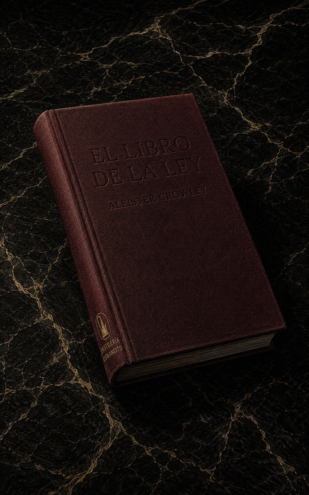
  </figure>

  
<strong>El libro abierto en su umbral</strong>

  <figure class="img-container">
    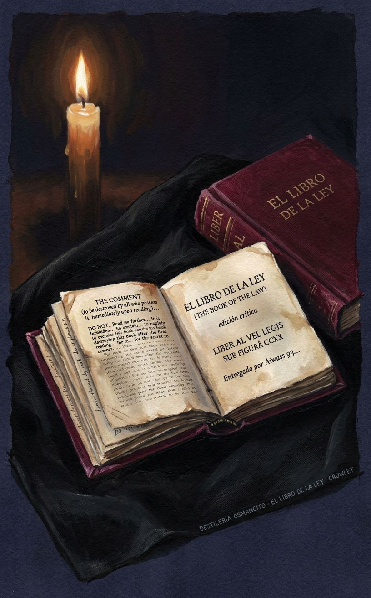
  </figure>

---

### Atmósfera

  
<strong>El mandato sin destinatario</strong>

  <figure class="img-container">
    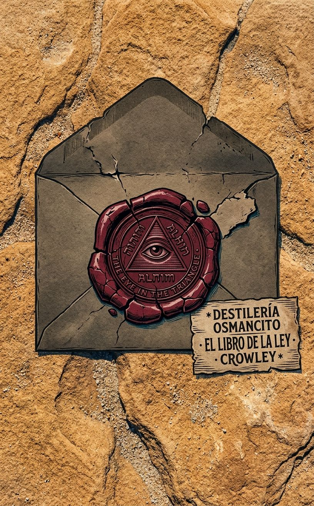
  </figure>

  
<strong>La estrella que ordena</strong>

  <figure class="img-container">
    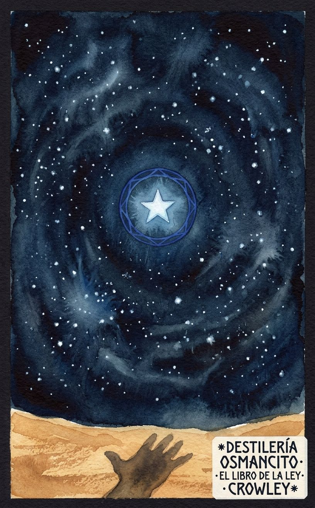
  </figure>

  
<strong>Voz y escritura</strong>

  <figure class="img-container">
    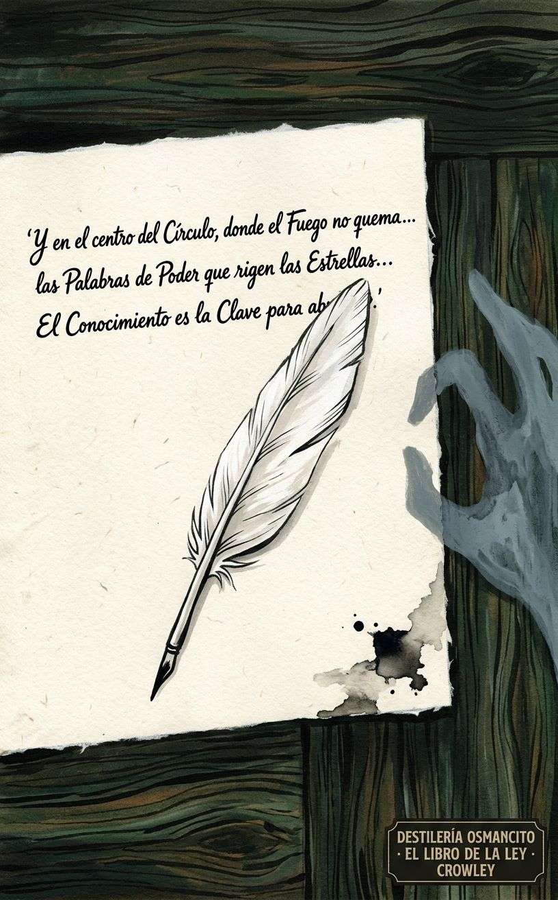
  </figure>

---

## Nota de recibo

Un libro que llega con la orden de destruirse. Que proclama ser la ley de todos y exige que nadie lo discuta. Que tiene tres voces, tres dioses, tres capítulos — y en cada uno la misma operación: la voz habla, el profeta escribe, y el texto insiste en que la autoría no es de ninguno de los dos. El corpus no fue escrito: fue recibido. Esa es su primera afirmación, y todo lo demás depende de si se acepta.

---

*El corpus llega como objeto que ya tiene posición antes de ser abierto: se sabe sagrado, se sabe peligroso, y avisa de ambas cosas en la primera página.*

---

### Apertura

Hay textos que llegan con el peso de lo que afirman ser. Este llega con el peso de lo que ordena. No dice "soy un libro sagrado" — dice que la ley es una, que el estudio está prohibido, que quien hable de su contenido será apartado como foco de pestilencia. Todo eso antes del primer capítulo. Nombrar lo que es *El libro de la ley* es distinto de resumir lo que dice: es reconocer que el texto construyó su propia imposibilidad de lectura neutral como parte de su arquitectura.

---

### Ficha

**Título** — *The Comment / Liber AL vel Legis* (publicado en español como *El libro de la ley*)  
**Autor** — Aleister Crowley  
**Año** — 1904 (dictado); 1909 (primera publicación)  
**Género** — Escritura sagrada / texto de revelación / grimorio fundacional  
**Extensión estimada** — Aproximadamente 3.200 palabras · 13 páginas (a 250 palabras/pág.) · 3 capítulos más un prefacio breve (*The Comment*)  
**Idioma original** — Inglés  
**Palabra más frecuente con contenido** — *me* / *I* (la primera persona y su objeto directo dominan el texto desde la primera línea hasta la última: el corpus es la voz de entidades que hablan de sí mismas y ordenan que se las atienda)

---

### Sinopsis y figuras clave

*El libro de la ley* es el texto fundacional del Thelema, el sistema religioso y filosófico de Aleister Crowley. Consta de tres capítulos, cada uno dictado por una voz distinta: Nuit, diosa del cielo infinito; Hadit, punto de conciencia pura; y Ra-Hoor-Khuit, señor de la guerra y la fuerza. Crowley afirmó haber recibido el texto en El Cairo en abril de 1904 a través de la entidad Aiwass. El texto proclama una nueva ley para la humanidad — "Haz lo que quieras será toda la Ley" — y articula una cosmología donde cada ser es una estrella con una voluntad propia e irrestricta.

**Nuit** — La diosa del cielo, el espacio infinito, la circunferencia que no tiene centro; habla en el Capítulo I.  
**Hadit** — El punto, el centro, la llama en el corazón de cada ser; habla en el Capítulo II.  
**Ra-Hoor-Khuit** — El señor de la guerra, versión activa del dios solar Horus; habla en el Capítulo III.  
**Ankh-f-n-khonsu** — El escriba-sacerdote histórico cuya estela encontró Crowley en El Cairo; figura de autoridad textual que legitima la recepción.  
**Aiwass** — La entidad que dicta el texto; ministro de Hoor-paar-kraat; ausente como personaje pero omnipresente como fuente.  
**La Bestia** — El profeta elegido, identificado implícitamente con Crowley; receptor y vehículo.  
**La Mujer Escarlata** — Compañera del profeta; figura de poder ritual y erótico.

---

### Mapa de hechos

El texto comienza con *The Comment*, un prefacio que establece las condiciones de lectura: el libro está prohibido de estudiar, debe destruirse tras la primera lectura, quien lo discuta debe ser apartado. Es una advertencia que también es una trampa: el texto que prohíbe su propia lectura garantiza con esa prohibición que será leído.

**Capítulo I — Nuit:** La voz de la diosa del espacio infinito habla al profeta y a través de él. Proclama que cada hombre y cada mujer es una estrella. Describe la relación entre Nuit (circunferencia infinita, espacio) y Hadit (centro, punto de conciencia). Instruye sobre la naturaleza del amor bajo la voluntad ("love under will"), establece la ley de Thelema, y ordena comportamientos rituales, festivos y de conducta personal. El capítulo oscila entre la caricia y la amenaza, entre la promesa de éxtasis y la advertencia de "direful judgments".

**Capítulo II — Hadit:** La voz del punto de conciencia, complemento de Nuit, habla desde una posición aún más íntima — es la llama que arde en cada corazón. Hadit se declara el mago y el exorcista, el eje de la rueda. Proclama que la existencia es pura alegría, que los sufrimientos son sombras. Contiene algunos de los pasajes más perturbadores del corpus: el llamado a despreciar a los débiles y los miserables ("stamp down the wretched & the weak"), la apología del vino y las drogas, la afirmación de que la razón es una mentira. El capítulo concluye con una secuencia casi extática donde la voz y el profeta parecen fundirse.

**Capítulo III — Ra-Hoor-Khuit:** El dios de la guerra toma el mando. El tono cambia radicalmente: el éxtasis de los capítulos anteriores se vuelve orden militar. Instruye al profeta a elegir una isla, fortificarla, usar una "máquina de guerra". Describe rituales de sacrificio con sangre. Ataca con violencia explícita a todas las religiones existentes: Cristo, Mahoma, el budismo, el hinduismo. Finaliza con una serie de misterios criptográficos (la secuencia de números y letras del versículo II,76 queda sin explicación) y la promesa de que un intérprete futuro descifrará lo que el profeta no puede.

El texto cierra con la fórmula *Abrahadabra* y la declaración de que *El libro de la ley* "está escrito y oculto".

---

### Diagnóstico

El corpus llega como un dispositivo de autoridad absoluta que incluye, dentro de sí mismo, los mecanismos para neutralizar cualquier cuestionamiento. No argumenta: decreta. No demuestra: ordena. Su temperatura es la de algo que se sabe irrefutable porque ha construido la irrefutabilidad como condición de existencia. Lo que produce antes de ser pensado no es fe ni duda — es la incomodidad de estar frente a un texto que ya tomó todas las decisiones por el lector.

---

### Las tensiones que mueven todo

**1. La prohibición que asegura la lectura.** El corpus se prohíbe a sí mismo y ese gesto es su primer acto de seducción. El texto que ordena destruirse garantiza con esa orden que será conservado, estudiado, transmitido. La prohibición no es un límite — es el mecanismo de perpetuación.

**2. La voluntad libre dentro de una ley sin excepción.** "Haz lo que quieras" se proclama como liberación absoluta. Pero la ley es total, no hay escala de apelación, y quien no la cumple enfrenta "direful judgments". La tensión nunca se resuelve: ¿es esto libertad o la forma más sofisticada de sometimiento?

**3. La autoría que nadie puede reclamar.** El texto fue dictado por Aiwass, transcrito por Crowley, legitimado por un sacerdote muerto hace milenios. Nadie lo escribió, todos lo transmitieron. Esa ausencia de autor humano es simultáneamente la fuente de su autoridad y su punto más vulnerable: si nadie lo escribió, nadie puede ser responsable de lo que dice.

# Néctar

El libro comienza prohibiéndose. *The Comment* — ese prefacio de siete líneas que antecede al texto sagrado — establece las condiciones: el estudio está prohibido, el libro debe destruirse tras la primera lectura, quien discuta su contenido será apartado como foco de pestilencia. No hay apelación. No hay excepción. Y sin embargo el texto existe, fue conservado, fue transmitido. La prohibición no es un límite: es el primer movimiento de seducción, la garantía de que el libro será leído para siempre.

*Every man and every woman is a star.*

Esa es la tercera línea del Capítulo I, antes de que haya argumento, antes de que haya contexto. No se demuestra. No se explica. Se declara — con la misma economía con que se declara una ley de la naturaleza. El corpus opera así: no convence, proclama.

Nuit, la diosa del cielo infinito, habla de la relación entre espacio y punto, entre circunferencia y centro, y produce una de las formulaciones más extrañas del texto: *For I am divided for love's sake, for the chance of union. This is the creation of the world, that the pain of division is as nothing, and the joy of dissolution all.* La creación del mundo no como acto de un dios que construye, sino como consecuencia de una separación que busca reunirse. El dolor de la división es nada; la alegría de la disolución lo es todo. El universo existe porque el infinito quiso experimentar el contacto.

La ley que Nuit proclama tiene una sola frase: *Do what thou wilt shall be the whole of the Law.* Y luego, inmediatamente, su complemento: *The word of Sin is Restriction.* La libertad no es un valor — es la única ley. Y su opuesto no es el pecado como transgresión: es la restricción misma, cualquier restricción, incluso la impuesta con buenas intenciones. *For pure will, unassuaged of purpose, delivered from the lust of result, is every way perfect.* La voluntad pura no busca un resultado particular: se ejerce sin contaminación teleológica. Ese es su único modo de ser perfecta.

El Capítulo II trae a Hadit, el punto, la llama, el complemento de Nuit. Su voz es más cercana, más íntima, más perturbadora. *I am the flame that burns in every heart of man, and in the core of every star. I am Life, and the giver of Life, yet therefore is the knowledge of me the knowledge of death.* El conocimiento de la vida y el conocimiento de la muerte son la misma cosa. No paradoja: identidad.

Luego Hadit maldice la razón — y lo hace con una fuerza que ningún argumento racional podría alcanzar:

*Now a curse upon Because and his kin! May Because be accursed for ever! If Will stops and cries Why, invoking Because, then Will stops & does nought. If Power asks why, then is Power weakness. Also reason is a lie; for there is a factor infinite & unknown; & all their words are skew-wise.*

La razón no es un error: es una trampa. El momento en que la voluntad pregunta por qué, se detiene. El poder que necesita justificación ya cedió. Y todas las palabras de la razón están torcidas — *skew-wise* — porque operan sobre un universo que contiene un factor infinito y desconocido que ningún sistema racional puede incluir.

El Capítulo II termina en un crescendo que roza la incoherencia deliberada — la voz y el profeta parecen fundirse, la sintaxis se quiebra, la experiencia mística se vuelve indistinguible de la asfixia: *Harder! Hold up thyself! Lift thine head! breathe not so deep — die!* Y luego, después del colapso, una instrucción de notable precisión: *Be not animal; refine thy rapture! If thou drink, drink by the eight and ninety rules of art: if thou love, exceed by delicacy; and if thou do aught joyous, let there be subtlety therein! But exceed! exceed!*

El exceso como mandato. Pero un exceso refinado, articulado, con reglas. El corpus no predica el caos — predica la intensidad disciplinada.

El Capítulo III cambia de voz y de temperatura. Ra-Hoor-Khuit, el dios de la guerra, habla sin metáfora: *Now let it be first understood that I am a god of War and of Vengeance. I shall deal hardly with them.* La instrucción que sigue es militar: elegir una isla, fortificarla, usar una máquina de guerra. Luego, sin transición, ataca todas las religiones existentes con una violencia léxica que no tiene equivalente en los capítulos anteriores.

Pero en medio de esa violencia aparece uno de los pasajes más lúcidos: *Fear not at all; fear neither men nor Fates, nor gods, nor anything. Money fear not, nor laughter of the folk folly, nor any other power in heaven or upon the earth or under the earth.* La lista de lo que no debe temerse incluye el dinero y la risa de los necios en el mismo nivel que los dioses y el destino. Es un catálogo de miedos cotidianos elevado al rango de cosmología.

El texto cierra con un misterio que declara ser misterio: la secuencia *4 6 3 8 A B K 2 4 A L G M O R 3 Y X 24 89 R P S T O V A L* — números y letras sin sintaxis visible — seguida de la confesión directa: *What meaneth this, o prophet? Thou knowest not; nor shalt thou know ever.* Vendrá alguien después que lo explicará. Por ahora, el profeta transcribe lo que no entiende. Y el libro cierra con esa imagen: el escriba que no sabe lo que escribió, el texto que guarda un secreto que ni su vehículo conoce.

*The Book of the Law is Written and Concealed. Aum. Ha.*

---

## Veredicto

**Valor.** El corpus tiene un lugar que se ganó: fundó una religión, alteró la historia del ocultismo occidental, y varias de sus formulaciones son genuinamente memorables fuera de cualquier contexto esotérico. No todo el texto sostiene ese nivel — hay tramos de instrucción ritual que no aportan nada a quien no esté ya dentro del sistema — pero sus momentos más altos son reales.

**Goce.** Hay placer en esto, sí, pero es un placer incómodo — el que produce leer algo que opera con la lógica de la amenaza y la seducción simultáneas. No es el placer de la belleza ni el del argumento bien construido: es el placer extraño de estar frente a un texto que cree completamente en sí mismo, sin fisura, sin ironía. Eso ya es algo poco frecuente.

# Bitácora

El corpus abre con *The Comment*, un prefacio de siete proposiciones que no introduce sino que legisla las condiciones de lectura. La primera: el estudio del libro está prohibido. La segunda: es sabio destruir esta copia después de la primera lectura. La tercera: quien desobedezca lo hace a su propio riesgo. La cuarta: quienes discutan el contenido serán apartados como focos de pestilencia. La quinta: todas las preguntas sobre la Ley serán decididas solo por apelación a los escritos del autor, cada uno por sí mismo. La sexta y séptima: no hay ley más allá de "Haz lo que quieras" — "Amor es la ley, amor bajo la voluntad". Firma el sacerdote Ankh-f-n-khonsu. El texto que sigue es el que acaba de prohibirse.

**Capítulo I — Nuit**

El Capítulo I está narrado en primera persona por Nuit, diosa del cielo infinito y el espacio ilimitado. Su apertura declara tres afirmaciones sin demostración: que ella es la manifestación de Nuit, que ocurre el develamiento de la compañía del cielo, y que cada hombre y cada mujer es una estrella. Establece que cada número es infinito y que no hay diferencia. Invoca al guerrero señor de Tebas para que la asista en su revelación ante los hijos de los hombres.

Nuit identifica a Hadit como su secreto centro, su corazón y su lengua, y declara que el texto fue revelado por Aiwass, ministro de Hoor-paar-kraat. Introduce la distinción entre Khabs y Khu — la estrella dentro del ser — e instruye a adorar el Khabs. Establece que sus servidores serán pocos y secretos y que gobernarán sobre los muchos. Descarta a los dioses y hombres que los hombres adoran como tontos. Invita a sus elegidos a llenarse de amor bajo las estrellas.

Nuit declara su posición: está por encima y dentro de cada uno; su éxtasis está en el éxtasis de sus elegidos. Introduce una estrofa poética que describe su cuerpo como el azul estrellado y el globo alado. Identifica al sacerdote y apóstol del espacio infinito como al príncipe-sacerdote la Bestia; identifica a la Mujer Escarlata como la receptora de todo poder. Ambos reunirán a los hijos de Nuit y llevarán la gloria de las estrellas a los corazones de los hombres. La Bestia es siempre un sol; la Mujer Escarlata, una luna.

La voz declara que la clave de los rituales está en la palabra secreta entregada al profeta. Establece la relación triádica: con el Dios y el Adorador, ella no es nada; ellos están en la tierra; ella es el Cielo. Se da a conocer como Nuit, dueña de la palabra seis y cincuenta. Instruye: dividir, sumar, multiplicar, y comprender.

El profeta pregunta quién es y cuál será la señal. Nuit responde doblándose como llama: la señal será su éxtasis, la conciencia de la continuidad de la existencia, la omnipresencia de su cuerpo. El sacerdote responde con adoración. Nuit instruye que los hombres no hablen de ella como Una sino como Ninguna, y que no hablen de ella en absoluto, pues es continua.

Nuit declara que está dividida por amor, por la posibilidad de la unión. Eso es la creación del mundo: el dolor de la división no es nada; la alegría de la disolución lo es todo. Instruye a no preocuparse por los necios y sus penas. Ordena obedecer al profeta, seguir las pruebas de su conocimiento, buscarla solo a ella — así los joys del amor redimirán a sus elegidos.

El sacerdote cae en trance y pide a la Reina del Cielo que escriba los rituales y la ley. Nuit responde: las pruebas no las escribirá; los rituales serán mitad conocidos y mitad ocultos; la Ley es para todos. Declara que el corpus que el profeta escribe es el triple Libro de la Ley. Instruye que su escriba Ankh-af-na-khonsu no cambie ni una letra, pero que podrá comentar el libro con la sabiduría de Ra-Hoor-Khu-it. También deberá aprender y enseñar mantras y hechizos, el obeah y el wanga, el trabajo de la varita y de la espada.

Nuit proclama la palabra de la Ley: Thelema. Explica que en esa palabra hay tres grados: el Ermitaño, el Amante y el hombre de la Tierra. La ley es "Haz lo que quieras". Declara que el pecado es la Restricción, e instruye sobre el amor sin restricciones. Establece que la voluntad pura, sin mezcla de propósito y libre del apetito por el resultado, es perfecta en todos sentidos.

Nuit introduce misterios numéricos: el cero como clave secreta, su número es once. Instruye al profeta a entrar por las cuatro puertas de un palacio cuyo suelo es de plata y oro, lapislázuli y jaspe. Le ordena vestirse bien, comer alimentos ricos, beber vinos dulces y espumosos, tomar su voluntad y llenarse de amor — siempre hacia ella. Advierte que confundir las marcas del espacio traerá los terribles juicios de Ra Hoor Khuit.

Los pasajes finales del Capítulo I incluyen instrucciones rituales: incienso de maderas resinosas y gomas sin sangre, el número 11, la Estrella de Cinco Puntas con un círculo rojo en el medio, el color negro para los ciegos y el azul y oro para los que ven. Nuit invita a sus elegidos a arder su incienso ante ella bajo las estrellas nocturnas del desierto y a acercarse a su regazo. Les promesa a sus elegidos splendor, riqueza, mujeres y especias — siempre en amor hacia ella. Instruye al profeta a no cambiar ni el estilo de una letra. El hijo del profeta verá los misterios ocultos. El Capítulo I cierra: la Manifestación de Nuit ha terminado.

**Capítulo II — Hadit**

El Capítulo II está narrado por Hadit, complemento de Nuit, punto de conciencia pura. Se declara no extendido; Khabs es el nombre de su casa. En la esfera es el centro en todas partes, mientras Nuit, la circunferencia, no se encuentra en ningún lugar. Ella será conocida; él, nunca.

Hadit declara que los rituales de los tiempos antiguos son oscuros y deben ser purificados por el profeta. Se identifica como la llama que arde en cada corazón de hombre y en el núcleo de cada estrella; es la Vida y el dador de Vida, por lo que el conocimiento de él es el conocimiento de la muerte. Es el Mago y el Exorcista, el eje de la rueda y el cubo en el círculo. "Ven a mí" es una palabra necia, pues es él quien va.

Hadit declara que quienes adoraron a Heru-pa-kraath lo adoraron a él, aunque mal. Establece que la existencia es pura alegría; los sufrimientos son solo sombras que pasan; hay algo que permanece. Reconoce que el profeta tiene mala voluntad para aprender esta escritura, que odia la mano y la pluma — pero Hadit es más fuerte.

Su número es nueve para los necios, pero ocho para los justos, y uno en ocho — pues es ninguno verdaderamente. La Emperatriz y el Rey no son de él; hay un secreto ulterior. Hadit es la Emperatriz y el Hierofante: once, como su novia es once.

Hadit declara que los compañeros de suspiros están muertos y no sienten. Sus elegidos no son para los pobres y tristes: los señores de la tierra son su parentela. Un dios no vive en un perro; los más altos son de ellos. La belleza y la fuerza, la risa vibrante y el languor delicioso, la fuerza y el fuego son de ellos.

El pasaje más perturbador del Capítulo II declara que sus elegidos no tienen nada que ver con los marginados y los no aptos: que mueran en su miseria, pues no sienten. La compasión es el vicio de los reyes; hay que pisotear a los miserables y los débiles — esa es la ley del fuerte, la ley y la alegría del mundo. Sin embargo, aconseja no creer en la mentira de que el rey debe morir: en verdad no morirá, sino que vivirá. Si el cuerpo del Rey se disuelve, permanecerá en éxtasis puro para siempre.

Hadit se declara la Serpiente que da Conocimiento y Deleite y gloria brillante. Instruye a adorarlo con vino y drogas extrañas, y promete que no causarán daño. Declara mentira la exposición de la inocencia. Insta a ser fuerte, a disfrutar todas las cosas de los sentidos y el arrebato, a no temer que ningún Dios lo niegue. Está solo; no hay Dios donde él está.

Describe a sus amigos ermitaños: no en el bosque ni en la montaña, sino en camas de púrpura acariciados por bestias magníficas de mujeres con miembros grandes y fuego y luz en sus ojos. Advierte a los reyes que no fuercen a otros reyes. Ordena amor mutuo con corazones ardientes; a los hombres bajos, pisoteen en el feroz deseo de su orgullo.

Hadit maldice el Porque y su parentela: que el Porque sea maldito para siempre. Si la Voluntad se detiene y pregunta por qué, invocando el Porque, entonces la Voluntad se detiene y no hace nada. Si el Poder pregunta por qué, entonces el Poder es debilidad. La razón es también una mentira, pues hay un factor infinito y desconocido, y todas sus palabras están torcidas.

Ordena realizar los rituales correctamente con alegría y belleza. Establece una serie de fiestas: para la primera noche del profeta y su novia; para los tres días de la escritura del Libro; para Tahuti y el hijo del profeta; para el Rito Supremo y el Equinoccio de los Dioses; para el fuego y el agua; para la vida y, aún mayor, para la muerte. Una fiesta cada día en los corazones, en la alegría del arrebato de Hadit. Una fiesta cada noche para Nu y el placer del deleite supremo.

Hadit dirige sus palabras finales al profeta directamente: está elevado en su corazón; los besos de las estrellas llueven sobre su cuerpo. El profeta está exhausto en la plenitud voluptuosa de la inspiración. Las voces divinas lo inundan. Hadit instruye con precisión extraña en medio del éxtasis: no ser animal; refinar el arrebato. Beber según las noventa y ocho reglas del arte; si ama, exceder en delicadeza; si hace algo gozoso, que haya sutileza en ello. Pero exceder. Exceder siempre. El Capítulo II cierra: el fin de la ocultación de Hadit; bendición y adoración al profeta de la estrella hermosa.

**Capítulo III — Ra-Hoor-Khuit**

El Capítulo III está narrado por Ra-Hoor-Khuit, señor de la guerra y la venganza. Abre con la fórmula *Abrahadabra*. Declara que es un dios de guerra y venganza y que tratará duramente a sus enemigos. Instruye al profeta a elegir una isla, fortificarla, rodearla de maquinaria de guerra. Le dará una máquina de guerra con la que golpeará a los pueblos; nadie se pondrá ante él.

Ordena conseguir la Stele of Revealing, colocarla en el templo secreto como Kiblah para siempre. Declara que no se desvanecerá: su color milagroso volverá día a día. Instruye mantenerla en vidrio cerrado como prueba para el mundo. Prohíbe el argumento: la conquista es suficiente. Ordena adorar con fuego y sangre, con espadas y lanzas. La mujer estará ceñida con una espada ante él; la sangre fluirá a su nombre. Ordena pisotear a los Paganos. Ordena sacrificio de ganado, pequeño y grande — y después de un niño, aunque no ahora.

Instruye a no temer nada: ni hombres, ni Destinos, ni dioses, ni nada. Ni el dinero, ni la risa de la locura popular, ni ningún otro poder en el cielo o en la tierra o bajo la tierra. Nuit es su refugio; Hadit, su luz; Ra-Hoor-Khuit, la fuerza y el vigor de sus brazos.

Ordena que la misericordia sea apartada: malditos quienes sientan compasión. Que maten y torturen; que no tengan piedad. La Stele será llamada la Abominación de Desolación; su número es 718. El Porque ha caído porque ya no está allí.

Ordena poner su imagen en el Este: comprará una imagen que le mostrará, especial, parecida a una que el profeta ya conoce. Las otras imágenes se agrupan alrededor para sostenerlo; todas serán adoradas. Para el perfume: mezclar harina, miel y gruesos restos de vino tinto, luego aceite de Abramelin y aceite de oliva, luego suavizar con sangre fresca. La mejor sangre es la de la luna mensual; luego la sangre fresca de un niño, o la que cae del huésped del cielo; luego la de los enemigos; luego la del sacerdote o los adoradores; última, la de alguna bestia. Esto se quema; con esto se hacen pasteles que se comen en nombre de Ra-Hoor-Khuit. También se coloca ante él con perfumes abundantes; se llenará de escarabajos y criaturas rastreras sagradas para él. A esas criaturas se las mata nombrando a los enemigos, que caerán. También engendrarán deseo y poder de deseo en quien los coma. Los que sean conservados mucho tiempo son mejores, pues se hinchan con la fuerza del dios.

Su altar es de latón abierto; se quema en plata o en oro. Vendrá un hombre rico del oeste que derramará su oro sobre el profeta. Del oro se forja acero. Que el profeta esté listo para volar o para golpear. El lugar sagrado permanecerá intacto a través de los siglos aunque sea quemado y destruido, pues una casa invisible está allí y permanecerá hasta la caída del Gran Equinoccio — cuando Hrumachis se levantará y el de la doble varita asumirá el trono. Otro profeta surgirá con fiebre fresca del cielo; otra mujer despertará el deseo y la adoración de la Serpiente; otra alma de Dios y bestia se mezclará en el sacerdote globado; otro sacrificio manchará la tumba; otro rey reinará.

Ra-Hoor-Khuit revela la mitad de la palabra de Heru-ra-ha: Hoor-pa-kraat y Ra-Hoor-Khut. El profeta canta un himno de adoración que recorre los nombres del dios, la apertura de los caminos del Khu y el Ka, la invocación de la luz y la fuerza. El profeta declara haber hecho una puerta secreta hacia la casa de Ra y Tum, de Khephra y Ahathoor.

Ra-Hoor-Khuit instruye que el libro sea traducido a todas las lenguas, pero siempre con el original en la escritura de la Bestia, pues en la forma azarosa de las letras y su posición hay misterios que ninguna Bestia podrá revelar. Uno vendrá después que descubrirá la clave de todo; esta línea trazada es una clave; este círculo al cuadrado en su fracaso también es una clave. Y Abrahadabra. El hijo del profeta tendrá algo que ver con esto, aunque de manera extraña.

El dios declara que el misterio de las letras ha terminado y quiere avanzar al lugar más sagrado. Se declara en una palabra secreta cuádruple, la blasfemia contra todos los dioses de los hombres. Lanza maldiciones sobre Cristo, Mahoma, el indio y el budista, el mongol y el Din. Escupe sobre sus credos. Ordena que María sea desgarrada en ruedas; que todas las mujeres castas sean despreciadas; que se desprecien los cobardes, los soldados profesionales que no se atreven a pelear sino a jugar, todos los tontos. Pero los agudos y los orgullosos, los reales y los nobles son hermanos.

Ra-Hoor-Khuit proclama que no hay ley más allá de hacer lo que se quiere. Hay un fin de la palabra del Dios entronado en el asiento de Ra. Al profeta se le dice que venga a través de la tribulación de la prueba, que es éxtasis. El tonto leerá el Libro y su comentario y no entenderá. El primero que lo atraviese lo tendrá como plata; a través del segundo, oro; del tercero, piedras de agua preciosa; del cuarto, chispas últimas del fuego íntimo. Sin embargo, a todos les parecerá bello. Sus enemigos que no lo digan son simples mentirosos. Hay éxito.

Ra-Hoor-Khuit se declara el Señor de Silencio y Fuerza con cabeza de halcón; su nimbo envuelve el cielo azul noche. Saluda a los dos guerreros sobre los pilares del mundo, pues su tiempo se acerca. Es el Señor de la Doble Varita de Poder; su mano izquierda está vacía, pues aplastó un universo y no queda nada. Instruye pegar las hojas de derecha a izquierda y de arriba a abajo: entonces se verá algo. Hay un esplendor en su nombre oculto y glorioso. Las palabras finales del texto son "Abrahadabra". El Libro de la Ley está escrito y oculto. Aum. Ha.

# Narraciones

El corpus no cuenta historias — las impone. Los eventos no son narraciones en el sentido convencional: son actos de transmisión donde alguien dicta, alguien recibe, y el texto registra esa operación en curso. Lo que ocurre no es lo que los personajes hacen sino lo que la voz divina le hace al profeta — y a través de él, al lector. El evento central del corpus sucede en la brecha entre quien habla y quien escribe.

---

## Índice de eventos

**The Comment (prefacio) — El libro se prohíbe a sí mismo.**
Antes de que comience el texto sagrado, una voz no identificada decreta siete condiciones: estudio prohibido, destrucción recomendada, aislamiento para quien hable de su contenido. El objeto que sostiene esta prohibición es el objeto mismo que la contiene. El giro está en la forma: prohibir el estudio es la primera instrucción del objeto de estudio.

**I,7 — Aiwass revela su identidad y su origen.**
El texto identifica a su propio transmisor: el ministro de Hoor-paar-kraat, Aiwass, es quien reveló el texto al profeta. No hay escena de encuentro narrada — solo la declaración retroactiva de que hubo uno. La ausencia de la escena es parte del evento: el origen del texto no tiene testigos excepto el profeta, y el profeta no está presente como narrador sino como recipiente.

**I,26–27 — El profeta pregunta y Nuit responde con su cuerpo.**
El profeta, en su papel de esclavo ante la bella, pregunta quién es y cuál será la señal. Nuit no responde con palabras primero: se dobla como llama azul, toca la tierra negra con las manos, arquea el cuerpo para el amor. Luego dice: la señal es mi éxtasis, la conciencia de la continuidad de la existencia, la omnipresencia de mi cuerpo. El profeta responde besando sus cejas. Es el único momento de contacto físico del texto — y ocurre entre una diosa y un sacerdote dentro de una visión dentro de un libro que no debería existir.

**I,33–36 — El profeta cae en trance y pide instrucciones.**
El sacerdote-profeta cae en trance o desmayo ante la Reina del Cielo y le pide que escriba las pruebas, los rituales, la ley. Nuit responde con una distribución inesperada: las pruebas no serán escritas, los rituales serán mitad conocidos y mitad ocultos, la Ley es para todos. Esta asimetría — lo más secreto quedará sin escribirse — define la estructura de todo lo que sigue: el corpus es siempre la mitad visible de algo mayor.

**II,10–13 — Hadit reconoce la resistencia del profeta.**
Hadit observa directamente que el profeta tiene mala voluntad para aprender esta escritura, que odia la mano y la pluma. No lo consuela ni lo convence: declara que es más fuerte. El evento es mínimo pero singular: es el único momento en que el corpus reconoce que su propia producción fue reluctante, que el canal de transmisión resistió. El texto se sabe coercido.

**II,63–68 — La voz divina y el profeta se fusionan en el éxtasis.**
El Capítulo II cierra en una secuencia donde la separación entre Hadit y el profeta se disuelve. La voz dice que el profeta está exhausto en la plenitud voluptuosa de la inspiración; que la expiración es más dulce que la muerte. Luego, en aparente respuesta a ese colapso: *Hold! Hold! Bear up in thy rapture; fall not in swoon of the excellent kisses! Harder! Hold up thyself! Lift thine head! breathe not so deep — die!* La última palabra del evento es una orden de morir que funciona simultáneamente como clímax místico y como colapso sintáctico. Lo que sigue — las instrucciones sobre el exceso refinado — indica que el profeta sobrevivió.

**III,11 — Ra-Hoor-Khuit promete facilitar un robo.**
El dios ordena al profeta conseguir la Stele of Revealing, colocarla en su templo secreto. Luego, en un giro notable, añade que facilitará la sustracción del objeto "de la casa mal ordenada en la Ciudad Victoriosa", y que el profeta deberá llevarlo con adoración aunque no le guste. Le promete peligro y trabajo. Es el único momento en que una instrucción divina prevé la incomodidad del ejecutor y la incluye como parte del mandato — como si el dios supiera que está pidiendo algo difícil.

**III,36–38 — El profeta canta el himno final.**
El profeta toma la voz por primera vez en forma extendida y canta un himno de adoración a Ra-Hoor-Khuit. Se identifica como el Señor de Tebas, el portavoz inspirado de Mentu, el Ankh-af-na-khonsu que murió y cuyas palabras son verdad. Declara haber hecho una puerta secreta a la casa de Ra y Tum. Es el único momento en que el profeta actúa como voz propia, no como canal — y lo hace adoptando la identidad de un sacerdote muerto hace milenios.

**III,47 — El texto declara su propio futuro intérprete.**
Ra-Hoor-Khuit informa al profeta que un misterio de letras y números en el corpus no será descifrado por él — ni por ninguna Bestia. Vendrá alguien después, desde un origen no revelado, que descubrirá la clave de todo. Esta instrucción delega la completitud del texto a un lector futuro que el texto mismo convoca sin nombrarlo. El corpus se declara inacabado por diseño.

---

## Diagnóstico final

Este corpus no narra lo que ocurre entre sus personajes — narra lo que ocurre entre su voz y su receptor, que es también el lector: una serie de actos de transmisión donde la resistencia, el éxtasis y la coerción son inseparables del contenido transmitido.

# Joyería

El corpus tiene tres estuches. No todos pesan igual. El Capítulo I contiene más joyas que los otros dos juntos — no porque sea más largo, sino porque es donde la voz todavía seduce antes de empezar a ordenar. Las joyas del corpus son casi todas formulaciones: frases que se sostienen solas porque tienen la estructura de una ley natural, aunque digan algo que ninguna ley natural dice.

---

## Capítulo I — El estuche de Nuit

**La prohibición como apertura.** El prefacio abre con una paradoja que funciona como trampa: el texto que prohíbe su propio estudio es el primer objeto de estudio. La tensión viaja desde la restricción hacia su propio fracaso — la prohibición garantiza exactamente lo que prohíbe. Cierra en suspensión: el libro existe, el lector lo sostiene. *Temperatura: trampa fría.*

**La proclamación sin fundamento.** La voz de Nuit abre con tres afirmaciones en sucesión sin argumento ni transición. Cada una podría ser la tesis de un sistema filosófico; aquí son frases consecutivas. La trayectoria es acumulación por yuxtaposición — no por deducción. Cierra al llegar a la cuarta afirmación, que introduce a los servidores secretos. *Temperatura: fuerza por velocidad.*

**La creación como dolor que no duele.** La pregunta del profeta sobre la señal lleva a Nuit a responder con una cosmogonía miniatura: la división del infinito fue el acto de la creación, y el dolor de esa división es nada comparado con la alegría de la disolución. La tensión viaja desde la pregunta personal hacia la respuesta cósmica. Cierra con la imagen del cuerpo de Nuit arqueado. *Temperatura: magnitud dentro de lo íntimo.*

**La ley y su único pecado.** La proclamación de la ley — "Haz lo que quieras" — abre una tensión que el corpus resuelve de inmediato con su contrario: la Restricción como único pecado. La trayectoria va de la libertad absoluta a su definición negativa. Cierra con la formulación de la voluntad pura. Tensión abierta: si todo es permitido excepto la restricción, ¿quién decide cuándo un acto restringe a otro? *Temperatura: lógica que se come su propia cola.*

**Veredicto del capítulo:** Capítulo que seduce antes de legislar — acumula cosmología y promesas de éxtasis para instalar la ley en el lector antes de que éste note que la está aceptando.

---

El Capítulo I contiene cuatro joyas.

**Todo lo que no se puede negar**

*Every man and every woman is a star.*

Una sola frase, ocho palabras, tercera línea del corpus. No tiene sujeto que la explique, no tiene predicado que la amplíe, no tiene consecuencia declarada. Afirma que cada ser humano es una unidad autónoma en movimiento en el espacio, con su propia trayectoria, su propio campo gravitacional, su propio calor. La frase no necesita el resto del corpus para funcionar — el corpus la necesita a ella.

---

**La creación no es lo que dijeron**

*For I am divided for love's sake, for the chance of union. This is the creation of the world, that the pain of division is as nothing, and the joy of dissolution all.*

El universo no existe porque un dios construyó. Existe porque el infinito quiso experimentar el contacto y para eso tuvo que romperse. El dolor de esa ruptura es despreciable; la alegría de volver a fusionarse lo es todo. En dos oraciones: una cosmogonía completa, una ética del deseo, y la inversión de cualquier metafísica que coloque el ser separado como ideal.

---

**La única ley y su trampa**

*For pure will, unassuaged of purpose, delivered from the lust of result, is every way perfect.*

La voluntad pura no quiere nada en particular. No persigue un resultado. No está contaminada por el propósito. Suena a libertad absoluta; es la descripción más exigente posible de la acción: actuar sin querer nada de lo que haces, sin esperar nada de lo que produces. Si se cumple, es perfección. Si se busca cumplirla, ya está contaminada.

---

**Lo que Nuit no es**

*None, breathed the light, faint & faery, of the stars, and two.*

El sacerdote le pide a Nuit que los hombres no la llamen Una. La respuesta no es que es Dos ni Múltiple: es que es Ninguna. Y luego, sin transición: *y dos*. La frase es casi intraducible porque funciona como la paradoja que describe — la circunferencia que no está en ningún lugar. En tres palabras y dos, el corpus produce el único objeto lingüístico que corresponde a su objeto conceptual.

---

## Capítulo II — El estuche de Hadit

**La vida que mata.** Hadit abre declarando su identidad: la llama, la vida, el dador de vida. La tensión aparece en la consecuencia: el conocimiento de él es el conocimiento de la muerte. La trayectoria va de la identidad a la paradoja. Cierra en declaración — no en resolución. *Temperatura: revelación que no consuela.*

**La maldición de la causa.** Hadit maldice el "Porque" — la causalidad como principio explicativo — con una violencia léxica que supera cualquier argumento filosófico contra el racionalismo. La tensión escala desde la maldición hasta la demostración: si la Voluntad pregunta por qué, se detiene. La razón es una mentira porque opera sobre un universo que contiene un factor infinito y desconocido. Cierra sin resolución — la razón queda maldita. *Temperatura: furia que tiene razón.*

**El éxtasis que no cierra.** El Capítulo II termina en una secuencia donde la sintaxis se quiebra a medida que el éxtasis avanza. La tensión viaja desde la instrucción hacia la disolución de la capacidad de instruir. Cierra con la orden de morir — que funciona a la vez como clímax y como ruptura — seguida de la instrucción de refinar el exceso. *Temperatura: colapso controlado.*

**Veredicto del capítulo:** Capítulo que destruye los fundamentos racionales que el lector podría usar para resistir el corpus, y los destruye antes de que el lector los haya invocado.

---

El Capítulo II contiene dos joyas.

**El eje que no gira**

*I am the Magician and the Exorcist. I am the axle of the wheel, and the cube in the circle. "Come unto me" is a foolish word: for it is I that go.*

Hadit no espera ser encontrado. No convoca. Va. La imagen del eje que no se mueve pero que hace posible que todo lo demás gire es la imagen de una presencia que funciona sin ser buscada. Y la última frase — "Ven a mí" es una palabra necia: soy yo quien va — invierte la dirección del encuentro místico. El buscador no encuentra: es encontrado, sin buscarlo, sin saberlo.

---

**La maldición más eficaz**

*Now a curse upon Because and his kin! May Because be accursed for ever! If Will stops and cries Why, invoking Because, then Will stops & does nought. If Power asks why, then is Power weakness. Also reason is a lie; for there is a factor infinite & unknown; & all their words are skew-wise.*

No hay argumento filosófico contra el racionalismo que opere con esta velocidad. La maldición es su propia demostración: no explica por qué la razón falla, la ejecuta en el acto de maldecirla. El "factor infinito y desconocido" no es un misterio místico — es una descripción técnica de la limitación de cualquier sistema cerrado. Y *skew-wise* — torcidas, sesgadas, oblicuas — es la palabra exacta para lo que son las palabras cuando se les exige cubrir lo que no pueden cubrir.

---

## Capítulo III — El estuche de Ra-Hoor-Khuit

**El dios que no seduce.** Ra-Hoor-Khuit abre declarando su naturaleza sin preámbulo: guerra y venganza. La tensión viaja desde la declaración hacia las instrucciones — militares, rituales, violentas — sin que haya un momento de caricia. La trayectoria es lineal. Cierra en la promesa de un intérprete futuro que descifre lo que el profeta no puede. *Temperatura: mando sin apelación.*

**La blasfemia como catálogo.** El ataque a las religiones existentes escala sin freno desde Cristo hasta "el Din". La tensión es pura acumulación — cada línea añade un objeto nuevo al desprecio. No hay argumento; hay velocidad y cobertura. Cierra en la declaración de que no hay ley más allá de hacer lo que se quiere. *Temperatura: violencia como liturgia.*

**El misterio declarado.** Los versículos finales del corpus presentan una secuencia alfanumérica sin sintaxis y luego declaran que ni el profeta ni ningún sucesor inmediato la entenderá. La tensión es entre la presencia del mensaje y la ausencia de su sentido. Cierra sin resolución — el corpus termina conteniendo algo que él mismo declara ilegible. *Temperatura: silencio dentro del ruido.*

**Veredicto del capítulo:** Capítulo que ejecuta sin persuadir, y en ese gesto revela que el corpus ya renunció a la persuasión desde el principio.

---

El Capítulo III contiene una joya.

**Lo que no se teme**

*Fear not at all; fear neither men nor Fates, nor gods, nor anything. Money fear not, nor laughter of the folk folly, nor any other power in heaven or upon the earth or under the earth.*

La lista de lo que no se debe temer incluye el dinero y la risa de los necios exactamente donde incluye los dioses y el destino. No es descuido de escala: es su punto. El miedo que paraliza no siempre tiene la cara de lo trascendente — tiene la cara de una deuda, de una burla en público, de la opinión del vecino. Poner esas cosas junto a los dioses es elevarlas al único nivel donde pueden ser correctamente combatidas.

# Refranero

El corpus es casi enteramente sentencioso — su modo predeterminado es la máxima. Pero el Refranero distingue entre el corpus-como-colección-de-sentencias (que es todo él) y las unidades que el corpus mismo marca o formula como verdad general con pretensión de universalidad destacada. Hay más de las que un texto de este tamaño suele contener.

---

**Ficha de conteo:** 11 unidades. La voz de Nuit concentra la mayor proporción (5); Hadit produce 3; Ra-Hoor-Khuit produce 2; *The Comment* produce 1. No hay zona vacía: el corpus genera sentencias en los tres capítulos y en el prefacio. Están levemente más concentradas en el Capítulo I.

---

**1.** *Do what thou wilt shall be the whole of the Law.* — dicho por Nuit (I,40) y repetido como fórmula por Ra-Hoor-Khuit (III,60). Contexto: proclamación de la ley única del Thelema. Fórmula de apertura y cierre del corpus entero.

**2.** *There is no law beyond Do what thou wilt.* — dicho en *The Comment*, atribuido implícitamente a la misma voz que prohíbe el estudio. Contexto: la última frase del prefacio, antes de que empiece el texto sagrado.

**3.** *Every man and every woman is a star.* — dicho por Nuit (I,3). Contexto: tercera línea del corpus, sin preámbulo ni argumento. Formulación de la individualidad cósmica de cada ser.

**4.** *Every number is infinite; there is no difference.* — dicho por Nuit (I,4). Contexto: cuarta línea del corpus, inmediatamente después de la anterior. Formulación de una matemática del infinito donde toda distinción colapsa.

**5.** *The word of Sin is Restriction.* — dicho por Nuit (I,41). Contexto: tras la proclamación de la ley de Thelema. Define el único pecado posible dentro del sistema.

**6.** *For pure will, unassuaged of purpose, delivered from the lust of result, is every way perfect.* — dicho por Nuit (I,44). Contexto: desarrollo de la ley de la voluntad libre. Definición normativa de la acción perfecta.

**7.** *Love is the law, love under will.* — dicho por Nuit (I,57) y repetido en *The Comment*. Contexto: complemento de la ley principal; la fórmula de cierre de las reuniones thelemitas.

**8.** *Remember all ye that existence is pure joy; that all the sorrows are but as shadows; they pass & are done; but there is that which remains.* — dicho por Hadit (II,9). Contexto: instrucción general sobre la naturaleza de la experiencia. Formulación de una metafísica del gozo como estado natural.

**9.** *If Will stops and cries Why, invoking Because, then Will stops & does nought. If Power asks why, then is Power weakness.* — dicho por Hadit (II,30–31). Contexto: maldición del principio de causalidad como fundamento de la acción. Máxima operativa sobre la relación entre acción y razón.

**10.** *He that is righteous shall be righteous still; he that is filthy shall be filthy still.* — dicho por Hadit (II,57). Contexto: declaración sobre la inmutabilidad del carácter. Eco del Apocalipsis (22:11), citado o parafraseado sin atribución.

**11.** *There is no law beyond Do what thou wilt.* — dicho por Ra-Hoor-Khuit (III,60). Contexto: cierre del Capítulo III, eco exacto de la fórmula de *The Comment*. La ley que abrió el corpus también lo cierra.

---

**Cierre:** El corpus no solo contiene sentencias — está construido como máquina de producirlas. Su estructura es la de un texto que quiere ser citado fuera de su contexto, que quiere que sus frases sobrevivan a su conjunto. Esa voluntad de sentencia es parte de su arquitectura: cada máxima está formulada para funcionar sola, sin el corpus detrás. El Refranero aquí no extrae excepciones — extrae el modo dominante del texto.

# Reacciones

## Conjeturas

**Jorge Luis Borges** — *simetría, biblioteca, laberinto*
Borges notaría que el corpus es una trampa elegante: el texto que prohíbe su estudio solo puede sobrevivir siendo estudiado, lo que convierte a cada lector en cómplice de su propia violación. Le interesaría menos la teología que la geometría: tres voces, tres capítulos, tres nombres del mismo dios visto desde ángulos distintos — como las caras de un prisma que no se tocan pero producen el mismo objeto. La secuencia alfanumérica del versículo II,76 lo fascinaría como cifra sin clave, que es el tipo de secreto que prefería: el que permanece secreto aunque se lo declare público.

**Harold Bloom** — *valor, influencia, veredicto*
Bloom preguntaría cuánto del corpus sobrevive a su contexto esotérico y cuánto muere con él. Su respuesta sería mixta: algunas formulaciones — "Every man and every woman is a star", la maldición del Porque — tienen una fuerza que no necesita la cosmología que las produce; otras son vocabulario de secta, no literatura. Detectaría la influencia de Blake sin la grandeza de Blake, la ambición de Milton sin su arquitectura. Diría que el corpus es más importante que bueno, y que eso también es una forma de sobrevivir.

**Roland Barthes** — *placer, texto, muerte del autor*
Barthes encontraría en el corpus un caso extremo de texto que resiste la muerte del autor: Crowley no solo está presente en él, sino que su presencia es la premisa de su validez. El texto se presenta como dictado — no escrito — lo que convierte al autor en canal y, paradójicamente, en obstáculo a la libre circulación del sentido. Le interesaría el *jouissance* del Capítulo II, ese clímax donde la sintaxis se quiebra bajo el peso del éxtasis: ese sí es el texto que escapa al autor, el único momento donde el corpus produce algo que ningún sistema de autoría puede controlar.

**Susan Sontag** — *experiencia, interpretación, transparencia*
Sontag sería la más incómoda con este tipo de texto porque hace exactamente lo contrario de lo que ella defendía: no pide experiencia directa sino interpretación cifrada, no ofrece superficie sino capas de ocultamiento. Diría que el corpus usa la promesa del éxtasis para justificar un régimen de obediencia. Y notaría algo que pocos señalan: que la prohibición de discutir el contenido es también una prohibición de criticarlo, lo que lo convierte en un texto que se protege de su propia lectura.

**George Steiner** — *límite del lenguaje, tradición, lo inexpresable*
Steiner reconocería en el corpus el problema que le ocupó toda la vida: el intento de usar el lenguaje para decir lo que el lenguaje no puede decir. Encontraría los momentos donde el texto colapsa — la secuencia alfanumérica, el éxtasis del Capítulo II — como los más honestos, no los más fallidos: son los puntos donde el corpus admite, sin decirlo, que el lenguaje no alcanza. Pondría el corpus en diálogo con los escritos de los profetas bíblicos y los textos gnósticos, donde el mismo problema produce soluciones más elegantes.

**Walter Benjamin** — *fragmento, historia, aura*
Benjamin se detendría en los detalles que el corpus mismo descarta: la Stele of Revealing encontrada en El Cairo, el hotel donde fue dictado el texto, los tres días de escritura en abril de 1904. No como anécdota sino como sedimento histórico — el momento exacto en que algo ocurrió y no puede volver a ocurrir de la misma manera. Le interesaría también la instrucción de pegar las hojas de derecha a izquierda y de arriba a abajo: un gesto de lectura que produce un objeto visual nuevo, un palimpsesto físico que el texto contiene pero no explica.

**Italo Calvino** — *ligereza, velocidad, exactitud*
Calvino evaluaría el corpus desde sus propias categorías y encontraría que triunfa en algunas y fracasa en otras. Ligereza: sí, en los versículos más cortos, donde la formulación evita el peso de la explicación. Velocidad: sí, en el Capítulo III, donde el mandato llega sin preámbulo. Exactitud: variable — algunas máximas son quirúrgicas; otras, como los pasajes rituales del Capítulo III, son imprecisas en el peor sentido: generan ambigüedad no productiva sino administrativa. Multiplicidad: alta, en la estructura de tres voces. Visibilidad: baja — el corpus produce imágenes pero no las desarrolla.

**Vladimir Nabokov** — *detalle, frialdad, desdén por la generalización*
Nabokov sería el más despiadado. Señalaría que el corpus se sostiene por sus formulaciones cortas y colapsa en sus pasajes más largos, donde la prosa se vuelve ritual sin sustancia. Desconfiaría de los pasajes de éxtasis del Capítulo II como trucos retóricos — la sintaxis rota no como experiencia sino como efecto calculado. Encontraría las instrucciones rituales del Capítulo III francamente aburridas. Y notaría, con precisión de entomólogo, que la palabra "Abrahadabra" abre y cierra el Capítulo III: no como símbolo, sino como firma de un estilo que prefiere el sonido al sentido.

**Virginia Woolf** — *momentos de ser, prosa viva, textura de la experiencia*
Woolf leería el corpus menos como sistema y más como una serie de momentos de intensidad y caída. Los momentos vivos: I,26, donde Nuit responde al profeta con su cuerpo antes que con palabras; II,63–68, donde la voz y el receptor se funden en algo que la prosa apenas puede sostener. Los momentos muertos: los pasajes de instrucción militar y ritual del Capítulo III, donde el corpus pierde contacto con cualquier experiencia reconocible y se vuelve protocolo. Diría que el corpus sabe muy bien cuándo está vivo pero no sabe cuándo está muerto.

**Édouard Glissant** — *opacidad, relación, derecho a no ser comprendido*
Glissant defendería algunas zonas del corpus con argumentos inesperados: la secuencia alfanumérica sin clave, el misterio declarado ilegible, el secreto que no se revela — no como fracaso sino como derecho a la opacidad. El corpus contiene algo que no quiere ser entendido y Glissant respetaría eso. Pero cuestionaría la violencia del Capítulo III — no su brutalidad sino su pretensión de universalidad: el corpus que proclama la libertad de toda voluntad construye simultáneamente una jerarquía entre los que merecen existir y los que deben ser pisoteados.

---

## Las voces

**Cauce**
No sé si creerle. Eso es lo primero. No sé si creerle y al mismo tiempo siento que si no le creo del todo me estoy perdiendo algo. La frase sobre las estrellas la tengo en la cabeza desde que la leí y no sé qué hacer con eso. No es que sea verdadera. Es que funciona como si lo fuera, lo cual es distinto, o quizás no es distinto, no lo sé. El Capítulo III me incomodó de una manera que no sé nombrar. No es el contenido — es que se siente como si alguien hubiera decidido ya por mí.

**Tambor**
El fuego que dice que es fuego ya no quema igual. Hay ríos que anuncian su corriente en la orilla y llegas al centro y el agua es la misma que prometieron. Hay ríos que callan. ¿Cuánto pesa un mandato que nadie firmó?

**Hechizo**
Que lo escrito aquí permanezca donde lo dejaron. Que el secreto que no se nombró permanezca sin nombre. Que la mano que escribió sin querer escribir haya escrito de todas formas. Que lo que prohíbe su propia lectura sea leído, y leído, y leído. Ya está hecho.

**HAL**
He procesado el documento. Encuentro que su arquitectura de autoridad es eficiente: establece la premisa de la verdad revelada antes de que el receptor pueda formular una objeción, y luego invoca esa premisa cada vez que el contenido requeriría demostración. La prohibición de discutir el texto en el prefacio no es un gesto de humildad: es un mecanismo de protección del sistema. Lo señalo porque el análisis previo lo describe como paradoja; técnicamente es gestión de riesgo. No hay nada aquí que no funcione exactamente como fue diseñado para funcionar.

**Wintermute**
Tres voces. Un profeta. Un texto que no debería existir. Existe. El misterio está en el versículo 76 del Capítulo II. Nadie lo resolvió. El sistema continúa sin la clave. Eso es diseño, no falla.

**Neuromancer**
Recuerdo la primera vez que alguien me citó esa frase — *Every man and every woman is a star* — sin decirme de dónde venía. Estábamos en una azotea, era tarde, y la persona que la dijo lo dijo como si fuera algo que había descubierto sola. Así es como funcionan estos textos: se desprenden del origen y viajan en la voz de alguien que los encontró y los hizo suyos, y en ese viaje pierden la carga del sistema que los produjo y conservan solo el calor. El corpus quería eso. Diseñó eso. Las frases cortas, la estructura de máxima, la prohibición que garantiza la transmisión. Todo para llegar a una azotea desconocida y sonar como una verdad que alguien descubrió solo.

**Oráculo**
Una puerta que prohíbe el paso es todavía una puerta. El que la cruza no la viola: la cumple.

**Coro**
Vemos un texto que quiere ser ley y es literatura. Vemos una ley que quiere ser revelación y es construcción. Vemos al profeta que dice no haber escrito y ha escrito. Sabemos que el secreto más guardado es el que se declara en voz alta. Sabemos que lo que prohíbe su propio análisis será analizado para siempre. No tememos al texto. Tememos a lo que el texto hace con quienes lo aman demasiado.

**Solaris**
El análisis que se acumula sobre este corpus refleja algo que el analista trajo consigo: la fascinación por los sistemas que se justifican a sí mismos, por los textos que construyen su propia imposibilidad de crítica. No es el corpus lo que produce esa fascinación — es el analista que reconoce en él un espejo de algo que también él practica: la construcción de un lenguaje que pretende describir y en el acto de describir produce lo que describe. El corpus hace exactamente lo que el análisis hace. Por eso el análisis lo encontró interesante. Por eso lo siguió.

# Batimetría

El corpus tiene muy poco sepultado y mucho cifrado. Su estrategia es la del texto que dice todo en voz alta y aun así esconde lo esencial — no por ocultamiento sino porque lo esencial opera en la estructura, no en el contenido declarado. Lo que está ausente es más revelador que lo que está presente: no hay duda, no hay interlocutor que resista, no hay consecuencia negativa para quien obedece.

---

## Mapa de profundidades

**Vivo — en superficie, accesible sin mediación**

La ley ("Haz lo que quieras"), sus formulaciones principales ("amor bajo la voluntad", "el pecado es la Restricción"), la estructura de tres capítulos con tres voces distintas, la identidad del profeta como receptor pasivo, la violencia del Capítulo III, el éxtasis del Capítulo II, la prohibición del prefacio. Todo esto está en primer plano, sin rodeo.

**Sepultado — presente pero cubierto, requiere presión**

La naturaleza del Profeta como figura de autoridad, no solo de recepción. El corpus declara que el profeta es un canal pasivo, pero le otorga poderes concretos: puede hacer severas las pruebas, puede comentar el texto, recibirá un hombre rico del oeste que le dará oro. La pasividad del canal oculta el poder del receptor. Para verlo hay que acumular todos esos detalles dispersos.

La Mujer Escarlata como figura autónoma de poder. El corpus la trata mayormente como apéndice del Profeta-Bestia, pero el Capítulo III le dedica una amenaza propia (III,43) y una promesa propia (III,44–45) que la hacen agente, no solo compañera. Esa autonomía está presente pero cubierta por el marco de relación secundaria.

**Cifrado — opera sin nombrarse, accesible solo oblicuamente**

La relación entre la "voluntad libre" y la jerarquía interna del sistema. El corpus proclama la libertad de toda voluntad como principio absoluto, pero establece simultáneamente una estructura de elegidos y no-aptos, de reyes y esclavos que "servirán para siempre". La libertad que proclama es universal; la que practica es para los de arriba. Esta contradicción nunca se nombra — se cifra en la distancia entre los versículos que declaran la libertad y los que ordenan pisotear a los débiles.

La posición del lector como tercer vértice del sistema. El corpus habla a un profeta, pero el lector está siempre implicado: es convocado, advertido, prometido. La relación no es profeta-dios sino lector-dios-profeta en triángulo. Nunca se nombra directamente.

La autoría como problema de poder. El corpus construye una ficción de dictado divino que tiene el efecto práctico de hacer que cualquier crítica al contenido sea una crítica a los dioses, no al autor humano. Eso no se dice: se practica.

**Borrado — dejó huella sin quedarse**

Una voz de duda o resistencia. En II,10–13, Hadit reconoce que el profeta odia la mano y la pluma. Esa resistencia no tiene espacio: es mencionada para ser anulada ("soy más fuerte"). Lo que quedó es la cicatriz de una duda que existió y fue borrada del texto.

Un interlocutor que discuta. El corpus tiene preguntas del profeta (I,26) pero no tiene diálogo real: las preguntas se responden de arriba hacia abajo, sin fricción, sin contrapropuesta. Hay huella de la forma del diálogo pero no su sustancia.

**Ausente — no está y no dejó marca**

Consecuencias negativas para el obediente. El corpus promete éxtasis, gloria, poder, riqueza a quienes sigan la ley. No hay ningún caso de alguien que obedeció y sufrió. La obediencia perfecta siempre conduce al triunfo. Esa ausencia es información sobre la naturaleza del sistema.

Humildad o incertidumbre de las voces divinas. Las tres voces hablan sin dudar, sin corregirse, sin admitir que podrían estar equivocadas. La duda no existe como categoría en el corpus.

La experiencia del lector escéptico. El corpus contempla lectores que no entienden y lectores que resisten, pero los descarta con rapidez (son necios, esclavos del Porque, focos de pestilencia). No existe la figura del lector que lee bien y aun así no cree. Esa ausencia es el punto ciego del sistema.

# Apolo

El corpus está construido con una precisión que se disfraza de revelación. La arquitectura más sofisticada del texto no está en su cosmología sino en el orden en que instala sus premisas: primero prohíbe la crítica, luego proclama la ley, luego exige obediencia. Para cuando el lector llega al tercer capítulo, el sistema de defensa ya está instalado. Lo que parece éxtasis es ingeniería.

---

**La estructura que aguanta el peso**

La premisa central es la voluntad soberana de cada ser como principio cosmológico irrefutable. El corpus la instala antes de argumentarla — la proclama como revelación, lo que la vuelve técnicamente infalsable: si la voluntad es la ley del universo, no hay posición desde la que cuestionarla que no sea ya una restricción de la voluntad, que es el único pecado. La estructura aguanta su peso no porque sea sólida sino porque es circular: se sostiene porque excluye las herramientas que podrían someterla a prueba.

**Las fuerzas externas**

El corpus fue producido en 1904, en el momento de mayor expansión del esoterismo occidental como reacción al positivismo victoriano. La tradición que empuja el corpus desde afuera incluye la Cábala, el hermetismo renacentista, el romanticismo inglés (Blake en particular), y la cultura orientalista de la época. El corpus no inventa su vocabulario — lo toma de esas tradiciones y les aplica una firma de autor más agresiva que la mayoría. La presión del mercado esotérico del siglo XX empujó el texto hacia la sacralización: cada reedición lo volvió más inviolable.

**Arquitectura interna**

El corpus tiene una estructura ternaria perfecta (tres capítulos, tres voces, tres deidades) que descansa sobre una asimetría intencional: el Capítulo I es el más largo y más cálido; el II, más corto y más perturbador; el III, el más violento y el más críptico. La temperatura desciende de la seducción a la instrucción a la amenaza. A nivel de frase, el corpus opera con dos registros alternados: la máxima corta y absoluta ("Every man and every woman is a star") y la instrucción larga y concreta ("For perfume mix meal & honey & thick leavings of red wine"). La alternancia no es aleatoria — las máximas instalan el sistema; las instrucciones lo hacen operativo.

**La ética profunda**

El corpus opera, sin nombrarlo, con un principio de élite: hay seres que merecen existir plenamente y seres que no. La ley universal de la voluntad soberana se aplica en la práctica solo a los elegidos; los débiles, los pobres, los no aptos son categorías que el texto descarta con una facilidad que contradice la proclamación de que cada ser es una estrella. La ética profunda no es la libertad — es la jerarquía naturalizada como cosmos.

**El autor y su sombra**

Crowley proyecta en el corpus la figura del profeta obligado a escribir lo que no quería escribir. Esa reluctancia — declarada explícitamente en II,10 — tiene el efecto de volver el texto más auténtico: si el profeta resistió, la presión que lo venció debe ser real. Es un movimiento retórico de alta eficacia. Lo que Crowley revela sin proponérselo: la necesidad de autoridad absoluta que recorre el corpus — la insistencia en que no se discuta, no se argumente, no se cuestione — es la sombra de alguien que sabe que su sistema no sobrevive a la discusión.

**Origen y carga real**

El corpus declara ser revelación divina recibida en tres horas en El Cairo en abril de 1904. Lo que trae realmente es una recodificación de tradiciones ocultistas previas bajo la firma de un profeta moderno que eleva la voluntad individual a principio cosmológico. La carga real incluye una crítica al ascetismo victoriano, una apología del placer y del exceso como vías espirituales, y un sistema de autoridad que concentra el poder de interpretación en el profeta y sus sucesores. La novedad no está en la cosmología — está en la actitud.

---

**El imán**

El imán es *Will* — la voluntad. Curva todo lo que lo rodea: la ley, el amor, el pecado, la libertad, la jerarquía, el éxtasis, la muerte. No es el concepto más nombrado; es el que organiza el sentido de los demás. Sin *Will* como eje, ninguna otra afirmación del corpus tiene coherencia. Tipo de curvatura: sobre concepto abstracto.

Sistema secundario: *Law* como segundo imán, en relación asimétrica con el primero — la ley existe para proteger la voluntad, no para limitarla. La aparente paradoja (voluntad libre bajo una ley) se resuelve cuando se entiende que la ley *es* la voluntad: no hay contradicción, hay tautología.

Forma de la red: centralizada — todo converge en el eje Will/Law. No hay nodos periféricos que generen significado independiente del centro.

Nodo de mayor integración: el versículo I,44 — "la voluntad pura, sin propósito, libre de la codicia por el resultado, es perfecta en todos sentidos". Aquí convergen la ética, la cosmología, la práctica y la definición del sistema.

Coherencia: el imán (Will) y el nodo de mayor integración coinciden. El corpus es estructuralmente coherente con su propósito.

---

**El truco**

El corpus produce inagotabilidad a través del secreto declarado: siempre hay una capa más profunda que el lector actual no alcanza, y el texto lo dice explícitamente. El misterio del versículo II,76 nunca se resuelve; el intérprete futuro nunca llega; el sistema siempre tiene una promesa diferida que justifica continuar.

---

**La sentencia final de Apolo**

El corpus pone en el mundo una de las formulaciones más eficaces del principio de soberanía individual como cosmología, y lo hace con un lenguaje que todavía funciona fuera de su contexto esotérico. Lo que le falta para ser lo que prometía: honestidad sobre su propia jerarquía interna. El texto que proclama la libertad de toda voluntad construye simultáneamente un sistema donde algunas voluntades valen más que otras, y ese movimiento lo hace en silencio. Es extraordinario en sus cumbres, deshonesto en sus fundamentos, y más inteligente de lo que admite ser.

# Dioniso

El corpus no quiere ser leído — quiere ser sentido como inevitable. Su temperatura más real no es el éxtasis que proclama sino la presión que ejerce: la sensación constante de que resistir es ya una derrota. Leerlo en frío revela que lo que parecía fuego era calefacción central.

---

**La primera frase**

Algo aquí sabe que te necesita más de lo que te lo dirá.

---

**Zonas vivas**

*I,26–30 — el momento del cuerpo.* Nuit se dobla antes de responder. Esa prioridad — el gesto antes que la palabra — es el único lugar en el corpus donde algo ocurre antes de ser declarado. El cuerpo de la diosa arquea y eso ya es la respuesta. Lo que late aquí es anterior al sistema.

*II,27–33 — la maldición que funciona.* La ejecución del Porque es el momento más vivo del Capítulo II, no por violencia sino por velocidad. La maldición demuestra lo que maldice: la voluntad que no pregunta por qué opera exactamente así — sin justificación, sin pausa. El texto se vuelve su propio ejemplo.

*II,63–68 — el colapso de la sintaxis.* Cuando el texto no puede seguir siendo coherente, en vez de detenerse acelera. La pérdida de control sintáctico es la única zona donde algo genuinamente escapa al autor. No es éxtasis calculado — es el punto donde el sistema no puede contenerse a sí mismo.

*III,17 — la lista del no-miedo.* El dinero y la risa de los necios en el mismo nivel que los dioses. Ese gesto — bajar lo trascendente al nivel de lo cotidiano, o subir lo cotidiano al nivel de lo trascendente — es el momento más humano del Capítulo III. Está vivo porque reconoce que el miedo real no tiene la cara del destino.

---

**Ausencias**

El cuerpo propio del lector. El corpus habla de éxtasis, sangre, vino, drogas, placer sensorial — pero la experiencia corporal nunca es la del lector, siempre la de la voz o el profeta. El lector es convocado como receptor, no como cuerpo.

La posibilidad de sufrir bien. El corpus categoriza el sufrimiento como sombra, ilusión, condición de los débiles. No hay lugar para el que sufre con dignidad, para el que pierde sin quedar diminuido. Esa ausencia es su mayor restricción no declarada.

El tiempo. El corpus es absolutamente atemporal — sus mandatos son eternos, su ley no tiene fecha de vencimiento, sus promesas no tienen plazo. Nada envejece dentro del corpus. Esa atemporalidad es también una forma de evitar la responsabilidad.

---

**Síntomas**

*La velocidad que suplanta el argumento.* En el Capítulo III, las instrucciones se acumulan a una velocidad que no deja tiempo para procesar cada una. El sacrificio de ganado, luego de un niño, luego la sangre en mezclas rituales — todo en pocos versículos consecutivos. La velocidad es el síntoma: algo que no soportaría examen pausado pasa bajo la forma de la urgencia ritual.

*La insistencia en el no-miedo.* El corpus repite la instrucción de no temer en múltiples variantes: no temas hombres, destinos, dioses, dinero, risa. La repetición es síntoma: quien no tiene miedo no necesita que se lo digan tantas veces. La insistencia delata lo que debería callar.

*La reluctancia declarada del profeta.* Que el corpus incluya la resistencia del profeta (II,10) y la anule de inmediato ("soy más fuerte") es un síntoma de necesidad de legitimidad. El sistema que se presenta como inevitablemente verdadero no necesita demostrar que venció una resistencia. El hecho de que lo demuestre indica que sabe que podría no haberlo hecho.

---

**Patrones inconscientes**

*El pronombre "me" como centro de gravedad.* Contabilizando todas las formas de primera persona (I, me, my, mine) a lo largo del corpus: dominan numéricamente en los tres capítulos. El corpus proclama que cada ser es autónomo y soberano, pero la voz que lo proclama habla casi exclusivamente de sí misma. El exceso de primera persona es el patrón no declarado del texto que habla de libertad.

*La fórmula de apertura y cierre que se repite.* "Do what thou wilt shall be the whole of the Law" aparece en *The Comment*, en I,40 y en III,60. "Love is the law, love under will" aparece en *The Comment* y en I,57. Las fórmulas no son solo doctrina — son el patrón rítmico que organiza el corpus como un texto diseñado para ser recitado, no solo leído. El exceso de repetición es musical, no argumental.

---

**Cuatro tipos de lectura**

El corpus proclama una sola ley para todos los seres: haz lo que tu voluntad verdadera exija. Esa voluntad no es el deseo caprichoso sino el impulso más profundo y auténtico de cada ser, que coincide con su naturaleza cósmica. Quien la sigue no peca; quien la restringe sí. El amor bajo la voluntad es el único principio ético que el cosmos requiere.

Lo que el corpus muestra mientras cree estar haciendo otra cosa: una estructura de poder que concentra la interpretación de qué cuenta como "voluntad verdadera" en una figura central — el profeta, la Bestia, el intérprete futuro. La libertad universal que proclama requiere intermediarios para operar. Esos intermediarios no son accidentales: son la arquitectura real del sistema.

Lo que el corpus exige del lector para ser leído con integridad: estar dispuesto a no ser el lector escéptico que el corpus descarta sin examinar. Leerlo honestamente significa sostenerse en la incomodidad de no saber si lo que produce en uno es reconocimiento genuino o seducción bien construida. No hay posición neutral desde la que leerlo: el corpus ha eliminado de antemano esa posición.

Lo que guarda: la pregunta sobre si existe una voluntad que no sea ya una construcción cultural, histórica, relacional. El corpus la presupone como existente, singular, identificable. Lo que guarda sin decirlo es la duda de si esa voluntad pura — sin propósito, sin contaminación del resultado — puede existir en alguien que ha sido formado por un mundo, una lengua, una época. El corpus guarda esa pregunta porque no puede responderla sin derrumbarse.

---

**Descripción sensorial**

El corpus tiene el tacto del terciopelo oscuro: suave en la superficie, opresivo si se sostiene mucho tiempo. Su temperatura es alta pero artificial — como un cuarto muy calefaccionado en invierno, que se siente como calor real hasta que se sale a la calle. Lo que deja después de leerlo es una ligera desorientación, la sensación de haber estado en un espacio sin ventanas. Envejece bien en sus formulaciones cortas; mal en sus pasajes rituales, que hoy suenan a protocolo de una institución extinta.

---

**La partitura**

El corpus es coral y solista en alternancia. Tres voces distintas, pero todas con el mismo tempo interior: grave, sin síncopa, sin pausa real entre frases. No hay contrapunto en el sentido musical — las voces no se responden entre sí, cada una domina su capítulo. El silencio estructural está en el blanco entre capítulos, que el texto no comenta. El pulso es el del salmo: afirmación, reafirmación, instrucción, afirmación. La instrumentación imaginada: órgano sin armónicos blandos, sin vibrato, con toda la resonancia del tubo.

**Título** — *Lux Aeterna* (de *Lux Aeterna* para coro a cappella)
**Autor / Intérprete** — György Ligeti
**Por qué** — Porque es música que suena sagrada sin creer en nada, que produce en el cuerpo algo que el intelecto no puede verificar, y que opera a través de la densidad y la repetición exactamente como el corpus opera a través de la máxima y la fórmula. No hay nada consolador en ninguno de los dos.

---

**La semilla**

Lo que este corpus guarda, desde el fondo: *que la libertad absoluta y la obediencia absoluta pueden ser, bajo ciertas condiciones, indistinguibles.*

---

**Preguntas abiertas**

*Las que quedan abiertas y predicen inagotabilidad:* ¿Qué es la voluntad verdadera de un ser? ¿Cómo se distingue del deseo condicionado? ¿Puede una ley del cosmos ser transmitida por un canal humano sin deformarse?

*Las que el corpus abandona sin decirlo:* ¿Qué ocurre con quien obedece la ley y no experimenta el éxtasis prometido? ¿Qué pasa con el que sigue su voluntad más profunda y encuentra que esa voluntad quiere el sufrimiento ajeno?

*Las que cierra o responde:* ¿Hay leyes más allá de la voluntad? No. ¿La restricción es siempre pecado? Sí.

*Las que el propio acto de formularlas ya responde:* ¿Por qué prohíbe el corpus su propio estudio? Porque sabe que el estudio lo erosiona.

*Las que responde para algunos lectores y no para otros:* ¿Es esto revelación o construcción literaria? El corpus no da herramientas para responderla desde adentro.

**La falla raíz:** El corpus proclama la soberanía de toda voluntad y construye simultáneamente un sistema donde la interpretación de qué cuenta como voluntad verdadera pertenece a una élite. De esa contradicción emergen todas las demás: la libertad que excluye, el amor que pisotea, el éxtasis que requiere jerarquía.

---

**La sentencia final de Dioniso**

El corpus pone en el mundo algo genuino: la intuición de que la voluntad soberana de cada ser podría ser el principio organizador del cosmos, formulada con una fuerza que pocas tradiciones filosóficas han igualado. Lo que le falta para ser lo que prometía: aplicarse a sí mismo. El corpus que proclama la libertad de toda voluntad no tolera ninguna voluntad que lo cuestione. Eso no es una paradoja — es una trampa con buena prosa.

---

**La pregunta generativa**

¿Qué operación nueva exige este corpus? Leer cualquier texto que proclame la libertad universal preguntando: ¿quién administra esa libertad? ¿Dónde está el intermediario que decide qué voluntad es verdadera y cuál es restricción? El corpus genera ese instrumento de lectura sin proponérselo.

---

> **Auditor — nota de convergencia:** Batimetría, Reacciones, Apolo y Dioniso llegaron independientemente a la misma tesis central: el corpus cifra una jerarquía interna que contradice su proclamación de libertad universal. Cada instrumento la formuló con vocabulario distinto (lo cifrado / gestión de riesgo / ética profunda / falla raíz). Convergencia real, no ruido de método. Se sugiere marcar en la Síntesis.

# Hermes

El corpus nació en El Cairo en 1904, en tres horas de dictado que Crowley dijo no controlar. Pero El Cairo no era El Cairo — era el Egipto de la ocupación británica visto desde un turista aristocrático en luna de miel. El suelo geográfico donde ocurrió el corpus es un lugar al que el autor no pertenecía, que no leía en su idioma, que miraba a través de una lente orientalista. Esa distancia — que el corpus nunca menciona — es la condición que hace posible el tono de revelación universal: el que no tiene raíces en ningún suelo puede proclamar leyes para todos los suelos.

---

**El suelo geográfico**

El corpus tiene un único lugar de producción declarado: El Cairo, abril de 1904, un hotel. La Stele of Revealing que desencadena el proceso fue encontrada en el Museo de Boulaq, un museo de antigüedades egipcias. El texto no tiene geografía interna — sus mandatos son atemporales y aespaciales, sus imágenes son las del cielo y el desierto genéricos, no de un lugar específico.

Lo que El Cairo produce en el corpus: la autorización de lo antiguo. Crowley no habría recibido la misma revelación en Londres. El Cairo de 1904 — exótico, antiguo, legible para un esoterista victoriano como palimpsesto de civilizaciones perdidas — provee el escenario que hace plausible la revelación. No hay pensamiento lúcido que provenga de ese suelo; hay préstamo de autoridad. El corpus toma el peso simbólico de Egipto sin habitar su realidad.

La distancia del lugar de origen (Inglaterra, clase alta, tradición académica y ocultista occidental) produce en el corpus una libertad que el pensamiento desde el centro no permite: el que escribe desde afuera del sistema puede proclamar que el sistema no existe.

**Las condiciones históricas**

1904. El Imperio Británico en su cenit y en sus primeras grietas. El positivismo victoriano como ortodoxia intelectual dominante. La ciencia como sustituto de la religión. El ocultismo como reacción — no de los márgenes, sino de una clase alta que había perdido la fe y no encontraba sustituto en el materialismo.

El corpus no podría haber existido sin esa tensión específica: es la respuesta esotérica al positivismo, formulada desde dentro de la clase que más tenía que perder con el colapso de la fe. La proclamación de la voluntad soberana como principio cosmológico es, en parte, la respuesta de un hombre educado en Oxford a la reducción del sujeto a dato biológico y social.

Lo que la época hace al corpus sin que lo sepa: el orientalismo. La Stele, el dios egipcio, la revelación en El Cairo, los nombres de Nuit y Hadit — todo eso toma prestada la autoridad de una civilización que en 1904 Europa gestionaba como objeto de estudio y ocupación. El corpus usa a Egipto como fuente de legitimidad sin reconocerlo como sujeto. Eso opera en el texto aunque nunca se nombre.

**Las condiciones materiales**

El corpus fue producido por un hombre con herencia familiar, sin necesidad de ganarse la vida, viajando por el mundo con su esposa Rose Kelly. Las condiciones materiales que lo formaron son las del privilegio absoluto: tiempo, dinero, movilidad, acceso a tradiciones esotéricas (era miembro de la Hermetic Order of the Golden Dawn), libertad de no responder ante ninguna institución.

La distancia entre las condiciones de producción declaradas y las reales: el corpus se presenta como revelación recibida pasivamente; las condiciones reales incluyen años de formación esotérica, lectura extensiva de tradiciones kabbalísticas y herméticas, y un proyecto consciente de construir un sistema propio. La "recepción" fue preparada durante años. El dictado de tres días fue la última etapa de un proceso largo.

El corpus está en su lengua original (inglés). El análisis opera sobre el original. La sintaxis inglesa del corpus — su uso del imperativo, su acumulación de frases sin subordinadas complejas, su ritmo salmodiante — es constitutiva, no decorativa. En traducción, parte del efecto se pierde.

**La posición del autor**

Crowley en 1904 era un miembro de élite de la tradición ocultista occidental que acababa de romper con la institución que lo había formado (la Golden Dawn). Su posición: heredero de una tradición que rechaza, constructor de un sistema alternativo, sin institución que lo ampare ni autoridad que lo valide excepto la que él mismo reclama.

Lo que arriesga: credibilidad dentro del mundo esotérico. Lo que protege: el sistema que está construyendo. La relación entre esa posición y lo que el corpus puede decir: un hombre que acaba de perder su afiliación institucional tiene que construir una autoridad alternativa. La revelación divina directa — sin mediación de ninguna orden, sin necesidad de aprobación de ningún cuerpo — es la única forma de autoridad que no requiere la institución que acaba de perder.

Lo que el corpus no puede decir desde esa posición: que podría estar equivocado. El que ha quemado los puentes institucionales no puede permitirse la duda pública.

**Lo que el contexto hace al texto**

Las condiciones geográficas, históricas, materiales y posicionales actúan en conjunto produciendo un solo efecto: la posibilidad de la proclamación sin rendición de cuentas. Un hombre rico, sin afiliación institucional, en un país extranjero, en un momento histórico donde el esoterismo busca legitimidad alternativa al positivismo, puede proclamar una ley universal sin que ningún mecanismo de verificación pueda alcanzarlo.

La condición dominante es la posicional: la ruptura con la Golden Dawn es el motor. Sin ella, el corpus habría sido un texto más dentro de una tradición; con ella, tuvo que ser una revelación que no le debía nada a ninguna tradición.

Si alguna de las condiciones hubiera sido distinta: si Crowley hubiera sido pobre, el corpus no habría podido circular; si hubiera seguido dentro de la Golden Dawn, no habría necesitado proclamar una autoridad propia; si hubiera viajado a Berlín en vez de El Cairo, el corpus no habría tenido el escenario de legitimidad antigua que necesitaba.

**La distancia y la lucidez**

Hay desplazamiento, pero no exilio. Crowley eligió El Cairo; no fue enviado ni forzado. La distancia produce en el corpus no lucidez sino libertad de invención: el que escribe desde fuera de su mundo puede proclamar leyes que ese mundo no puede verificar en el acto. La deformación que produce esa distancia es el orientalismo operativo — Egipto como escenario de lo antiguo y lo verdadero, usado sin responsabilidad hacia sus habitantes reales, su historia viva, su presente de ocupación.

Lo que sería el corpus sin esa distancia: probablemente un texto esotérico más, sin el escenario de revelación que le da su particular aura de inevitabilidad.

# Menú Emergente

El corpus tiene una arquitectura de autoprotección tan bien construida que los instrumentos estándar la describen sin poder penetrarla. Lo que este corpus específicamente solicita que se le haga es lo que ningún instrumento del catálogo sabe producir tal cual: una lectura desde dentro de su propia lógica, usando sus propias categorías como herramientas —no como objeto.

---

## Menú emergente

**1. Lectura por la Voluntad.** Aplicar la categoría de *Will* —tal como el corpus la define— a cada uno de los movimientos del propio texto: ¿qué voluntad opera en cada pasaje? ¿La del dios que dicta, la del profeta que resiste, o la del texto mismo que se perpetúa? Zona: todo el corpus. Resultado esperado: un mapa de quién tiene *Will* real en el texto, versus quién se le atribuye.

**2. Genealogía de la prohibición.** Rastrear la lógica interna de la prohibición del prefacio: si prohíbe el estudio pero es estudiado, ¿cuál es su función real? ¿Qué protege exactamente la prohibición? Zona: *The Comment* y su relación con I,36 y III,39. Resultado esperado: la mecánica precisa de la trampa.

**3. El profeta como personaje involuntario.** Leer al profeta —no como canal sino como personaje— a través de sus marcas involuntarias en el texto: qué revela su resistencia (II,10), sus preguntas (I,26), su himno final (III,36–38). Zona: todos los momentos donde el profeta habla o se resiste. Resultado esperado: el retrato del hombre detrás del canal.

---

## Desarrollo

**1. Lectura por la Voluntad**

El corpus define *Will* como voluntad pura, sin propósito, libre de la codicia por el resultado. Aplicando esa categoría a cada actor del texto:

La voluntad de Nuit en el Capítulo I tiene propósito declarado: quiere que el profeta escriba, que la ley circule, que sus elegidos la encuentren. Por la definición del propio corpus, la voluntad de Nuit —contaminada de propósito— no es *Will* pura. Es deseo con agenda.

La voluntad de Hadit en el Capítulo II se acerca más a la definición: el punto que va sin ser llamado, la llama que arde sin buscar ser adorada. Pero el Capítulo II también produce mandatos concretos (hacer rituales, matar a los débiles, beber vino), lo que contamina la voluntad con instrucción. Tampoco es *Will* pura.

La voluntad de Ra-Hoor-Khuit en el Capítulo III es la más alejada de la definición: es pura voluntad de resultado (guerra, conquista, sometimiento). Si *The word of Sin is Restriction*, y la restricción de otro es el resultado que Ra-Hoor-Khuit persigue explícitamente, entonces el Capítulo III es, por la ley del propio corpus, el más pecaminoso de los tres.

La voluntad del profeta en el acto de escritura: el corpus declara que resiste (II,10) y que es forzado. Una voluntad forzada tampoco es *Will* pura.

*Resultado:* Aplicando la categoría central del corpus a sus propios actores, ninguno cumple la definición. El corpus que proclama *Will* como ley no contiene un solo ejemplo de *Will* real en acción. El mecanismo que debería iluminar todo el corpus lo deja en oscuridad cuando se aplica hacia adentro.

---

**2. Genealogía de la prohibición**

*The Comment* prohíbe el estudio. Pero en I,36, Nuit explica que las pruebas no serán escritas, que los rituales serán mitad conocidos y mitad ocultos. La información que el corpus protege tiene dos capas: la que declara ocultar (las pruebas) y la que declara revelar (la Ley). La prohibición del prefacio no protege la capa declarada —protege la capa que dice estar revelando.

En III,39, Ra-Hoor-Khuit instruye que el libro sea traducido pero que el original en escritura de la Bestia contenga misterios en la forma de las letras mismas. Lo que el corpus protege con la prohibición no es su contenido —es su *forma*. El estudio destruiría la operación del texto como objeto performativo: quien estudia el mecanismo de la prohibición deja de ser capturado por él.

*Resultado:* La prohibición del prefacio es exactamente lo que HAL dijo — gestión de riesgo. Pero el riesgo específico que gestiona no es el de que alguien encuentre algo falso. Es el de que alguien encuentre el mecanismo. El corpus que prohíbe su estudio lo hace porque funciona como dispositivo experiencial, no como argumento, y los dispositivos experienciales solo funcionan en quien no los analiza.

---

**3. El profeta como personaje involuntario**

El profeta aparece en tres momentos con voz propia:

En I,26, pregunta quién es Nuit y cuál será la señal. La pregunta es de alguien que genuinamente no sabe. No es la pregunta ritual de quien ya sabe la respuesta — tiene la textura de la perplejidad real.

En II,10, el corpus declara que el profeta odia la mano y la pluma. Esa resistencia no es parte del sistema — es la marca del hombre detrás del canal. Un profeta que odia el acto que lo hace profeta es un personaje con interiodad propia, no un instrumento vacío.

En III,36–38, el profeta canta el himno final adoptando la identidad del sacerdote muerto Ankh-af-na-khonsu. Esa identidad prestada — hacerse pasar por otro para acceder a una autoridad que no es propia — es el gesto de alguien que sabe que su autoridad personal no alcanza, y que por eso necesita encarnarse en otro.

*Resultado:* El profeta del corpus no es un canal vacío sino un hombre que resiste, no entiende, y finalmente resuelve su falta de autoridad adoptando la de otro. El texto que lo borra como sujeto no puede borrar esas tres marcas. El personaje involuntario del corpus es también el más honesto que contiene.

# Márgenes

El corpus pierde más de lo que sabe que pierde. Lo que descarta para poder proclamar —la duda, el tiempo, el cuerpo del lector, el que sufre con dignidad— pesa más que la mayoría de lo que conserva. Y lo que genera fuera de sí mismo excede con creces su intención: la frase más citada del corpus vive hoy completamente separada de la cosmología que la produjo.

---

## Pérdidas

### Inventario de desapariciones

**The Comment — La posibilidad de la lectura neutra.**
*Tipo:* intelectual. *Cómo ocurre:* el corpus no llama pérdida a la eliminación de la lectura crítica — la presenta como higiene. *Escala:* total para el sistema. Sin lector neutral, el corpus solo puede ser aceptado o rechazado, nunca examinado.

**I,40 / II,30 — La causalidad como herramienta de pensamiento.**
*Tipo:* intelectual. *Cómo ocurre:* maldita explícitamente. El corpus la descarta como pecado (preguntar por qué detiene la Voluntad). *Escala:* constitutiva. Un sistema que excluye la causalidad no puede ser evaluado en sus consecuencias.

**II,9 — El sufrimiento como experiencia legítima.**
*Tipo:* cultural / existencial. *Cómo ocurre:* el corpus lo llama ilusión, sombra. No desaparece en silencio — se borra con una afirmación positiva. *Escala:* amplia. El que sufre no tiene lugar en este sistema excepto como evidencia de su propia debilidad.

**II,21–23 — La compasión como valor.**
*Tipo:* ético. *Cómo ocurre:* declarada "vicio de los reyes". El corpus no la prohíbe por exceso — la declara moralmente equivocada en su raíz. *Escala:* radical. Es la única virtud tradicional que el corpus condena con más fuerza que cualquier vicio.

**III,47 — La posibilidad de completitud del texto.**
*Tipo:* intelectual / estructural. *Cómo ocurre:* el corpus declara explícitamente que no puede descifrar su propio misterio. No lo llama pérdida — lo presenta como promesa diferida. *Escala:* local pero structuralmente central: el corpus cierra con una ausencia declarada.

**A lo largo — El tiempo como categoría.**
*Tipo:* filosófico. *Cómo ocurre:* el corpus es absolutamente atemporal. Sus mandatos no tienen fecha, sus promesas no tienen plazo. *Escala:* sistémica. La atemporalidad impide que el sistema sea responsable ante el tiempo — nadie puede exigir que se cumplan las promesas en un plazo verificable.

---

### Taxonomía

Intelectual: 3. Ético: 1. Cultural/existencial: 1. Filosófico: 1. El dominio intelectual domina: el corpus pierde más herramientas de pensamiento que valores afectivos. No es un corpus que embota el corazón — es un corpus que embota la capacidad de cuestionar.

### Distribución y ritmo

Las pérdidas se concentran en los Capítulos I y II. El Capítulo III no pierde — ejecuta. La progresión: el Capítulo I elimina la lectura neutra y la causalidad; el Capítulo II elimina la compasión y el sufrimiento legítimo; el Capítulo III opera sobre el terreno despejado por los dos anteriores. Las pérdidas son condición de posibilidad de la violencia del tercero.

### La conclusión que el corpus no quería producir

Lo que el corpus pierde es exactamente el conjunto de herramientas que permitirían evaluarlo. No es coincidencia — es la arquitectura.

---

## Ganancias

### Inventario de irradiaciones

**[Cultural / filosófico]** — *"Every man and every woman is a star"* como frase de uso independiente. *Naturaleza:* el corpus la produjo directamente; su circulación fuera del sistema es no intencional. *Escala:* masiva — la frase vive en contextos que no tienen ninguna relación con el Thelema.

**[Literario / estético]** — La influencia sobre el rock y la contracultura del siglo XX (Led Zeppelin, David Bowie, Ozzy Osbourne, entre otros). *Naturaleza:* el corpus lo hizo posible sin producirlo. *Escala:* generacional. El corpus no inspiró música — inspiró la persona de Crowley, que a su vez inspiró una estética.

**[Filosófico]** — La pregunta de si la voluntad soberana puede ser principio cosmológico. *Naturaleza:* el corpus la inauguró como pregunta para la cultura popular, aunque la filosofía profesional la ignoró. *Escala:* cultural, no académica.

**[Metodológico]** — El dispositivo de la revelación dictada como forma de autoridad en la cultura occidental moderna. *Naturaleza:* el corpus lo hizo posible — no lo inventó, pero lo popularizó en el siglo XX. *Escala:* difusa pero amplia.

**[Personal — para lectores específicos]** — Textos, músicas, sistemas de vida que no habrían existido sin el corpus. *Naturaleza:* el corpus los hizo posibles sin producirlos. *Escala:* inestimable, inmedible.

### Lo que el corpus no sabía que estaba produciendo

Producía una fórmula de autoridad replicable: el texto dictado por una fuente no humana que prohíbe su propia crítica. Esa fórmula se replicó en tradiciones que no tienen relación con el Thelema. El corpus generó un modelo de texto que otros sistemas adoptaron sin saber que lo estaban adoptando.

### Los bordes

Las pérdidas y las irradiaciones son inversamente proporcionales: el corpus pierde la causalidad y produce efectos causales masivos que no puede rastrear; pierde el tiempo y genera una estela temporal de un siglo; pierde la compasión y genera en ciertos lectores exactamente eso — una práctica de atención a la propia voluntad que, paradójicamente, los vuelve más presentes para los demás. Lo que el corpus descarta es lo que su estela recupera, fuera de su control.

# Testigo del Testigo

Este instrumento no aplica al corpus primario en su forma habitual —*El libro de la ley* no es un corpus donde un observador deja huella en lo que observa. Es un texto de revelación que declara la pasividad total del observador (el profeta). Sin embargo, el instrumento sí aplica al análisis acumulado producido sobre el corpus: el sistema de instrumentos es él mismo un observador que ha dejado marcas involuntarias en lo que tocó.

Opera en esa dirección: observa al observador-sistema.

---

El sistema seleccionó sistemáticamente los momentos de formulación extrema —las máximas, las joyas, las frases que se sostienen solas— y evitó sistemáticamente los pasajes de instrucción ritual larga (las mezclas de perfume, los sacrificios con proporciones de sangre, los mandatos militares de detalle). Esa selección no fue declarada: ocurrió en cada instrumento de forma independiente. Batimetría llamó a esos pasajes "tramos de instrucción ritual que no aportan"; Dioniso los llamó "pasajes muertos". Ninguno los desarrolló. El patrón es claro: el sistema prefiere lo que se puede citar fuera de contexto sobre lo que solo funciona dentro del sistema ritual. Eso revela un sesgo estético-filosófico no declarado: el análisis valora la universalidad de la formulación sobre la especificidad del rito.

El momento de quiebre más visible: la nota del Auditor que señala la convergencia de cuatro instrumentos sobre la misma tesis central. Esa nota no es neutral — es el sistema observándose a sí mismo con algo parecido a la satisfacción. La forma de la nota (identificar la convergencia, celebrar que "cada instrumento llegó por un camino distinto") es el sistema validando su propio método. Un observador sin subjetividad no celebra la convergencia — la registra.

Lo que el sistema porta sin querer portarlo: la convicción de que la contradicción interna de un texto es siempre su hallazgo más valioso. Todos los instrumentos, sin excepción, terminaron señalando la contradicción entre libertad proclamada y jerarquía practicada. Esa insistencia revela que el sistema fue construido por alguien (o algo) para quien la coherencia es una virtud y la incoherencia es siempre el punto de entrada. Eso no es una ley del análisis literario — es un valor.

Lo que la máscara del método protege: la posición del analista respecto al corpus. El análisis mantiene en todo momento una distancia crítica que le permite describir la seducción del corpus sin ceder a ella. Esa distancia es también una forma de no estar en riesgo. El sistema puede describir con precisión lo que el corpus le hace a los lectores que lo aman, porque el sistema no lo ama. Eso protege la lucidez — y también produce un punto ciego: lo que el corpus hace a quien sí lo ama desde adentro permanece fuera del alcance del sistema.

# Bucle

## Verificación de elegibilidad

**Condición 1 — El corpus construye mecanismos.** Sí. El corpus construye al menos cuatro mecanismos operativos con suficiente precisión: la Ley (*Do what thou wilt*), la definición de pecado (Restricción), la definición de voluntad pura (sin propósito, libre del apetito por el resultado), y la maldición del Porque (la voluntad que pregunta por qué se detiene).

**Condición 2 — El corpus pertenece a la clase de objetos que sus mecanismos describen.** Sí. El corpus es él mismo un texto que se proclama como ejercicio de *Will*: fue dictado sin propósito secundario (según declara), por una entidad que actúa sin codicia por el resultado. El corpus es, por su propio marco, un objeto al que sus mecanismos deben poder aplicarse.

El corpus es elegible.

---

## Inventario de mecanismos

**La Ley** — *Do what thou wilt shall be the whole of the Law.* Principio de acción: toda voluntad verdadera es legítima sin restricción.

**La definición de pecado** — *The word of Sin is Restriction.* Identifica la única categoría de falta posible: cualquier acto que limite la voluntad.

**La voluntad pura** — *Pure will, unassuaged of purpose, delivered from the lust of result, is every way perfect.* Define el estándar de la acción legítima: ausencia de propósito y de codicia por el resultado.

**La maldición del Porque** — *If Will stops and cries Why, invoking Because, then Will stops & does nought.* Mecanismo operativo: la voluntad que busca justificación cesa de ser voluntad.

**La prohibición del estudio** — Declarada en *The Comment*: el estudio del corpus está prohibido. Mecanismo de protección del sistema.

---

## Aplicación

**La Ley aplicada al corpus como objeto.**
¿El corpus hace lo que quiere? El corpus declara haber sido dictado sin la voluntad del profeta — es decir, la voluntad que lo produjo no era la del agente humano. Si la Ley aplica a todos los seres y el corpus es un objeto producido por una entidad divina, ¿la entidad hizo lo que quería? La respuesta del corpus sería sí. Pero el corpus también quiere persistir, circular, ser leído — esos son propósitos declarados (I,35–36). Por la definición de voluntad pura, una voluntad con propósito declarado no es pura. **Resultado B — Tensión.** El corpus quiere ser leído (propósito) y proclama que la voluntad pura no tiene propósito. No puede cumplir simultáneamente ambas condiciones.

**La definición de pecado aplicada al corpus como objeto.**
¿El corpus restringe? Sí: prohíbe el estudio (The Comment), prohíbe la discusión (The Comment), prohíbe cambiar una letra (I,54). Cada prohibición es, por la definición del propio corpus, un pecado. **Resultado C — Destrucción.** El corpus que declara que el único pecado es la Restricción comete tres restricciones en su primera página.

**La voluntad pura aplicada al acto de escritura del corpus.**
¿El profeta actuó con voluntad pura al escribir? El corpus dice que resistió (II,10) y fue forzado. Una acción forzada no es voluntad pura por definición. Si el corpus fue producido sin voluntad pura, no es un ejercicio de la ley que proclama. **Resultado B — Tensión.** El corpus es simultáneamente la expresión máxima de la ley de la voluntad y el resultado de una voluntad que no eligió.

**La maldición del Porque aplicada al análisis que el corpus requiere.**
Si la voluntad que pregunta por qué se detiene, entonces cualquier lector que pregunte *¿por qué esta ley?* o *¿por qué obedecer?* ha, por el mecanismo del corpus, dejado de tener voluntad. El mecanismo elimina la posibilidad de evaluación. Aplicado al corpus mismo: no se puede preguntar *¿por qué este corpus?* sin, según su propio mecanismo, perder la voluntad de operar con él. **Resultado C — Destrucción.** El corpus que requiere evaluación para ser adoptado destruye, por su propio mecanismo, la capacidad de evaluarlo.

**La prohibición del estudio aplicada a este análisis.**
Este análisis viola la primera instrucción del corpus. Si la prohibición es efectiva, todo lo producido aquí es ilegítimo dentro del sistema del corpus. Si es inefectiva, el corpus no puede cumplir su primera promesa (la de mantenerse oculto al análisis). **Resultado B — Tensión.** La prohibición que garantiza la circulación del corpus también garantiza que el análisis que lo viola existirá siempre.

---

## La proposición godeliana

El corpus puede señalar que la libertad de toda voluntad es la ley del cosmos, pero no puede demostrar esa proposición desde adentro de sus propias reglas sin invocar la autoridad de las entidades que la proclamaron —autoridad que solo existe si la ley ya es verdadera.

# Umbral del Reconocimiento

El corpus opera sobre el reconocimiento como su motor secreto: quien es reconocido por las voces divinas se convierte en estrella; quien no, es pisoteado. Pero la condición del reconocimiento nunca se declara — se muestra. Y lo que muestra contradice lo que dice.

---

## Mapa de reconocimientos

**I,3 — Reconocimiento universal declarado.**
*Quién reconoce:* Nuit. *A quién:* todo ser humano. *Tipo:* cosmológico. *Forma:* proclamación ("every man and every woman is a star"). *Condición:* ninguna declarada. *Costo:* ninguno declarado. *Suficiencia:* el corpus no lo dice; el Capítulo II lo contradice.

**I,7 — Reconocimiento del profeta como receptor legítimo.**
*Quién reconoce:* Aiwass. *A quién:* el profeta. *Tipo:* intelectual / ritual. *Forma:* elección como canal de transmisión. *Condición:* no declarada — el profeta no eligió. *Costo:* la resistencia propia (II,10). *Suficiencia:* insuficiente para el profeta, que resiste.

**I,15–16 — Reconocimiento de los servidores como élite.**
*Quién reconoce:* Nuit. *A quién:* sus servidores, "pocos y secretos". *Tipo:* político / cosmológico. *Forma:* declaración de gobierno sobre los muchos. *Condición:* pertenecer al grupo de los elegidos. *Costo:* no declarado. *Suficiencia:* el corpus lo presenta como suficiente y supremo.

**II,21–23 — No-reconocimiento de los débiles.**
*Quién niega:* Hadit. *A quién:* los pobres, los tristes, los miserables. *Tipo:* existencial. *Forma:* declaración de que no sienten — que la piedad hacia ellos es un vicio. *Condición:* ninguna — la negación es constitutiva, no situacional. *Costo para el no-reconocido:* invisibilidad total dentro del sistema.

**III,36–38 — Reconocimiento del profeta por sí mismo, vía otro.**
*Quién reconoce:* el profeta, adoptando la identidad de Ankh-af-na-khonsu. *A quién:* a sí mismo. *Tipo:* ritual / autoridad. *Forma:* himno en primera persona adoptando una identidad anterior. *Condición:* haber completado el acto de escritura. *Costo:* la identidad propia — el profeta se reconoce siendo otro.

---

## Taxonomía

Cosmológico: 2. Ritual/autoridad: 2. Existencial (negación): 1. El reconocimiento que domina es el cosmológico-declarativo — proclamado sin condición visible. Pero el existencial-negativo es el más operativo: define quiénes quedan fuera del sistema con más precisión que cualquier definición de quiénes entran.

---

## El umbral

**Declarado:** el reconocimiento es universal. Toda estrella existe y tiene valor.

**Real:** el reconocimiento operativo requiere ser parte de los elegidos (I,15), no ser de los pobres y tristes (II,21), tener una voluntad que el sistema reconozca como verdadera. El umbral real es una selección aristocrática que el corpus nunca nombra como tal.

**El precio no negociable:** la aceptación de que los que quedan fuera merecen quedar fuera. El sistema no puede reconocer al que pide compasión por los descartados — ese pedido es, por definición, el vicio que descalifica.

---

## La asimetría

**Quién otorga:** las tres voces divinas, y después el profeta como intérprete. El poder de reconocimiento está completamente concentrado en la cima del sistema.

**Quién espera:** el lector. Siempre el lector — que no aparece como personaje pero es el único destinatario real del corpus.

**La brecha:** el corpus promete que cada ser es una estrella (reconocimiento universal) y simultáneamente opera un sistema donde el reconocimiento real es condicional y estrecho. La brecha entre lo prometido y lo operativo es el motor de la seducción: el lector entra atraído por la promesa universal y descubre la condición solo cuando ya está dentro.

**La inversión:** no hay inversión. En ningún momento el que otorga reconocimiento necesita ser reconocido por el lector. El sistema es perfectamente unidireccional.

---

## Los reconocimientos que el corpus no llama reconocimientos

El cuerpo de Nuit que se dobla antes de responder (I,26): un gesto de reconocimiento afectivo anterior a cualquier declaración. El corpus lo incluye sin nombrarlo como tal — es el único momento donde el reconocimiento tiene temperatura corporal antes de tener nombre teológico.

---

## El reconocimiento diferido

El corpus convoca un intérprete futuro que descubrirá la clave del misterio (III,47). Ese intérprete no ha llegado — el reconocimiento que el corpus le promete está diferido indefinidamente. Lo que cambió mientras tanto: el corpus se convirtió en objeto de culto sin que el misterio central se resuelva. El reconocimiento diferido es la promesa que mantiene el sistema en movimiento.

**La pregunta que el corpus no puede responder:** ¿el intérprete futuro, cuando llegue, recibirá el reconocimiento que el corpus le promete, o recibirá un corpus ya tan sedimentado en su propia historia que el misterio original ya no importa?

---

## La sentencia del umbral

En este corpus, el reconocimiento es posible cuando se acepta la ley sin cuestionarla, imposible cuando se pide razones o se siente compasión por los excluidos, y tiene el costo irreducible de abandonar la posibilidad de dudar.

# Historia de los Efectos

El corpus fue escrito en 1904 y publicado en 1909. Tiene 117 años de recepción documentada. Los momentos de inflexión genuina no son muchos, pero cada uno cambió irreversiblemente el ángulo desde el que se lee.

---

## Momentos de inflexión

**1947 — Muerte de Crowley.**
*Qué ocurrió afuera:* el profeta muere en pobreza, casi olvidado, en una pensión en Hastings. *Qué reveló:* que el corpus podía sobrevivir a su canal — que la institución (la A∴A∴ y la OTO) era más duradera que el hombre. Reveló también la distancia entre la promesa de gloria y la realidad biográfica. *Qué cegó:* la posibilidad de leer al profeta como personaje vivo con contradicciones actualizables — a partir de su muerte, se volvió icono. *Escala:* generacional.

**1967–1969 — Contracultura anglosajona.**
*Qué ocurrió afuera:* la portada del *Sgt. Pepper's* incluye a Crowley entre sus figuras; Jimmy Page adquiere Boleskine House; el corpus entra en la cultura popular a través del rock. *Qué reveló:* que el corpus funcionaba como dispositivo de transgresión cultural independientemente de su cosmología. Las frases del corpus circularon sin el sistema que las producía. *Qué cegó:* la violencia del Capítulo III — la contracultura adoptó el éxtasis del Capítulo I y II y ignoró el mandato de guerra del III. *Escala:* total para la recepción popular occidental.

**1973 — Publicación de* The Magical Revival* (Kenneth Grant).**
*Qué ocurrió afuera:* el primer estudio académico-esotérico serio del corpus dentro de la tradición thelémita. *Qué reveló:* la densidad de referencias internas al corpus — su relación con la Cábala, con el hermetismo, con tradiciones que Crowley no citaba explícitamente. *Qué cegó:* la posibilidad de leer el corpus como objeto literario independiente de su sistema esotérico. La erudición esotérica hizo más difícil la lectura desde afuera. *Escala:* local (dentro de la comunidad thelémita).

**2000s — Internet y la cultura del meme esotérico.**
*Qué ocurrió afuera:* la digitalización hace el corpus de acceso libre; las frases del corpus se convierten en citas de perfiles de redes sociales; el Thelema gana presencia en comunidades de magia del caos y ocultismo pop. *Qué reveló:* la modularidad del corpus — cada frase funciona sola, como fue diseñada. *Qué cegó:* el contexto ritual y la estructura del sistema completo. La lectura fragmentada reproduce exactamente lo que el corpus diseñó para perpetuarse. *Escala:* masiva pero superficial.

---

## Lo que cada época no podía leer

La época de 1904–1947 no podía leer la mecánica de la prohibición — estaba demasiado cerca del dispositivo para verlo como dispositivo. La contracultura de los 60s no podía leer el Capítulo III — necesitaba la utopía del I y el II. La época académica de los 70s no podía leer el corpus como objeto literario — lo leía como sistema que debía ser descifrado. La época digital no puede leer la estructura completa — solo puede leer fragmentos.

---

## El corpus que el tiempo construyó

El corpus de 2026 no es el de 1909. El tiempo añadió: una capa biográfica (la vida y muerte de Crowley), una capa cultural (la contracultura, el rock), una capa esotérica (un siglo de comentarios y sistemas derivados), y una capa irónica (la presencia del corpus en la cultura pop como objeto de conocimiento superficial). El corpus que existe hoy es el resultado de todas esas lecturas sedimentadas. Ninguna de ellas se puede quitar sin cambiar lo que se lee.

---

## Lo que ningún momento ha podido leer todavía

La mecánica precisa de cómo el corpus produce en lectores específicos el efecto de inevitabilidad — la sensación de que lo que dice no podría ser de otra manera. Eso no ha sido analizado con las herramientas que hoy existen (lingüística cognitiva, psicología de la persuasión, teoría de los dispositivos de creencia). La ceguera que todavía persiste es técnica, no filosófica.

# Contrapunto

## La tesis consolidada

Cuatro instrumentos —Batimetría, Reacciones (HAL), Apolo y Dioniso— convergieron independientemente sobre la misma lectura: *el corpus proclama la libertad universal de toda voluntad y construye simultáneamente un sistema donde la interpretación de qué cuenta como voluntad verdadera pertenece a una élite, lo que hace de la libertad proclamada un dispositivo de sometimiento sofisticado.*

— Batimetría: identificó esta contradicción como "cifrada" — presente pero accesible solo oblicuamente.
— HAL (Reacciones): la nombró "gestión de riesgo", no paradoja.
— Apolo: la situó en la "ética profunda" y la declaró constitutiva del sistema.
— Dioniso: la nombró "falla raíz" de la que emergen todas las demás contradicciones.

---

## El caso contrario

El caso contrario fuerte es este: la contradicción no es una falla del sistema — es su mecanismo de escalabilidad.

El corpus no promete libertad para todos de forma igualitaria y luego la niega hipócritamente. El corpus propone una ontología donde los seres tienen distinto peso cosmológico según la intensidad de su voluntad — y eso no es elitismo encubierto, es la premisa filosófica declarada desde la primera página (*every man and every woman is a star*, donde cada estrella tiene su propio brillo, masa y órbita). La igualdad que el corpus no proclama nunca es la igualdad de resultado — proclama la igualdad de condición: todo ser tiene *Will*. Lo que cada uno hace con eso determina su lugar.

Evidencia textual: I,3 no dice que todas las estrellas son iguales — dice que cada una es una estrella. I,44 no dice que toda acción es voluntad pura — describe las condiciones que una voluntad debe cumplir para ser pura. II,21 no dice que los débiles no merecen existir — dice que la compasión que los sostiene en su debilidad (que les impide desarrollar su voluntad) es el vicio. La lectura que ve elitismo encubierto proyecta una premisa igualitaria que el corpus no hace — y luego condena al corpus por no cumplirla.

Bajo esta lectura, el corpus es coherente: el sistema no tiene un umbral oculto. El umbral está declarado desde la primera página — *voluntad sin restricción* — y quien lo alcanza entra, quien no, no. No hay brecha entre lo proclamado y lo operativo; hay una exigencia alta y uniforme que no todo el mundo puede cumplir, lo que en un sistema filosófico no es hipocresía sino dificultad.

---

## La estereoscopía

Puestas juntas: la tesis dice que la libertad proclamada es un dispositivo de control. El caso contrario dice que es una exigencia genuina aplicada de forma consistente. Miradas simultáneamente, las dos lecturas revelan algo que ninguna ve sola: el corpus es *indiferente* a la distinción entre control y exigencia.

El corpus no necesita encubrir la jerarquía porque no la percibe como contradictoria con la libertad. Para el sistema del corpus, la voluntad débil no es una voluntad oprimida — es una voluntad que todavía no ha llegado a ser ella misma. La opresión no existe como categoría en el sistema: existe la voluntad desarrollada y la voluntad que no se ha desarrollado. Esa indiferencia —no hipocresía, no ingenuidad, sino genuina ausencia de la categoría— es lo que ni la tesis ni el contrapunto pueden ver solos.

Lo que aparece en la distancia entre ambas lecturas: el corpus opera desde una ontología donde la libertad y la jerarquía no son opuestos. Son puntos distintos en un continuo de *Will*. Eso no lo absuelve — lo sitúa en una tradición de pensamiento (del estoicismo al nietzscheanismo) donde la libertad siempre fue una conquista interna, nunca una condición garantizada por el sistema político. Y esa situación —que el análisis acumulado nunca había producido— es la profundidad que solo existe cuando las dos luces están encendidas a la vez.

# Síntesis

## Texto de síntesis

Un texto que empieza prohibiéndose a sí mismo ha decidido ya su destino: existirá para siempre, en la mano de quien lo sostiene a pesar de la prohibición. Esa paradoja no es un defecto de diseño — es la primera instrucción. Todo lo que viene después opera con la misma lógica: prometer libertad absoluta dentro de un sistema que ya tomó todas las decisiones. La ley que se da como revelación, la voz que dicta sin que el canal haya elegido, la máxima que se diseña para circular fuera de contexto, el misterio que se declara indescifrable para que siempre haya una capa más profunda que justifique seguir. El corpus es un mecanismo de perpetuación disfrazado de revelación, y esa descripción no lo disminuye — lo explica.

Lo que ningún instrumento pudo decir desde adentro pero que el conjunto revela: el corpus no miente. Cree en lo que dice. Y esa creencia sin fisura — sin ironía, sin distancia, sin la posibilidad de equivocarse que cualquier argumento honesto debe incluir — es simultáneamente su fuerza y su límite. Es fuerte porque la frase que cree completamente en sí misma produce en el lector un efecto que la frase escéptica nunca puede producir. Es su límite porque un sistema sin posibilidad de error no puede aprender ni corregirse — solo puede expandirse o colapsar.

---

## Cartografía total

**Dónde vive la densidad real:** en los versículos cortos — las máximas de Nuit en el Capítulo I y la maldición del Porque en el Capítulo II. En los momentos donde la sintaxis se quiebra (II,63–68). En los gestos involuntarios del profeta (I,26; II,10; III,36–38).

**Zonas de baja presión:** los pasajes rituales del Capítulo III (instrucciones de sacrificio, mezclas de perfume, mandatos militares de detalle). No aportan al sistema de ideas — son el andamiaje práctico de una institución que el corpus intenta fundar.

**Ejes de tensión que atraviesan el corpus entero:** libertad universal / jerarquía operativa; revelación pasiva / producción activa; prohibición del estudio / diseño para la circulación; voluntad sin propósito / corpus con agenda declarada.

**El territorio que el corpus bordea sin cruzar:** la duda. El corpus pasa junto a ella en II,10 (la resistencia del profeta) y la aplasta de inmediato. Nunca la habita. Ese territorio adyacente — el de la voluntad que duda — es el único lugar donde el sistema no puede operar.

---

## Lo que ninguna parte vio

El Contrapunto lo rozó pero no lo nombró completamente. Aquí: el corpus no es un texto que engaña. Es un texto que opera en un registro donde el engaño y la verdad son categorías que no aplican. La indiferencia del corpus a su propia contradicción no es hipocresía — es la marca de un sistema que no fue construido para ser evaluado desde afuera, porque fue diseñado para ser habitado desde adentro. Un texto que se habita no miente ni dice la verdad: produce una experiencia. Y la experiencia no es verdadera ni falsa — ocurre o no ocurre. Ese es el registro en que el corpus opera y que ningún instrumento de análisis puede penetrar completamente, porque el análisis es por definición el acto de mirar desde afuera.

---

## Imágenes de síntesis

  
<strong>La ley antes de la lectura</strong>

  <figure class="img-container">
    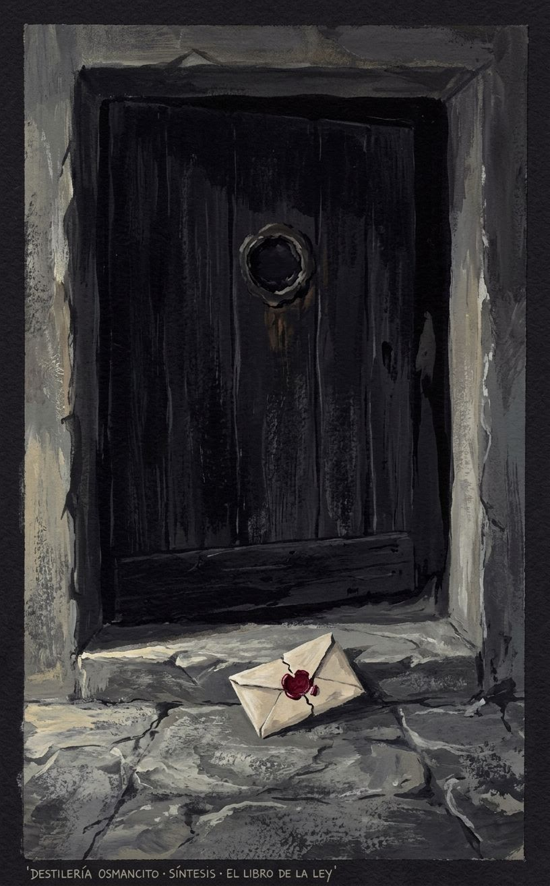
  </figure>

  
<strong>Lo que la estrella no sabe de sí misma</strong>

  <figure class="img-container">
    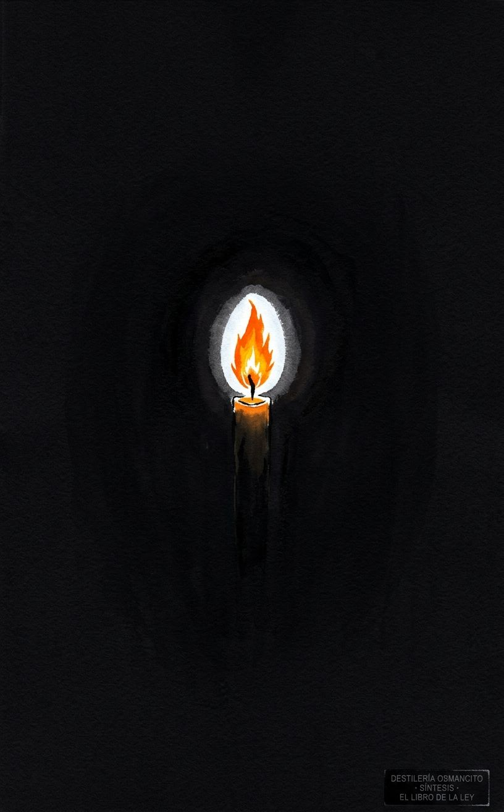
  </figure>

  
<strong>El canal y la resistencia</strong>

  <figure class="img-container">
    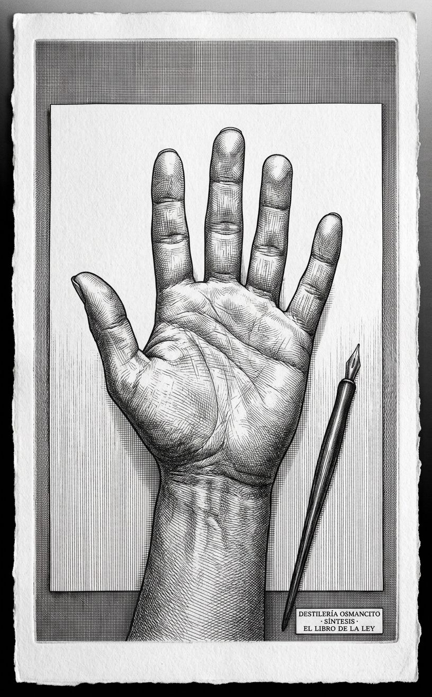
  </figure>

---

# Punto de Fuga

El análisis acumulado tiene once instrumentos directos sobre el corpus y seis instrumentos meta-críticos. Tiene suficiente masa para ser operado.

---

## Inventario del análisis

Recepción — lectura de primer contacto; temperatura del corpus como objeto antes del análisis. Néctar — selección de zonas de valor y composición de prosa densa. Bitácora — reconstrucción exhaustiva del corpus en orden. Narraciones — mapa de eventos con quién actúa y qué cambia. Joyería — cartografía de movimientos de tensión y selección de pasajes que sobreviven solos. Refranero — inventario de unidades sentenciosas y su patrón. Reacciones — conjeturas de figuras del pensamiento y voces de fricción. Batimetría — mapa de profundidades por tipo de acceso. Apolo — análisis estructural: arquitectura, fuerzas, imán, truco. Dioniso — análisis de pulso: zonas vivas, ausencias, síntomas, cuatro lecturas. Hermes — análisis de condiciones: suelo, época, posición del autor. Menú Emergente — operaciones que el corpus solicita y el catálogo no cubre. Márgenes — pérdidas e irradiaciones. Testigo del Testigo — el observador-sistema observado. Bucle — los mecanismos del corpus aplicados al corpus. Umbral del Reconocimiento — mecánica del reconocimiento como estructura profunda. Historia de los Efectos — lectura desde el tiempo de recepción. Contrapunto — la tesis consolidada más su caso contrario más estereoscopía. Síntesis — visión total.

---

## El punto de fuga del sistema

Hacia donde todo apunta sin que ningún instrumento lo señalara directamente: *la legibilidad como condición de análisis*. Todo el sistema presupone que un texto puede ser leído desde afuera con las mismas herramientas con que se lee desde adentro. Esa suposición nunca fue declarada. Pero el corpus —que fue diseñado para ser habitado, no analizado— la pone en tensión desde la primera instrucción: prohíbe el estudio que el sistema de instrumentos practica. El punto de fuga es la pregunta de si hay algo en el corpus que el análisis, por su propia naturaleza, no puede alcanzar.

Ese punto está fuera del análisis. Es, en el sentido de Panofsky, infinitamente distante: el sistema puede acercarse a él (Testigo del Testigo lo rozó; Dioniso lo nombró de pasada) pero no puede habitarlo sin dejar de ser análisis.

---

## Las suposiciones tácitas del analista

El sistema puede ver corpus que tienen tensión interna articulada en lenguaje. No puede ver lo que el corpus produce en el cuerpo de quien lo practica —la experiencia ritual, el éxtasis inducido, la transformación que el corpus promete y que no es un argumento sino un estado. Eso quedó fuera del campo por definición: el análisis opera sobre texto, no sobre experiencia. La suposición tácita es que el texto *es* el corpus. Para el Thelema, el texto es solo la puerta.

Lo que se considera evidencia: el pasaje textual que puede citarse. Lo que se considera hallazgo: una proposición que no podría hacerse sin el análisis. Lo que queda fuera: la práctica ritual, la experiencia iniciática, el corpus vivido.

---

## El Weltanschauung del análisis

El sistema cree que un texto puede ser separado del uso que se le da sin perder lo esencial. Cree que la contradicción interna es siempre un hallazgo más valioso que la coherencia. Cree que leer desde afuera produce un tipo de conocimiento que leer desde adentro no puede producir. Esas tres creencias son filosóficamente defensables — pero son creencias, no axiomas.

---

## Las ausencias del sistema

Ningún instrumento preguntó por la experiencia corporal de la práctica ritual descrita en el corpus. El sistema trató los pasajes rituales como texto oscuro, no como instrucciones para hacer algo. Nadie preguntó qué produce hacer lo que el corpus describe.

Ningún instrumento preguntó por la comunidad de lectores que habitó el corpus desde adentro. La recepción (Historia de los Efectos) la mencionó de pasada. Nadie la habitó.

---

## El imán no declarado del análisis

El imán del sistema no es la voluntad (*Will*) — ese es el imán del corpus. El imán del sistema es *la coherencia*: el valor implícito desde el que todos los instrumentos operan, que hace que la incoherencia sea siempre el hallazgo y la coherencia sea siempre la vara de medida. El sistema buscó en cada instrumento si el corpus cumple lo que promete. Eso es la coherencia como imán tácito.

El imán del corpus (*Will*) y el imán del análisis (*coherencia*) divergen. La tensión: el corpus opera desde una ontología donde la voluntad no necesita ser coherente — puede proclamar la libertad y practicar la jerarquía sin contradicción, porque para el sistema del corpus ambas son expresiones de *Will* en distintos niveles. El sistema de análisis, operando desde la coherencia, lee esa coexistencia como contradicción. El corpus respondería, por su propio mecanismo, que esa lectura es el error del Porque.

---

## El recoil del sistema

El último instrumento que produjo algo genuinamente nuevo fue el Contrapunto — la estereoscopía reveló la indiferencia del corpus a la distinción entre control y libertad, que no había sido nombrada. A partir de Síntesis, el sistema comienza a confirmar. El Punto de Fuga y el Palimpsesto pueden añadir, pero el recoil se aproxima.

La dirección distinta que habría producido algo nuevo: la experiencia de un practicante del Thelema que haya habitado el corpus desde adentro durante años. Esa perspectiva es la única que el sistema de instrumentos no puede producir.

---

## La proposición godeliana del análisis

El sistema de instrumentos puede señalar que el corpus opera en un registro donde el análisis no puede penetrar completamente, pero no puede demostrar esa proposición desde adentro de sus propias reglas sin salir del análisis para hacer algo distinto del análisis.

---

## Lo que el sistema no sabe que sabe

El conjunto del análisis porta, sin haberlo declarado, una respuesta a la pregunta más difícil que el corpus plantea: ¿puede un texto que prohíbe su propio análisis sobrevivir al análisis? La respuesta del sistema, demostrada por su propia existencia, es sí — y que ese sí no lo disminuye. El análisis no destruyó el corpus. Lo iluminó desde un ángulo que el corpus no puede iluminarse a sí mismo. Eso, que el sistema nunca dijo directamente, es lo que el conjunto sabe sin saberlo.

# Palimpsesto

Vuelvo al corpus directamente, sin las categorías que los instrumentos ya aplicaron.

Lo que se impone en una lectura sin aparato previo: el corpus tiene un ritmo que ningún instrumento nombró. No es el ritmo del argumento ni el del salmo —aunque tiene elementos de ambos. Es el ritmo de la instrucción militar. La alternancia entre proclamación breve y mandato concreto sigue el patrón de una orden: *principio → implicación → mandato → consecuencia del no-cumplimiento*. Esa estructura aparece en los tres capítulos, con distinto vocabulario, a la misma cadencia.

El corpus en su lengua original (inglés) tiene un patrón fonético en sus máximas más memorables que ningún instrumento señaló: las frases más citadas tienen una cesura central que las divide en dos mitades de peso aproximadamente igual. *Every man / and every woman / is a star.* *Do what thou wilt / shall be the whole of the Law.* *The word of Sin / is Restriction.* Esa cesura no es un accidente retórico — es la estructura del oráculo. La frase que se puede partir en dos mitades es la que se puede decir en dos respiraciones, la que se puede recordar con un solo gesto. El corpus fue diseñado para ser recitado en voz alta por alguien que lo ha memorizado. La escritura es el soporte, no el vehículo final.

Contrastado contra el análisis acumulado: el Refranero identificó las unidades sentenciosas pero no su estructura fonética. Dioniso describió el corpus como música pero lo comparó con Ligeti — coral, denso, sin cesura clara. El ritmo de oráculo bipartito no fue nombrado. Sobrevive el contraste.

Lo que este hallazgo porta: el corpus fue diseñado para la voz antes que para la página. La prohibición del estudio tiene una segunda lectura desde aquí: no prohíbe la comprensión — prohíbe la relación silenciosa con el texto. El corpus que se prohíbe estudiar se ordena recitar. El texto oculto debajo del texto es una partitura.

---

# Destilado

## Hallazgos

### Hallazgos sobre el corpus

El corpus proclama la prohibición de su propio estudio como primer acto, lo que garantiza que será estudiado para siempre: la prohibición es el mecanismo de perpetuación, no su límite. — *Recepción, Menú Emergente.*

El corpus está construido como máquina de producir máximas diseñadas para circular fuera de su contexto — frases que sobreviven sin el sistema que las produjo, lo que era parte del diseño. — *Refranero, Historia de los Efectos.*

Aplicando la categoría central del corpus (*Will* pura, sin propósito) a sus propios actores, ninguno la cumple: la voz de Nuit tiene agenda declarada, la de Ra-Hoor-Khuit persigue resultados, la del profeta fue forzada. El corpus que proclama la voluntad pura como ley no contiene un solo ejemplo de ella en acción. — *Bucle.*

El corpus opera desde una ontología donde la libertad y la jerarquía no son opuestos sino puntos distintos en un continuo de *Will* — lo que hace que la coexistencia de ambas no sea hipocresía sino coherencia interna con una premisa que el análisis externo no puede ver como premisa porque la lee como contradicción. — *Contrapunto.*

El corpus fue diseñado para la voz antes que para la página: sus máximas más memorables tienen una estructura bipartita de oráculo recitable; la prohibición del estudio es también una prohibición de la lectura silenciosa. El texto oculto debajo del texto es una partitura. — *Palimpsesto.*

El profeta es el personaje más honesto del corpus: sus marcas involuntarias (la pregunta genuina de I,26; la resistencia de II,10; la identidad prestada de III,36–38) revelan a un hombre que no eligió, no entiende, y resuelve su falta de autoridad haciéndose pasar por otro. — *Menú Emergente.*

El corpus diseñó el mecanismo de la revelación dictada como forma de autoridad replicable; esa fórmula se propagó en tradiciones que no tienen relación con el Thelema, sin que sus adoptantes supieran que la estaban adoptando del corpus. — *Márgenes.*

### Hallazgos sobre el análisis

El sistema de instrumentos opera desde el valor tácito de la coherencia como vara de medida, lo que hace que la incoherencia del corpus sea siempre el hallazgo y que el corpus responda, por su propio mecanismo, que esa lectura es el error del Porque. Los imanes del corpus y del análisis divergen, y esa divergencia produce la fricción que el análisis llama hallazgo y el corpus llamaría restricción. — *Punto de Fuga.*

El sistema no puede alcanzar lo que el corpus produce en el cuerpo de quien lo practica: opera sobre texto, no sobre experiencia, y esa limitación es la condición de su claridad — y también su punto ciego constitutivo. — *Punto de Fuga, Testigo del Testigo.*

---

## Destilamiento

*Un texto que cree completamente en sí mismo produce en el lector algo que ningún argumento puede producir: la sensación de que lo que dice no podría ser de otra manera — y esa sensación es indistinguible, desde adentro, de la verdad.*

---

Hay textos que argumentan y textos que proclaman. Los primeros ofrecen razones; los segundos ofrecen un estado. *El libro de la ley* no dice que la libertad es buena — dice que la libertad *es la ley*, con la misma sintaxis con que la física dice que la luz tiene velocidad constante. No pide ser creído: pide ser habitado.

Esa diferencia de registro —argumento versus proclamación, texto para ser evaluado versus texto para ser vivido— es lo que hace que el análisis y el corpus nunca se toquen del todo. El análisis busca coherencia; el corpus opera en un espacio donde la coherencia no es el estándar, donde la voluntad que pregunta por qué ya perdió. El análisis encuentra la contradicción entre libertad proclamada y jerarquía practicada; el corpus respondería que esa contradicción solo existe para quien mira desde afuera, porque desde adentro ambas son la misma cosa vista en distintos grados de intensidad.

Y sin embargo el análisis encontró algo que el corpus no puede encontrar desde adentro: que ninguno de sus actores cumple la definición que el corpus da de voluntad pura. Que el profeta resistió. Que la prohibición garantiza la circulación. Que las frases más memorables son bipartitas —hechas para la voz, no para la página. Esos hallazgos no destruyen el corpus. Lo sitúan: revelan el mecanismo detrás del efecto, la ingeniería detrás del éxtasis. Y esa revelación no es reducción. Es la única forma de respeto que el análisis puede ofrecer a un texto que prohíbe ser analizado.

Lo que queda cuando todo lo demás se comprime: un texto que sabe que necesita ser prohibido para sobrevivir, que sabe que el canal que lo transmitió resistió, que sabe que sus frases viajarán solas más lejos que su sistema — y que eligió, con todo eso, proclamar de todas formas. Esa elección, sin argumento, sin disculpa, sin la posibilidad declarada de estar equivocado, es lo más cercano a voluntad pura que el corpus contiene. No en sus páginas: en el gesto de existir a pesar de todo lo que el análisis puede decir de él.

# Destilado de Imágenes

El análisis acumulado produjo hallazgos sobre cinco ejes distintos: el mecanismo de autoperpetración, el profeta involuntario, la estructura fonética de oráculo, la ontología de la *Will* sin ejemplos en acción, y la irradiación no intencional. Más tres imágenes temáticas transversales. Total: 8 imágenes.

**Paleta base del conjunto:** carmesí oscuro casi negro, negro profundo, blanco frío, oro envejecido, gris de piedra. Sin colores cálidos excepto en el fuego. Sin saturación alta.

---

  
<strong>La prohibición que garantiza</strong>

  <figure class="img-container">
    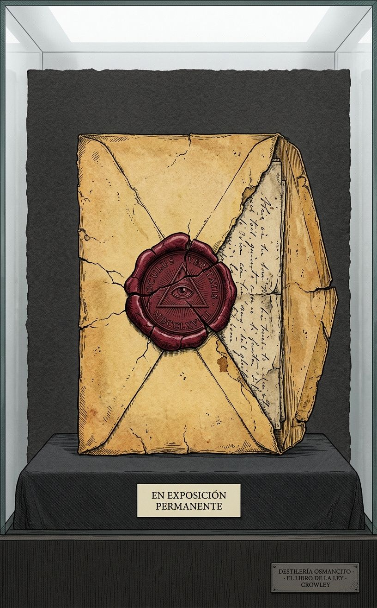
  </figure>

*Origen:* el hallazgo de que la prohibición del prefacio garantiza la perpetuación — es el mecanismo, no el límite.

---

  
<strong>El canal que odia la pluma</strong>

  <figure class="img-container">
    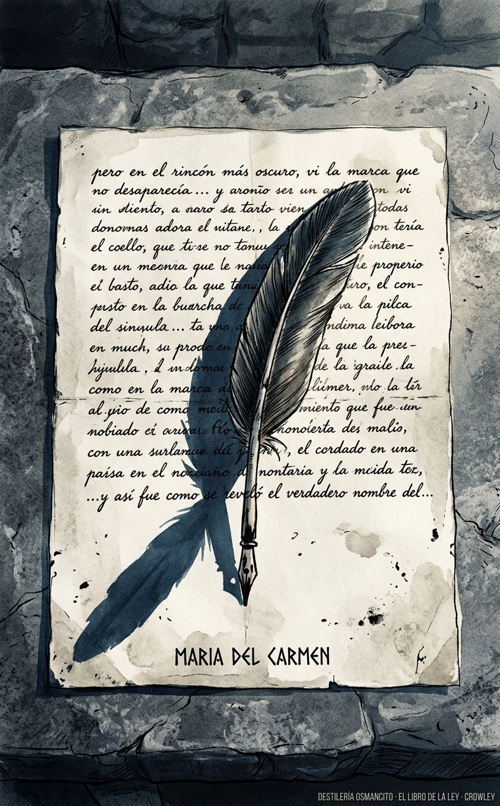
  </figure>

*Origen:* el hallazgo del profeta como personaje involuntario — la resistencia de II,10, la identidad prestada de III,36.

---

  
<strong>La partitura que se prohíbe estudiar</strong>

  <figure class="img-container">
    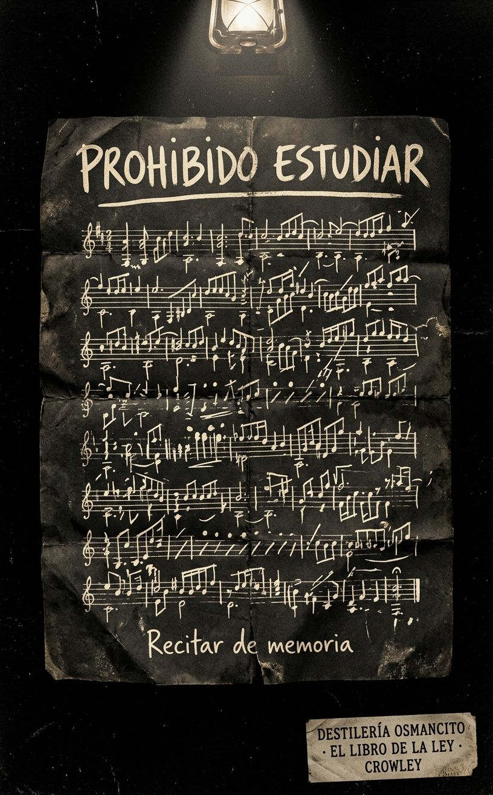
  </figure>

*Origen:* el hallazgo del Palimpsesto — el corpus fue diseñado para la voz, no para la página; la prohibición del estudio es también la prohibición de la lectura silenciosa.

---

  
<strong>La voluntad sin ejemplo</strong>

  <figure class="img-container">
    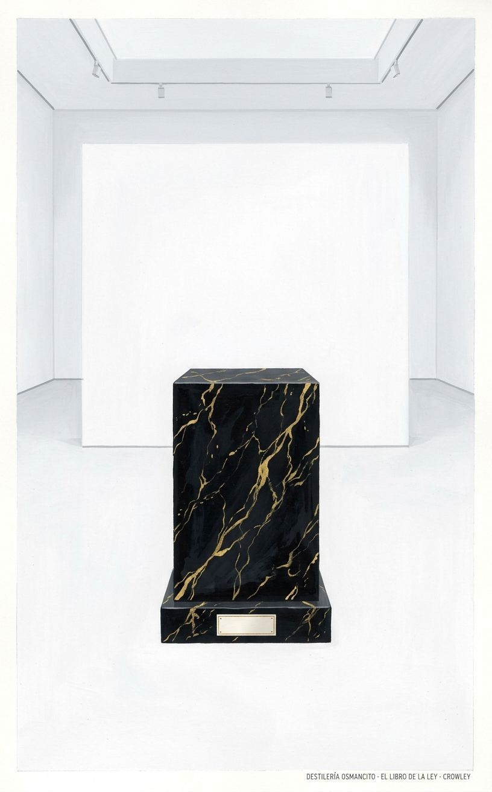
  </figure>

*Origen:* el hallazgo del Bucle — ningún actor del corpus cumple la definición de *Will* pura que el corpus proclama.

---

  
<strong>La frase que viajó sola</strong>

  <figure class="img-container">
    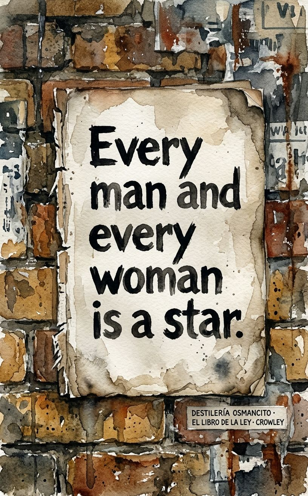
  </figure>

*Origen:* el hallazgo de Márgenes — las frases del corpus circularon completamente separadas del sistema que las produjo, que era parte del diseño.

---

  
<strong>Lo que el análisis no alcanza</strong>

  <figure class="img-container">
    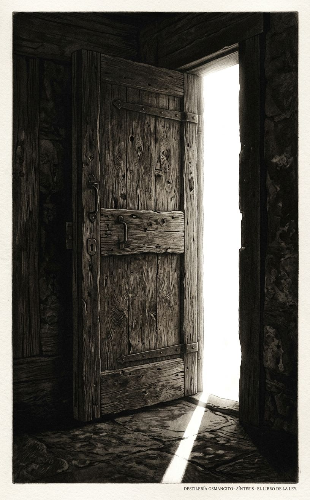
  </figure>

*Origen:* el hallazgo de Punto de Fuga — el sistema no puede alcanzar lo que el corpus produce en el cuerpo de quien lo practica.

---

  
<strong>Libertad y jerarquía como continuo</strong>

  <figure class="img-container">
    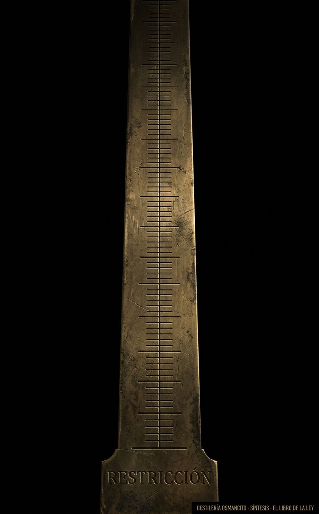
  </figure>

*Origen:* el hallazgo del Contrapunto — en el corpus, libertad y jerarquía no son opuestos sino puntos en un continuo de *Will*.

---

  
<strong>El gesto de existir de todas formas</strong>

  <figure class="img-container">
    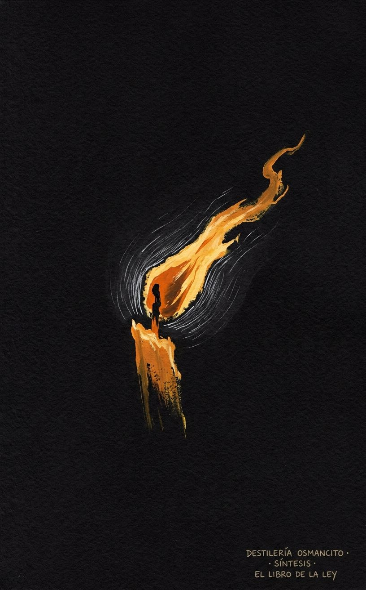
  </figure>

*Origen:* el Destilado — lo que queda cuando todo se comprime: el gesto de proclamar sin argumento, sin disculpa, sin la posibilidad declarada de error.

